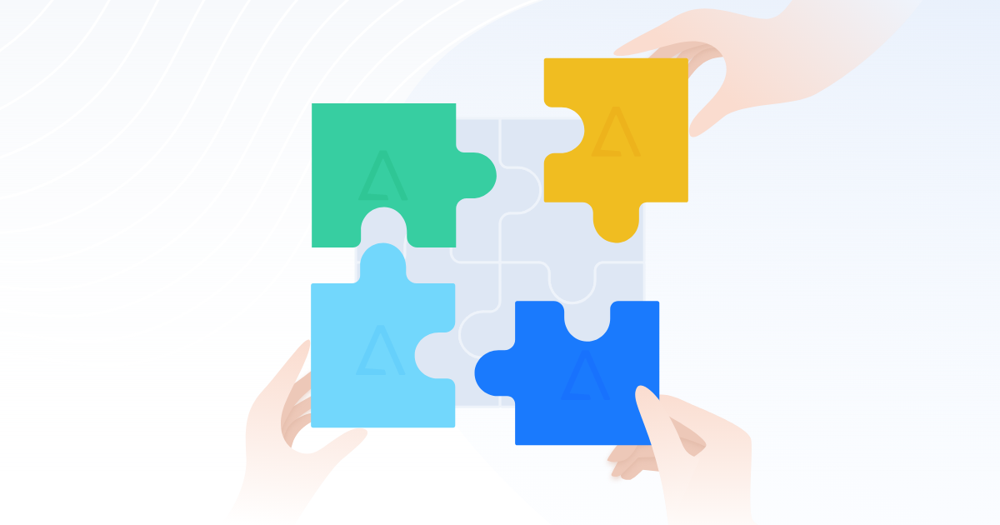
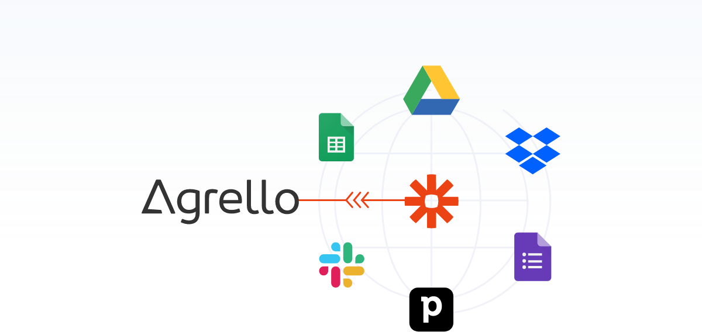

**Järgnevas artiklis tutvustame sulle põhjuseid, miks just Agrello võiks kõikides nendes dokumendihalduse aspektides olla sobilik partner sinu ettevõtte jaoks ning kuidas on sul võimalik aega säästa, et keskenduda olulisematele ülesannetele kui “paberimajandus”.**

‍

Tänapäeval mõeldakse igas ettevõttes paratamatult sellele, milline oleks kõige efektiivsem viis dokumentide digitaalseks haldamiseks. Erinevates valdkondades on erinev igakuine dokumentide maht, kuid igas ärivaldkonnas on kindlasti vajadus töölepingute ning müügi- või teenuse lepingute sõlmimiseks. Kõik need dokumendid tuleb ette valmistada, digitaalseks allkirjastamiseks saata ning hiljem ka organiseerida ja hoiustada. Kui dokumentidega on ametis mitu inimest, siis võib kiiresti tekkida segadus. Selle vältimiseks tasub otsida dokumentide digitaalseks haldamiseks mugav tööriist.

‍

[YouTube Video](https://www.youtube.com/watch?v=-pB61XgekeA)

‍  
  
Dokumentide haldamise all peame silmas kogu dokumendi elutsüklit, mis sisaldab endas dokumentide ettevalmistamist, redigeerimist, koostööd, osapooltele laiali saatmist, allkirjastamist ning ka sorteerimist ja hoiustamist. Lepingute ja ettevõtte dokumentide haldamiseks on turul väga palju erinevaid lahendusi. Samuti on palju platvorme digitaalseks allkirjastamiseks. Välismaisetest konkurentidest väärivad mainimist näiteks DocuSign, PandaDoc, Adobe, SignEasy, eSignGenie jpt ning kodumaistest on silmapaistvaim Dokobit. Järgnevas artiklis tutvustame sulle põhjuseid, miks just Agrello võiks kõikides nendes dokumendihalduse aspektides olla sobilik partner sinu ettevõtte jaoks ning kuidas on sul võimalik aega säästa, et keskenduda olulisematele ülesannetele kui “paberimajandus”.  
‍

### ‍  
1\. Teenuse kättesaadavus ja lihtsus

Agrello on oma platvormi loomisel võtnud eesmärgiks teenuse võimalikult lihtsa ja kiire kättesaadavuse ilma ebavajalike piiranguteta. Seetõttu ei ole konto loomiseks ja sisselogimiseks vaja muud kui e-posti aadressi. Isegi parooli ei ole Agrello konto jaoks vaja - iga kord sisse logides saadame sinu e-posti aadressile unikaalse numbrikoodi, millega saad sisselogimise autoriseerida.  
  
Kuna allkirjastamisel on alati ka teine pool, kes ei pruugi sinu poolt valitud teenusega eelnevalt tuttav olla, siis on väga oluline kasutajamugavus. Agrellos oleme sellele palju rõhku pannud, et kõik saaks tehtud kiirelt, lihtsalt ja mugavalt.

‍

### 2\. Kõik ühel platvormil

Erinevate tööriistade paljusus on üks probleeme, mis ettevõttesiseselt võib probleeme tekitada. Iga uue tööriista kasutuselevõtt eeldab mõningast õppeperioodi, et asjad paika saada ja seetõttu kehtib siin kindlasti põhimõte, et vähem on rohkem. Agrello platvormil on võimalik läbi viia kõik lepingu allkirjastamisega seotud etapid, alustades lepingu ettevalmistamisest, selle allkirjastamisele saatmisest kuni allkirjastamise ja hoiustamiseni.

‍

### 3\. Paindlikud allkirjastamise võimalused

Vahel on kohalikul tasemel lepingu sõlmimiseks vaja kasutada just kvalifitseeritud digitaalset allkirja. Selle jaoks on Agrellos kättesaadavad tuttavad kvalifitseeritud allkirjastamise meetodid nagu Smart-ID, Mobiil-ID ja ID-kaart mis teevad allkirjastamise mugavaks ja kiireks. Samas, kui juhtub, et keegi sinu partneritest on välisriigist, siis saab ta dokumendi allkirjastada Agrello lihtallkirjaga ning loodav dokument on mõistlikus PDF-formaadis kättesaadav kõikidele osapooltele.

‍

### 4\. Erinevad dokumendi formaadid vastavalt vajadusele

Iga dokumenti alustades on kasutajal vaja teha valik, millises formaadis ta soovib allkirjastatud dokumenti näha. Toetatud formaatideks on ASIC ja PDF. Valiku tegemisel tuleb silmas pidada, kes on dokumendi allkirjastajad, sest sellest olenevad kättesaadavad allkirjastamise meetodid. Näiteks on ASIC konteinerit võimalik allkirjastada ainult Smart-ID, Mobiil-ID või ID-kaardiga ning kui vastaspoolel neid ei ole, siis ei olegi tal võimalik seda dokumenti allkirjastada. Samuti tulenevad formaadi valikust piirangud failide arvule - PDF formaat toetab üksikut tekstiformaadis dokumenti, kuid ASIC konteinerisse on võimalik lisada erinevaid formaate ning ka mitu faili korraga.

‍

### 5\. Taaskasutatavad lepingupõhjad

Et lepingu ettevalmistamisele kuluvat aega veelgi vähendada, saab Agrello platvormil oma ettevõtte kõige rohkem kasutust leidvatest dokumentidest luua dünaamiliste väljadega taaskasutatavaid lepingupõhjasid. Kuna enamasti kasutatakse lepingu ettevalmistamiseks Microsoft Wordi, siis oleme loonud spetsiaalse markeeringu, mis aitab sul teksti sees sobivasse kohta luua dünaamilise välja, mida on võimalik Agrello platvormil mugavalt täita. Nii ei ole vaja dokumenti eraldi kopeerida, täita, salvestada ja üles laadida, vaid kõik toimub Agrello keskkonnas. Dünaamilise välja loomiseks tuleb kasutada dokumendi tekstis **{{loogelisi\_sulgusid}}**. Need loogelised sulud ei jää dokumendis nähtavale, vaid indikeerivad ainult välja asukohta enne selle täitmist. Sulgude sisse võid kirjutada selle välja nime, näiteks **{{ettevotte\_nimi}}, {{registrikood}}**. [**Pikemalt dokumendi ettevalmistamisest loe**](https://www.agrello.io/post/kuidas-microsoft-wordis-lepingud-allkirjastamiseks-ettevalmistada) [**siit**](https://www.agrello.io/post/kuidas-microsoft-wordis-lepingud-allkirjastamiseks-ettevalmistada).

‍

### 6\. Mugavad koostöövõimalused

Kindlasti eeldab ühe lepingu sõlmimine mitmetasandilist koostööd, seda nii ettevõttesiseselt, kui ka väliste partneritega. Agrello platvormil on olemas jagatud kaustad ehk “space’id”, kuhu saab näiteks projektipõhiselt dokumente jagada ning vastavalt vajadusele kutsuda kolleege või partnereid sinna koostööd tegema. Kõigil kausta liikmetel on ligipääs dokumentidele ning vastavalt neile antud õigustele võimalus dokumente redigeerida ja allkirjastada.  
  
Lisaks koostööle kaustades on võimalik dünaamilisi välju oma välisele partnerile täitmiseks määrata. Nii saab ta platvormile tulles ise oma ettevõtte informatsiooni enne allkirjastamist sisestada. Samuti jääb allkirjastatud dokument ka temale platvormil tähtajatult kättesaadavaks ning puudub vajadus seda eraldi alla laadida või e-kirjaga saata.

‍

### 7\. Turvaline hoiustamine

Peale dokumendi allkirjastamist tõusetub päevakorda küsimus hoiustamise kohta. Tihti tehakse seda mõnes pilveteenuses või kõvakettal, aga vahel lähevad dokumendid hoopis postkasti sügavustes kaduma ja nii on neid hiljem raske leida. Agrello platvormil saad allkirjastatud dokumente muretult hoida, need on sulle alati kättesaadavad. Samuti saad dokumente kaustadesse organiseerida ja oma meeskonnaga jagada.

‍

### 8\. Integratsioonid

‍

‍

Erinevate uute tööriistade kasutuselevõtu asemel oleks lihtsam ja efektiivsem juba kasutusel olevad tööriistad enda kasuks paremini tööle panna. Agrelloga on võimalik luua automaatseid ühendusi läbi Zapieri integratsioonide ning seeläbi luua veelgi efektiivsemaid töövooge. Oleme proovinud tuua mitmeid näiteid selliste integratsioonide kohta: integratsioon **Google Sheets ja Agrelloga**, [**integratsioon Pipedrive-iga**](https://agrello-web.webflow.io/post/automatiseeri-lepingute-loomise-protsess-labi-agrello-ja-pipedrivei-integratsiooni), integratsioon [**Google Drive ja Agrello vahel**](https://agrello-web.webflow.io/post/automatiseeri-lepingute-allkirjastamine-google-drivei-ja-zapieri-uhendusega). Näiteks Google Sheetsi integratsioon Agrelloga võimaldab sul Sheetsis paikneva info põhjal korraga palju lepinguid või dokumente luua. Nii saab kogutud informatsiooni automaatselt ära kasutada ning ei ole vaja aega kulutada manuaalsele andmesisestusele.

‍

### 9\. Mugav mobiilivaade

Agrello eesmärgiks on pakkuda võimalikult mugavat kasutajakogemust ka mobiilivaates. Nii on võimalik jooksvalt kõikide dokumentide staatusel silma peal hoida ning dokumente allkirjastada ilma arvutit välja otsimata.

‍

### 10\. Personaalne lähenemine

Kui sinu ettevõte on Agrello kasutamisest huvitatud ning vajab töövoogude seadistamisel või Agrello juurutamisel abi, siis oleme sinu jaoks olemas. Meie jaoks on kliendi heaolu väga tähtis ning just see võiks olla viimane ja kõige tähtsam punkt, miks valida just kodumaine Agrello oma partneriks ning osaleda meie pilootprojektis. [**Loe lähemalt, kuidas me üheskoos Eesti ettevõtte Leguar Capitaliga nende igapäevast töömahtu lihtsustada ja kiirendada aitasime**](https://www.agrello.ee/kuidas-agrello-abiga-kiiremini-investoritega-lepinguid-solmida)**.**  

‍