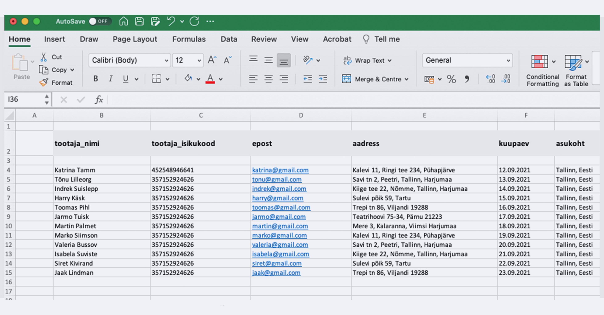

**Digitaalne allkirjastamine on meie elu väga mugavaks teinud ning kiirendanud äriprotsesse. Sellest hoolimata kulub lepingute ettevalmistamisele ja allkirjastamisele endiselt väga palju aega. Lepinguid luuakse ükshaaval ja käsitsi, allkirju kogutakse ajakuluka e-kirjavahetuse käigus ning lõpetuseks kaovad tähtsad dokumendid *mailbox*´i ära.**

Mis siis, kui seda saaks teha teistmoodi? Mis oleks, kui kümnete lepingute ettevalmistamine oleks vaid minutite töö ja see kõik toimuks vigadeta? Kas poleks mõistlik, kui allkirjastatud dokumendid liiguksid ise õigesse kausta? Kas see tähendaks, et teatud inimesi ei ole enam vaja? Või pigem seda, et saame keskenduda nendele teemadele, mis meid päriselt kõnetavad ja huvitavad?

**Siinkohal jagame 5 kasulikku nippi, kuidas nutikamalt lepinguid sõlmida ja vähendada tüütut käsitööd, mis lepingute vormistamise ja allkirjastamisega tihtipeale kaasas käivad.**

## ‍

1\. Lepingute allkirjastamiseks vali sobiv platvorm

Eraldi allkirjastamise platvorm teeb dokumentidega töö oluliselt lihtsamaks ja kiiremaks. Samuti annab see hea ülevaate kõikidest ettevõtte lepingutest, sest kõik lepingud asuvad ühes kindlas kohas, mis on kõikidele ettevõtte määratud isikutele ligipääsetavad. Samuti annab allkirjastamise platvorm võimaluse dokumentidega seonduvaid toiminguid oma ettevõtte tööriistadega ühendada ning allkirjastamise protsessi automatiseerida.

Peamine murekoht on alustamine, millegi uue õppimine, senistest tavadest loobumine. Hea platvormi valik ja selle juurutamine ettevõttes toob sulle tagasi väärtuslikku vaba aega. Siin on näiteks hea lugu sellest, [**kuidas suure kliendibaasiga ettevõte Horeca Sevice oma lepinguid efektiivsemalt haldama hakkas**](https://www.agrello.io/ee/kuidas-hallata-suure-kliendibaasiga-seotud-lepinguid-efektiivsemalt).

Teame väga hästi, kuidas aastatega juurutatud protsesse on vaevaline muuta. Seepärast olemegi lähemalt selgitanud, [**miks on lepingute allkirjastamiseks hea valida eraldi platvorm**](https://www.agrello.io/post/milleks-on-vaja-lepingute-allkirjastamiseks-eraldi-platvormi) ja mida see endaga kaasa toob.

‍

### 2\. Kasuta dünaamiliste väljadega lepingupõhja

Oleme Agrellos loonud viisi, kuidas lepingute ettevalmistamisele kuluvat aega vähendada. Kuna enamus inimesi kasutab dokumentidega töös Microsoft Wordi, siis just sellele tööriistale olemegi loonud lahenduse. Nipp seisneb selles, et piisab vaid ühe lepingupõhja loomisest, mis on seejärel korduvalt kasutatav (näiteks tööleping või konfidentsiaalsusleping).  
‍

Lepingupõhi peaks sisaldama dünaamilisi välju, mida iga töötaja puhul on tarvis lepingus muuta. Sellise põhja kasutamisel ei ole tarvis ühte ja sama faili duplikeerida, eraldi välju täita, salvestada, e-maili teel allkirjastamisele saata ega eraldi kaustadesse arhiveerida. Dünaamiliste väljadega lepingupõhjad aitavad sul lepinguid kiiremini ette valmistada, vältida lepingu väljade täitmisel vigu, saata vaid kliki vajutusega leping pooltele allkirjastamiseks, ning seejärel saada teavitus selle kohta, kui kõik osapooled on allkirjad andnud.

‍

### ‍

3\. Liiguta lepingud kaustadesse automaatselt

Kas sooviksid, et peale lepingu allkirjastamist kõikide osapooltega liiguks leping automaatselt sinu poolt määratud kausta? Sa ei pea enam jälgima, millal leping on allkirjastatud, ei pea seda *mailbox*´ist otsima, eraldi kausta alla laadima ning sa ei pea muretsema, et äkki lepingu liigutamine kindlasse kausta ununeb ja leping läheb kaduma.

‍

‍

Agrello platvormi [**ühendamisel näiteks Google Drive**](https://www.agrello.io/post/automatiseeri-lepingute-allkirjastamine-google-drivei-ja-zapieri-uhendusega) või Dropbox kaustaga, liiguvad kindla staatusega lepingud sinu poolt määratud kaustadesse automaatselt. Samuti saad seadistada teavitused Slacki, mis annaksid sinule või sinu meeskonnale märku, kui lepingud on allkirjastatud. Kui soovid, et peale lepingu allkirjastamist [**ilmuks soovitud staatus näiteks Pipedrive´i müügikanalisse**](https://www.agrello.io/post/automatiseeri-lepingute-loomise-protsess-labi-agrello-ja-pipedrivei-integratsiooni), siis saad ka selle ühenduse hõlpsalt luua.

‍

### 4\. Automatiseeri lepingute ettevalmistamine

Mõnikord tuleb ette olukordi, kui on vaja kiiresti luua kümneid või sadu allkirjastamisele minevaid dokumente ühe ja sama põhja peale. Olgu selleks juhuks siis töösisekorraeeskirjade uuendamine, kliendilepingute muudatused või liitumislepingute allkirjastamine.

Toome näite, kuidas oleks võimalik kiiremini kõikide ettevõtte töötajate vahel allkirjastada uuenenud töösisekorraeeskirjad? Esiteks tuleb luua dünaamiliste väljadega lepingupõhi ning kõikide töötajate andmetega Exceli tabel, kus iga töötaja kohta on täidetud tema andmed (nimi, amet, kontaktandmed, isikukood jms). Seejärel, et töötajate andmetest saaks automaatselt luua allkirjastamiseks ettevalmistatud töösisekorraeeskirjad, [**oleks vaja seadistada ühendus Agrello ja Zapieri vahel**](https://www.agrello.io/post/kuidas-agrello-ja-exceliga-luua-sadu-allkirjastamisele-minevaid-dokumente). Nüüd ei ole enam vahet, kui palju töötajaid nimekirjas on, kas kümneid või sadu, lepingud valmistatakse Agrellos ette automaatselt ja kiiresti.

‍

Sedalaadi püsivat ühendust on tänaseks kasutanud juba mitmed ettevõtted, et säästa dokumentide ettevalmistamisele kuluvat aega.

### 5\. Halda ja organiseeri lepinguid ühes kindlas kohas

Peale dokumendi allkirjastamist tuleb päevakorda küsimus hoiustamise kohta. Tihti tehakse seda mõnes pilveteenuses või kõvakettal, aga vahel lähevad dokumendid hoopis postkasti sügavustes kaduma ja nii on neid hiljem raske leida. Agrello platvormil saad allkirjastatud dokumente muretult hoida, need on sulle alati kättesaadavad. Samuti saad dokumente kaustadesse organiseerida ja oma meeskonnaga jagada.

Agrello platvormi avakuva annab sulle hea ülevaate lepingute staatustest. Veel mugavam on selleks kasutada mobiiliäppi. Nii on sul alati olemas teadmine, millised lepingud on veel allkirjastamisel ja millised on kõikide osapoolte peale lõplikult allkirjastatud.

‍

‍

### Proovi ise järele

‍  
Kui sinus äratas käesolev lugu uusi mõtteid ja sinu ettevõte on allkirjastamise platvormi kasutamisest huvitatud ning vajab töövoogude seadistamisel ja juurutamisel abi, siis miks mitte **valida just kodumaine Agrello oma partneriks.**
