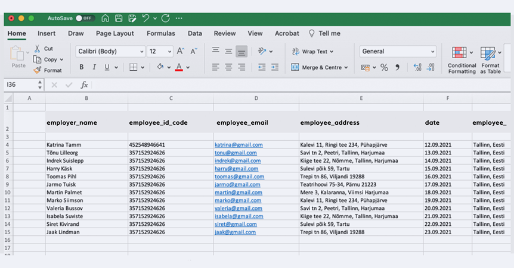

**Digitālā parakstīšana ir padarījusi mūsu dzīvi ļoti ērtu un paātrinājusi biznesa procesus. Tomēr līgumu sagatavošana un parakstīšana joprojām ir ļoti laikietilpīga. Līgumi tiek veidoti pa vienam un manuāli, paraksti tiek vākti laikietilpīgā e-pasta sarakstē, un galu galā svarīgi dokumenti pazūd e-pasta kastītē.**

‍

Kas būtu, ja to varētu darīt citādi? Kas būtu, ja desmitiem līgumu sagatavošana būtu tikai dažu minūšu jautājums un viss būtu bez kļūdām? Vai nebūtu jēgpilni, ja parakstītie dokumenti paši nonāktu pareizajā mapē? Vai tas nozīmētu, ka noteikti cilvēki vairs nebūtu vajadzīgi? Vai drīzāk, ka mēs varētu koncentrēties uz jautājumiem, kas mūs patiešām uzrunā un interesē?

‍

**Šeit mēs dalāmies ar 5 noderīgiem padomiem, kā varat parakstīt līgumus gudrāk un samazināt nogurdinošo manuālo darbu, kas bieži ir saistīts ar līgumu formalizēšanu un parakstīšanu.**

‍

## 1\. Izvēlieties piemērotu platformu līguma parakstīšanai

Sava parakstīšanas platforma padara darbu ar dokumentiem daudz vieglāku un ātrāku. Tā arī nodrošina labu pārskatu par visiem uzņēmuma līgumiem, jo visi līgumi atrodas konkrētā vietā, kurai var piekļūt visi attiecīgie cilvēki uzņēmumā. Parakstīšanas platforma arī piedāvā iespēju savienot ar dokumentiem saistītās darbības ar jūsu uzņēmuma rīkiem un automatizēt parakstīšanas procesu.

‍

Galvenā problēma ir sākt, apgūt kaut ko jaunu un atteikties no vecajiem paradumiem. Ja izvēlēsieties labu platformu un ieviesīsiet to savā uzņēmumā, jūs ietaupīsiet vērtīgu brīvo laiku. Piemēram, [**šeit ir laba stāsts par to, kā Horeca Service**](https://www.agrello.io/case-study-streamlining-the-contract-process-with-agrello), uzņēmums ar lielu klientu bāzi, sāka efektīvāk pārvaldīt savus līgumus.

‍

Mēs ļoti labi zinām, cik grūti ir mainīt procesus, kas ir pastāvējuši gadiem ilgi. Tāpēc mēs sīkāk paskaidrojām, [**kāpēc ir labi izvēlēties savu platformu līgumu parakstīšanai un**](https://www.agrello.io/post/10-reasons-to-choose-agrello-as-a-contract-management-solution) ko tas nozīmē.

‍

### 2\. Izmantojiet līguma veidni ar dinamiskajiem laukiem

Agrello mēs esam izveidojuši veidu, kā samazināt līgumu veidošanai nepieciešamo laiku. Tā kā lielākā daļa cilvēku izmanto Microsoft Word, lai strādātu ar dokumentiem, mēs esam izstrādājuši risinājumu šim rīkam. Triks ir tāds, ka pietiek izveidot tikai vienu veidni līgumam, kuru pēc tam var izmantot atkal un atkal (piemēram, darba līgumu vai konfidencialitātes līgumu).

‍

‍

Līguma veidnei vajadzētu saturēt dinamiskos laukus, kuri jāmaina līgumā katram darbiniekam. Ja izmantojat šādu veidni, jums nav jādublē tas pats fails, jāaizpilda atsevišķi lauki, jāsaglabā, jāsūta e-pasts parakstīšanai vai jāarhivē atsevišķās mapēs. Līgumu veidnes ar dinamiskajiem laukiem palīdz jums ātrāk veidot līgumus, izvairīties no kļūdām, aizpildot līguma laukus, nosūtīt līgumu pusēm parakstīšanai ar vienu klikšķi un saņemt paziņojumu, kad visas puses ir parakstījušas.

‍

### 3\. Automātiski pārvietojiet līgumus mapēs

Vai vēlaties, lai līgums automātiski tiktu pārvietots uz jūsu norādīto mapi pēc tam, kad esat to parakstījis ar visām pusēm? Jums nav jāseko līdzi, kad līgums tika parakstīts, jums nav jāmeklē tas savā e-pasta kastītē, jālejupielādē atsevišķā mapē, un jums nav jāuztraucas, ka varētu aizmirst pārvietot līgumu uz konkrētu mapi un līgums pazūd.

‍

‍

Ja jūs [**savienojat Agrello platformu ar Google Drive**](https://www.agrello.io/post/easily-prepare-contracts-for-signing-with-google-drive-and-zapier-automation) vai Dropbox mapi, piemēram, līgumi ar noteiktu statusu automātiski tiks pārvietoti uz jūsu norādītajām mapēm. Jūs varat arī iestatīt paziņojumus Slack, lai informētu jūs vai jūsu komandu, kad līgumi ir parakstīti. Ja vēlaties, lai pēc līguma parakstīšanas parādītos vēlamais statuss, piemēram, [**Pipedrive pārdošanas kanālā**](https://www.agrello.io/post/automate-the-contract-creation-workflow-with-agrello-and-pipedrive-integration), jūs varat viegli izveidot arī šo savienojumu.

‍

### 4\. Automatizējiet līgumu sagatavošanu

Dažreiz rodas situācijas, kad nepieciešams ātri izveidot desmitiem vai simtiem dokumentu, kas jāparaksta pēc vienas un tās pašas veidnes. Vai tas būtu iekšējo darba noteikumu atjaunošana, izmaiņas klientu līgumos vai abonēšanas līgumu parakstīšana.

‍

Izveidosim piemēru: Kā būtu iespējams ātrāk panākt, lai visi uzņēmumā parakstītu atjauninātus darba noteikumus? Vispirms jums jāizveido līguma veidne ar dinamiskajiem laukiem un Excel izklājlapa ar visu darbinieku datiem, kurā ir ievadīti katra darbinieka dati (vārds, profesija, kontaktinformācija, personas identifikācijas numurs utt.). Lai pēc tam varētu automātiski izveidot parakstīšanai gatavus darba noteikumus no darbinieku datiem, [**jāizveido savienojums starp Agrello un Zapier**](https://www.agrello.io/post/the-next-step-in-document-automation-agrello-in-zapier). Tagad nav svarīgi, cik darbinieku ir sarakstā, vai tie ir desmiti vai simti, līgumi tiek izveidoti automātiski un ātri Agrello.

‍

‍

Šāda veida pastāvīgu savienojumu jau ir izmantojuši vairāki uzņēmumi, lai ietaupītu laiku, veidojot dokumentus. Mēs esam vairāk rakstījuši par vienu piemēru šeit: [**Kā jūs varat izmantot Agrello, lai ātrāk parakstītu līgumus ar investoriem**](https://www.agrello.io/case-study-closing-investment-rounds-faster-with-agrello).

‍

### 5\. Pārvaldiet un organizējiet līgumus vienā vietā

Pēc dokumenta parakstīšanas rodas jautājums par uzglabāšanu. Bieži tas tiek darīts mākoņa pakalpojumā vai cietajā diskā, bet dažreiz dokumenti pazūd e-pasta dzīlēs, un vēlāk tos ir grūti atrast. Agrello platformā jūs varat bez raizēm glabāt parakstītos dokumentus, tie vienmēr ir jums pieejami. Jūs varat arī organizēt dokumentus mapēs un dalīties ar tiem ar savu komandu.

‍

### Izmēģiniet paši

Ja šis stāsts ir raisījis jaunās domas jūsos un jūsu uzņēmums ir ieinteresēts izmantot parakstīšanas platformu un nepieciešama palīdzība darbplūsmu iestatīšanā un ieviešanā, tad **kāpēc neizvēlēties Agrello kā savu partneri?**

‍
