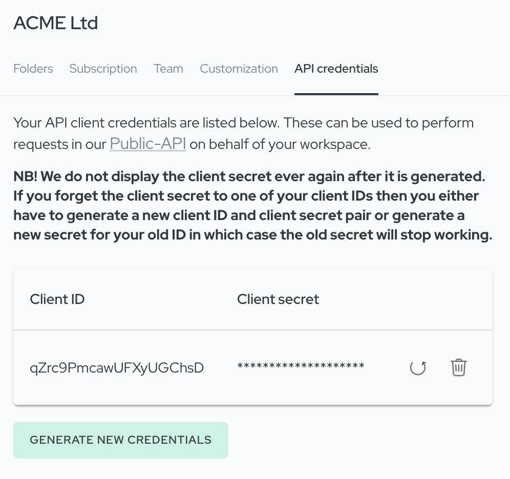
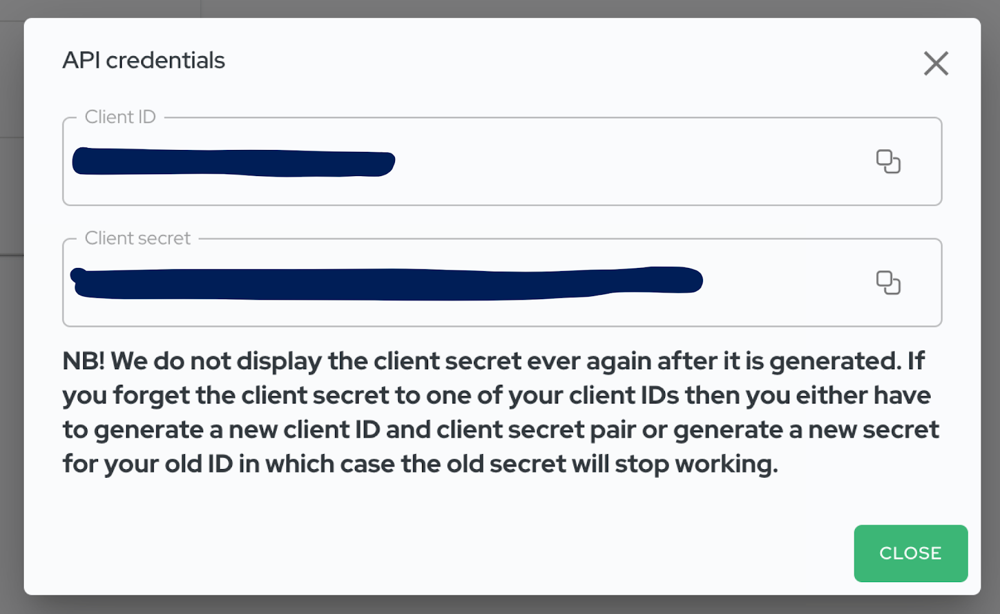
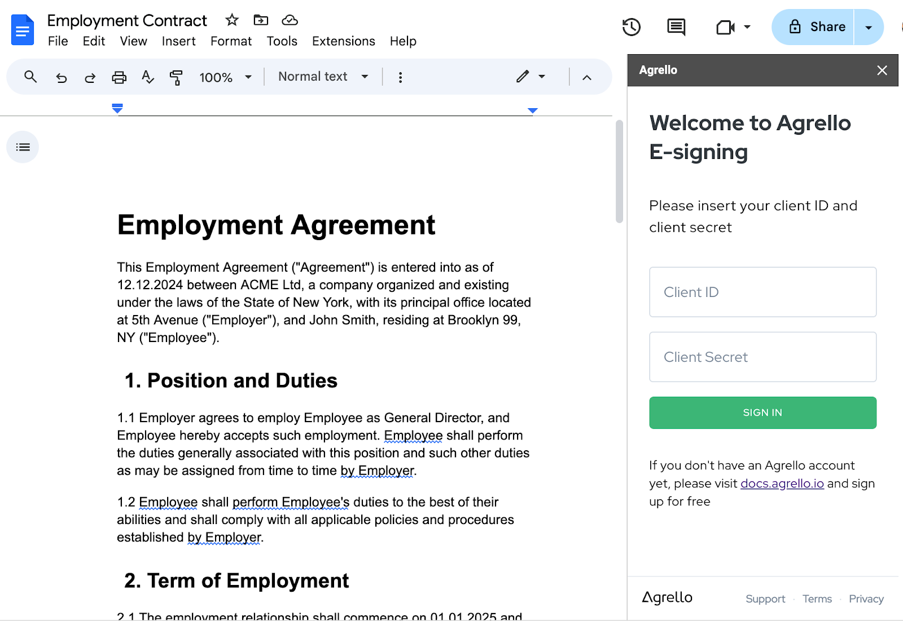

## Process Overview

To get started, follow these steps:

1.  **Install the Agrello Add-on** from Google Workspace Marketplace.
2.  **Generate API Keys and Log In to the Add-on**
3.  **Use the Add-on to Send Documents for Signing**

## Step 1: Install Agrello Add-on from Google Workspace Marketplace.

1\. Go to [Agrello Google Docs™ Add-on listing here](https://workspace.google.com/marketplace/app/agrello_esigning_addon_for_google_docs/401150328969)

2\. Click on blue **Install** button  
‍

3.  In new popup window follow the instructions and provide permissions for add-on.

4.  Next time you open **Google Docs™** you will now see **small Agrello button** on the marketplace sidebar on the right side of the screen.  
    ‍

‍

5.  If you don't see the sidebar please press on the small expand button on the lower right corner of Docs window.

‍

## Step 2: Generate API Credentials in Agrello

To connect your **Google Docs™ Add-on with Agrello**, you need API credentials.

1.  **Access API Credentials in Agrello  
    ‍**
    1.  Log in to your Agrello platform account.
    2.  Open your **Workspace Settings** and navigate to the **"API Credentials"** tab.

2.  **Generate New Credentials**
    1.  Click the **"Generate New Credentials"** button.
3.  **Copy Your Credentials**

1.  Copy the **Client ID** and **Client Secret** displayed in the dialog box.
2.  **Important:** The **Client Secret** will only appear once. Save it securely for future use.

You’re now ready to use these credentials to log in to the Google Docs Add-on.

## Step 2: Open the Agrello Google Docs Add-on

1.  **Launch Google Docs™**
    - Open a document in Google Docs.
2.  **Access the Agrello Add-on**  
    Locate \*\*Agrello logo on sidebar and click to open it.
    \*\*

‍

## Step 3: Log In to the Add-on

1.  **Enter Your API Credentials**
    - In the Agrello add-on, input your **Client ID** and **Client Secret** in the respective fields.
2.  **Sign In**
    - Click the **"Sign In"** button to authenticate and connect the add-on to your workspace.

Once logged in, you’ll see options to send documents for signing.

## Step 4: Send a Document for Signing

‍

‍

1.  **Select a Folder**
    - In the Agrello sidebar, click **"Select folder…"** to choose where the signed document will be saved in your workspace.
2.  **Add Signer Emails**
    - Enter the email addresses of the recipients who need to sign the document.
    - Separate multiple email addresses with commas.
3.  **Choose the Output Format**
    - Select the desired signature format:some text
      - **PDF - Secure PAdES signature**
      - **ASIC - Digital signature container**
      - **EDOC - Latvian qualified e-signature**
    - Optionally, enable **"Send out immediately"** if you want the document sent right away without storing it as a draft.
4.  **Send the Document**
    - Click **"Send for Signing"** to send your document for e-signatures.

You can now monitor the signing process via the Agrello platform.

## Step 5: Log Out (Optional)

If you need to log out of the Agrello Add-on:

1.  **Go to the Settings Tab**
    - In the Agrello sidebar, click on the **"Settings"** tab.
2.  **Log Out**
    - Click the **"Logout"** button under the "Current Workspace" section.

This ensures your account is disconnected, especially if using a shared device.

## Conclusion

You’ve successfully set up and used the Agrello Google Docs Add-on to send a document for e-signing! With this powerful tool, you can streamline your document workflows directly within Google Docs.

Happy signing! 😊

\*\*\*

### **Troubleshooting Safari Authorization Issues**

If you encounter authentication errors while installing or using the Agrello Add-on in Safari, the browser may be automatically selecting a Google account not intended for use with the Add-on. To address this issue:

1.  **Check Signed-In Accounts:**  
    In Safari, visit [accounts.google.com](https://accounts.google.com) and sign out of any accounts not needed. Make sure that only the intended Google account is signed in.
2.  **Use a Private Window (Suggested method):**  
    Open the authorization or installation link in a new Private Window. Sign in exclusively with the correct Google account before proceeding.
3.  **Clear Stored Credentials:**  
    Remove any saved Google credentials in Safari’s settings or macOS Keychain Access. This ensures Safari doesn’t auto-select an unintended account.
4.  **Adjust the Auth User Parameter (Advanced):**  
    If you have multiple Google accounts signed in, try modifying the URL’s `authuser` parameter. For instance, changing `authuser=0` to `authuser=1` might prompt the correct account selection. However, this step is usually unnecessary if you ensure that only the desired account is signed in.

By following these steps, you can ensure Safari uses the correct Google account for installing and accessing the Agrello Add-on.

‍

‍
