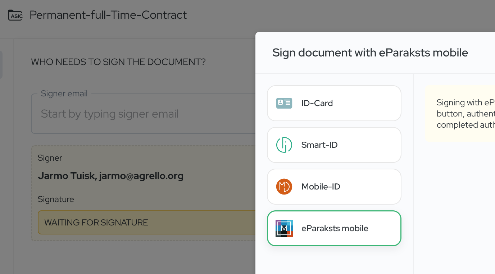
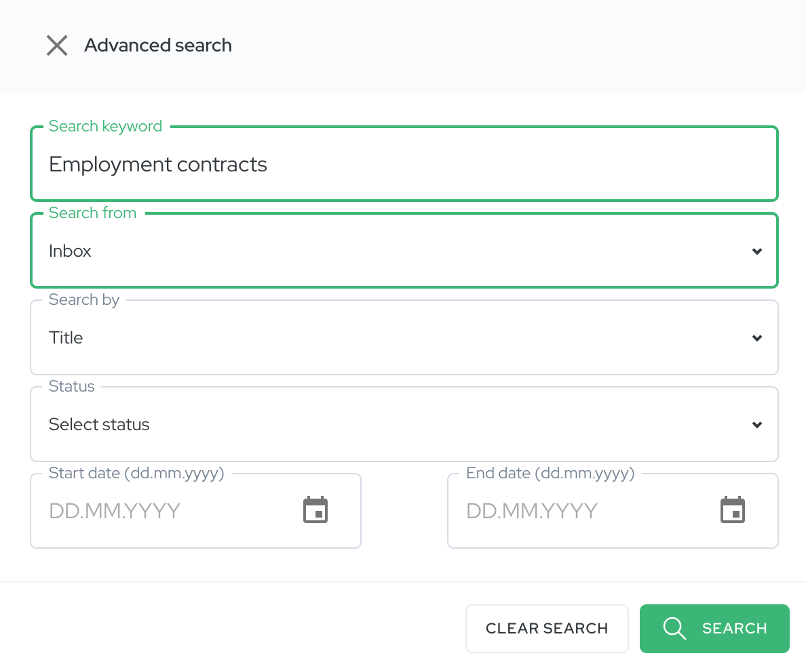

First, we've integrated support for Latvia's qualified electronic signature, [**eParaksts**](https://www.eparaksts.lv/). Second, we've revamped our document search functionality, allowing you to search contracts by parties involved, status, and creation dates. Let's dive deeper into what these updates mean for you.

## **Support for Latvia's eParaksts: Expanding Our Qualified E-Signature Support**

### **What is eParaksts?**

eParaksts is Latvia's nationally recognized qualified electronic signature, provided by the Latvian State Radio and Television Centre (LVRTC). It serves as a secure and legally binding method for individuals and businesses in Latvia to sign documents electronically. Just like handwritten signatures, qualified electronic signatures are legally recognized across the European Union, thanks to the eIDAS Regulation.

### **Why is This Integration Important?**

By adding support for eParaksts, Agrello continues to strengthen its commitment to providing secure and legally compliant e-signature solutions across Europe. This integration means that Latvian users can now:

- **Sign documents with legal certainty**: Use eParaksts within Agrello to sign contracts, agreements, and other important documents, ensuring they are [legally binding under EU law](https://www.agrello.io/post/what-should-you-know-about-eidas-when-e-signing-eu-business-contracts).
- **Streamline cross-border transactions**: Collaborate with international partners seamlessly, as qualified electronic signatures are recognized across EU member states.
- **Use local and familiar e-signing method**: eParaksts is well-known and widely used e-signing method in Latvia.

Sign documents with eParaksts mobile

## **Enhanced Document Search: Find What You Need, When You Need It**

As your digital documents grow in number, finding specific contracts or agreements can become a time-consuming task. We understand that efficiency is key, which is why we've overhauled our document search capabilities.

### **What's New in Agrello Search?**

You can now search for documents based on contract parties, status, and creation dates. This means you can find all documents associated with a particular individual or organization, filter documents by their current status—whether they're pending, signed, or awaiting action—and locate documents created within a specific time frame.

### **How Does It Improve Your Experience?**

The enhanced search functionality saves you time by allowing you to quickly locate the documents you need without sifting through multiple folders or files. It helps you stay organized by keeping track of your ongoing and completed agreements with ease. By spending less time searching, you can enhance productivity and focus on tasks that matter.

### **Practical Examples**

For instance, during audit preparation, you can easily gather all contracts signed within the last fiscal year. In client management, you can retrieve all agreements associated with a specific client to review terms or prepare for meetings. For workflow monitoring, you can check the status of pending documents to follow up with parties who haven't signed yet.

\*\*\*

These updates reflect our dedication to continuously improving Agrello's e-signing platform to meet our customers’ evolving needs. By integrating Latvia's eParaksts, we're empowering our Latvian users with a tool that's trusted, secure, and legally robust. The enhanced document search functionality is designed to help you stay organized and efficient in managing your digital documents.

## **Try Out the New Features Today**

We invite you to explore these new features and see how they can benefit your workflow. Log in to your Agrello account to start using eParaksts for your electronic signatures and experience the improved document search functionality firsthand.

Simply log into [https://docs.agrello.io/](https://docs.agrello.io/) and test the new features out.

## **We Value Your Feedback**

Your insights are invaluable to us. Let us know how these updates are impacting your experience, and share any suggestions you may have for future improvements. Simply email us at [support@agrello.org](mailto:support@agrello.org) and we’ll get back at you in no time.

At Agrello, we're more than just a service provider—we're your partner in navigating the digital landscape of document management and electronic signatures. Stay tuned for more updates as we continue to innovate and enhance our platform for you.

‍
