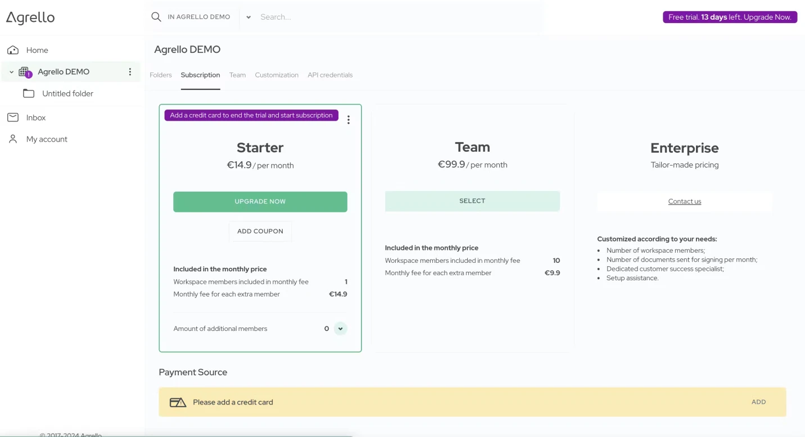

## Konta izveide

Agrello konta izveide ir vienkārša un ātra. Lūk, kā sākt:

1.  Apmeklējiet mūsu mājaslapu un noklikšķiniet uz zilās pogas **"Sākt darbu" vai "Pieteikties"** augšējā labajā stūrī.
2.  Vai arī dodieties tieši uz [https://docs.agrello.io](https://docs.agrello.io), lai atvērtu mūsu lietotni.
3.  Sekojiet norādēm ekrānā, lai reģistrētu savu kontu.

‍

Jums ir trīs iespējas izveidot kontu:

- Izmantot Google kontu
- Izmantot Microsoft kontu
- Saņemt vienreizēju pieteikšanās kodu uz e-pastu

##

Kā darbojas vienreizējie pieteikšanās kodi?

Ja izvēlaties vienreizējā pieteikšanās koda opciju:

1.  Ievadiet savu e-pasta adresi
2.  Saņemsiet e-pastu no mums ar **tēmu "Agrello: Apstipriniet savu e-pastu"**
3.  Iekopējiet kodu no e-pasta Agrello tīmekļa lietotnes ievades laukā
4.  Ievadiet savus kontaktdatus, kad tas tiek pieprasīts

Kad būsiet izpildījuši šos soļus, mūsu sistēma automātiski izveidos jums darba telpu, iestatīs pirmo mapi un aktivizēs izmēģinājuma abonementu.

## Pirmās darba telpas izveide

Jauna darba telpa tiks izveidota, balstoties uz jūsu norādīto uzņēmuma nosaukumu. Jūs tiksiet noteikts kā šīs darba telpas īpašnieks.

## Pirmās mapes izveide

Mēs automātiski izveidosim pirmo mapi, ļaujot jums nekavējoties sākt augšupielādēt dokumentus parakstīšanai.  
‍

‍

‍

## Izmēģinājuma perioda sākšana

Pēc konta izveides mēs aktivizēsim jums 14 dienu bezmaksas izmēģinājuma periodu. Šajā laikā varat bez maksas veidot un parakstīt dokumentus, kā arī izpētīt mūsu sistēmas iespējas. Kredītkarte nav nepieciešama, lai izmēģinātu Agrello.

‍

‍

## Izmēģinājuma perioda beigšana un abonementa sākšana

Lai beigtu izmēģinājuma periodu un sāktu abonementu:

1.  Dodieties uz Abonementa ekrānu:
2.  - Noklikšķinot uz izmēģinājuma joslas blakus jūsu vārdam augšējā rīkjoslā, vai
    - Noklikšķinot uz jūsu darba telpas nosaukuma kreisajā navigācijas panelī un izvēloties Abonements
3.  Abonementa ekrānā noklikšķiniet uz "Uzlabot tagad"
4.  Ievadiet savas kredītkartes datus, lai aktivizētu abonementu

Kad būsiet veiksmīgi ievadījis kredītkartes informāciju, mēs iekasēsim maksu par pirmo abonementa mēnesi.

‍

‍

## Kas notiek, kad izmēģinājuma periods beidzas automātiski?

Ja neesat pievienojis kredītkarti, jūsu izmēģinājuma periods automātiski beigsies pēc 14 dienām. Mēs droši glabāsim jūsu dokumentus 12 mēnešu periodā, un jūs varat aktivizēt abonementu jebkurā laikā, izpildot iepriekš minētos soļus, lai pievienotu derīgu kredītkarti.

## Kā priekšlaicīgi pārtraukt izmēģinājuma periodu un dzēst kontu

Ja vēlaties priekšlaicīgi beigt izmēģinājuma periodu un dzēst savu kontu:

1.  Dodieties uz Mans Konts ekrānu
2.  Noklikšķiniet uz pogas "Dzēst kontu"

‍
