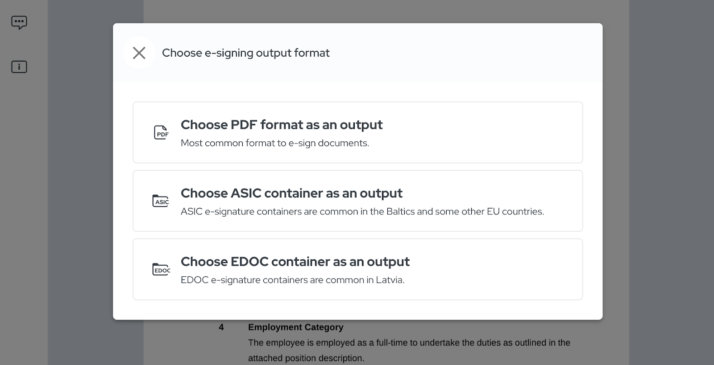
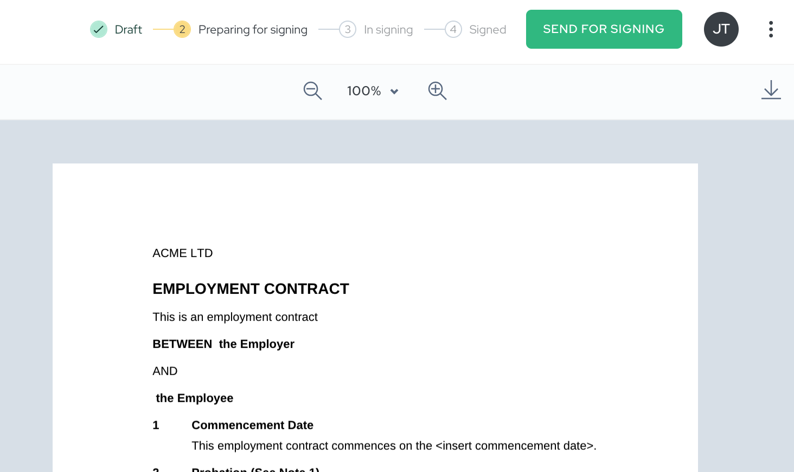

## Kāpēc EDOC ir svarīgs Latvijas lietotājiem

EDOC (Elektroniski sertificēta dokumenta) formāts ir Latvijas uzticamais standarts drošiem e-parakstiem, un tā pamatā ir Eiropas ASiC (Associated Signature Containers) struktūra. Būtībā EDOC ir specializēta [ASiC](https://www.agrello.io/post/pdf-and-asic-document-output-types) ieviešana, kas izstrādāta, lai atbilstu Latvijas juridiskajiem un regulatīvajiem standartiem dokumentu autentifikācijai un ilgtermiņa validācijai. Integrējot EDOC Agrello piedāvājumos, mēs dodam iespēju mūsu lietotājiem ar pārliecību mijiedarboties ar Latvijas iestādēm, nodrošinot, ka viņu dokumenti atbilst stingrajām atbilstības prasībām oficiāliem iesniegumiem un darījumiem.

Lūk, kā tas darbojas: EDOC formāts izmanto ASiC-E, konteinera modeli gan datu, gan digitālā paraksta glabāšanai vienā drošā paketē. Šajā struktūrā EDOC faili izmanto XAdES (XML Advanced Electronic Signatures), uzlabotu XML balstītu paraksta standartu, kas nodrošina uzlabotas drošības funkcijas, piemēram, ilgtermiņa validāciju ar kvalificētiem laika zīmogiem un Sertifikātu atsaukšanas sarakstiem (CRL). Šī sistēma nodrošina, ka katrs EDOC dokuments saglabā savu derīgumu laika gaitā, saglabājot paraksta integritāti un atbilstību normatīvajiem aktiem.

Pieņemot EDOC, Agrello lietotāji iegūst piekļuvi spēcīgam risinājumam, kas nevainojami atbilst Latvijas e-paraksta prasībām, ļaujot viņiem parakstīt, iesniegt un pārvaldīt dokumentus valdības, uzņēmējdarbības un personīgai lietošanai ar pilnīgu miera sajūtu.

## Kā EDOC integrācija uzlabo Agrello piedāvājumus

Ar EDOC iekļaušanu Agrello tagad piedāvā atbalstu [PDF](https://www.agrello.io/post/secure-your-pdf-documents-with-pades-signatures), [ASIC](https://www.agrello.io/digital-signing/what-is-asic-container-and-xades-signature) un EDOC formātiem, sniedzot lietotājiem plašu izvēli, lai izpildītu savas dokumentu parakstīšanas prasības. Šī vairāku formātu iespēja ne tikai nodrošina lielāku elastību, bet arī nostiprina Agrello apņemšanos ievērot Eiropas [eIDAS](https://www.agrello.io/post/what-level-signatures-can-you-give-on-agrello-platform) (Elektroniskās identifikācijas, autentifikācijas un uzticamības pakalpojumu) standartus.

EDOC formāts ir īpaši piemērots oficiālai dokumentācijai, ņemot vērā tā robusto struktūru un papildu funkcijas ilgtermiņa validācijai. Pielāgojoties EDOC stingrajiem standartiem, Agrello piedāvā lietotājiem iespēju droši glabāt un pārsūtīt dokumentus ar uzlabotu aizsardzību, kas pārsniedz tipiskās e-paraksta prasības. Tas ietver kvalificētus laika zīmogus un strukturētas sertifikātu validācijas, kas ir būtiskas dokumentu autentiskuma saglabāšanai ilgākā laika periodā.

Īsumā sakot, mūsu EDOC atbalsts sniedz lielāku pārliecību lietotājiem dažādās nozarēs, sākot no valdības struktūrām, kurām nepieciešams apstrādāt oficiālos dokumentus, līdz uzņēmumiem un privātpersonām, kas meklē drošas, atbilstošas digitālās parakstīšanas iespējas. Ar Agrello paplašinātajām formātu iespējām lietotāji var pārliecinoši pārvaldīt visu veidu dokumentus, zinot, ka tos atbalsta jaunākās drošas parakstīšanas tehnoloģijas.

## Praktiski EDOC lietošanas gadījumi

Agrello atbalsts EDOC formātam paver plašu praktisko pielietojumu klāstu, atvieglojot lietotājiem dokumentu darbplūsmu pārvaldību dažādās nozarēs:

- **Valsts pakalpojumi**: Tiem, kam nepieciešams iesniegt oficiālus dokumentus Latvijas valsts vai pašvaldību iestādēm, EDOC atbalsts nodrošina nevainojamu saderību ar valdības prasībām. Neatkarīgi no tā, vai tas ir pieteikumu iesniegšana, regulatīvo dokumentu iesniegšana vai saziņa ar valsts iestādēm, lietotāji var paļauties uz EDOC, lai izpildītu nepieciešamos standartus drošai digitālai iesniegšanai.
- **Biznesa darījumi**: Korporatīvajā pasaulē drošība un atbilstība ir būtiska, īpaši strādājot ar līgumiem, vienošanām vai konfidenciālu dokumentāciju. EDOC papildu validācijas un laika zīmogošanas slāņi nozīmē, ka uzņēmumi var pārliecinoši apstrādāt līgumus, nodrošināt to saturu un saglabāt atbilstību ES noteikumiem. Šis formāts ir īpaši vērtīgs uzņēmumiem, kas vēlas noslēgt juridiski saistošas vienošanās bez nepieciešamības pēc klātienes parakstiem.
- **Personīgā lietošana**: Privātpersonām, kurām nepieciešams parakstīt personiskos pieteikumus, veidlapas vai citus oficiālus dokumentus, EDOC nodrošina vienkāršu un juridiski atbilstošu veidu, kā elektroniski parakstīt dokumentus. Ar Agrello platformu lietotāji var viegli izvēlēties EDOC formātu un pabeigt savus parakstīšanas uzdevumus ar dažiem klikšķiem, padarot ikdienas procesus ērtākus.

Pielāgojoties šiem konkrētajiem lietošanas gadījumiem, Agrello EDOC atbalsts apmierina plašas lietotāju bāzes vajadzības, padarot drošu un atbilstošu digitālo parakstīšanu pieejamu visiem.

## Darba sākšana ar EDOC Agrello platformā

EDOC izmantošana Agrello ir veidota tā, lai būtu vienkārša, ļaujot jums droši sagatavot un nosūtīt dokumentus parakstīšanai tikai dažos soļos:

### **Augšupielādējiet savu dokumentu**‍

Sāciet, augšupielādējot failu, ko vēlaties nosūtīt parakstīšanai. Agrello atbalsta dažādus dokumentu veidus, tāpēc varat sākt ar praktiski jebkuru faila formātu.

‍

### **Sagatavojiet parakstīšanai**

Pēc melnraksta pārskatīšanas noklikšķiniet uz zaļās pogas **Sagatavot parakstīšanai** augšējā labajā stūrī. Pēc tam jūs redzēsiet iespēju izvēlēties vēlamo izvades formātu — PDF, ASIC vai EDOC. Izvēlieties **EDOC**, lai izveidotu dokumentu, kas atbilst Latvijas elektroniskā paraksta standartiem.

‍

### **Pievienojiet parakstītājus un nosūtiet**

Kad izvades formāts ir izvēlēts, ievadiet parakstītāju e-pasta adreses, pēc tam noklikšķiniet uz **Nosūtīt parakstīšanai**. Agrello parūpēsies par pārējo, nodrošinot, ka jūsu dokuments tiek droši piegādāts katram parakstītājam.

Tiem, kas strādā ar veidnēm vai automatizē dokumentu darbplūsmas, EDOC ir pilnībā atbalstīts, veidojot dokumentus no veidnēm vai izmantojot Agrello publisko API. Tas atvieglo EDOC iekļaušanu gan standarta, gan pielāgotās parakstīšanas procesos, nodrošinot vēl lielāku elastību lietotājiem, kas pārvalda lielu dokumentu apjomu.

## Secinājums

Agrello atbalsts Latvijas EDOC formātam iezīmē vēl vienu soli uz priekšu mūsu misijā padarīt drošu, atbilstošu digitālo parakstīšanu pieejamu ikvienam. Neatkarīgi no tā, vai jūs strādājat ar valdības dokumentiem, biznesa līgumiem vai personīgiem pieteikumiem, EDOC piedāvā ilgtermiņa validācijas un atbilstības Latvijas e-paraksta standartiem garantiju. Ar EDOC pievienošanu mūsu esošajām PDF un ASIC opcijām Agrello nodrošina elastīgu, spēcīgu platformu, kas atbilst mūsu lietotāju dažādajām vajadzībām.

Vai esat gatavi vienkāršot savu dokumentu parakstīšanu ar EDOC? Izpētiet jauno formātu un piedzīvojiet racionālāku, drošāku veidu, kā pārvaldīt savus dokumentus ar Agrello.

‍

Apmeklējiet [https://docs.agrello.io](https://docs.agrello.io), lai sāktu bez maksas!
