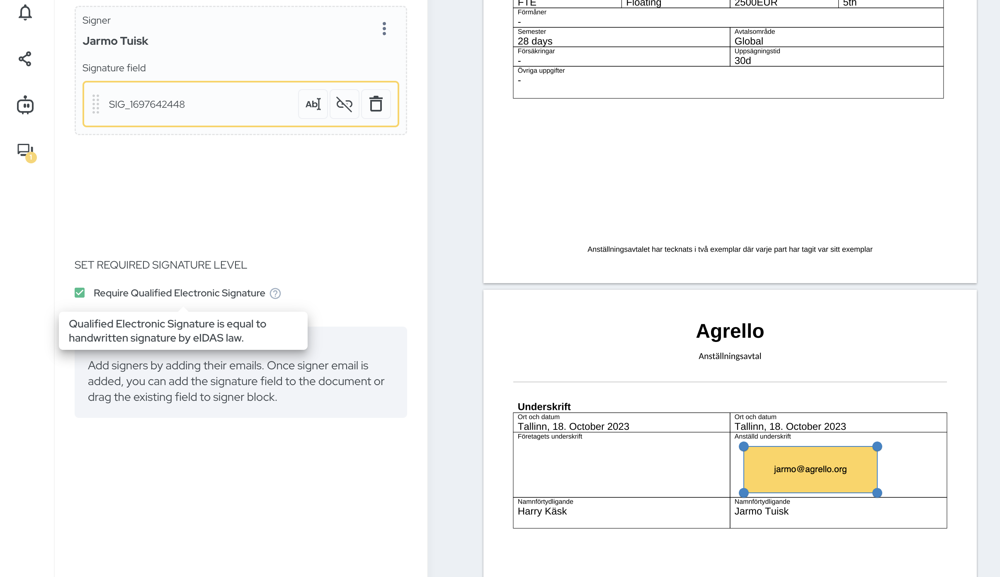

Mūsu jaunais atjauninājums nostiprina mūsu apņemšanos piedāvāt drošas parakstīšanas metodes un lietotājiem draudzīgus rīkus. Mēs ar prieku atklājam jaunākās funkcijas, ko esam pievienojuši Agrello platformai. Tās ir:

- Zviedrijas BankID parakstīšana
- Dokumentu komentāri
- Obligātā QES pārslēgšana
- Jaunas dokumentu darbības

Iedziļināsimies sīkāk!

##

## 1\. Atbalsts Zviedrijas BankID parakstīšanai

Mēs esam pievienojuši jaunu parakstīšanas metodi: Zviedrijas BankID.

BankID, kas atzīts par uzticamāko identitātes nodrošinātāju Zviedrijā, garantē, ka jūsu e-paraksti ir ne tikai juridiski saistoši, bet arī nodrošināti ar visaugstākajiem standartiem.

Drošība un lietošanas ērtums ir divi galvenie Agrello pīlāri. Ar atbalsta ieviešanu Zviedrijas BankID mēs nostiprinām abus.

Neatkarīgi no tā, vai esat uzņēmums Zviedrijā vai sadarbojaties ar Zviedrijas partneriem, šī integrācija piedāvā papildu uzticamības un ērtību līmeni.

‍

[YouTube Video](https://www.youtube.com/watch?v=rA14yu8_wlY)

‍

## 2\. Dokumentu komentāru ieviešana

Ar jauno dokumentu komentēšanas funkciju Agrello optimizē jūsu pārskatīšanas procesu. Tagad jūs varat viegli uzaicināt savu līguma partneri izskatīt un komentēt līgumu pat pirms parakstīšanas procesa uzsākšanas.

Kas vēl? Mūsu iebūvētais Word dokumentu redaktors ļauj veikt izmaiņas reālajā laikā, nodrošinot, ka jums ir sagatavots pilnveidots līgums, kas gatavs parakstīšanai.

## 3\. Drošības uzsvēršana ar obligāto kvalificēto elektronisko parakstu (QES)

Ir situācijas, kad tiesiskais regulējums pieprasa kvalificēto elektronisko parakstu izmantošanu. Saglabājot atbilstību un drošību kā galveno principu, Agrello tagad ļauj norādīt, ka dokumentu drīkst parakstīt tikai ar QES. Tas nodrošina ne tikai parakstītāja autentiskumu, bet arī dokumenta integritāti, atbilstot augstākajiem juridiskajiem standartiem.

## 4\. Uzlabota dokumentu pārvaldība ar jaunām darbībām

Mēs esam ieviesuši arī trīs jaunas ar dokumentiem saistītas darbības:

- **Lejupielādēt oriģinālo failu:** Iegūstiet oriģinālo failu, ko izmantojāt līguma izveidei. Neatkarīgi no tā, vai tas ir Word fails vai jebkurš cits formāts, jūs varat viegli tam piekļūt turpmākai atsaucei vai jaunu līgumu izstrādei.
- **Izveidot kopiju:** Nepieciešams dublēt esošu dokumentu? Ar vienu klikšķi jūs tagad varat izveidot kopiju un paātrināt jauna līguma izstrādes procesu, balstoties uz esošo saturu.
- **Izveidot veidni:** Efektivitāte iegūst jaunu nozīmi ar šo funkciju. Pārveidojiet jebkuru dokumentu par veidni un izmantojiet to atkārtoti, lai ietaupītu laiku un nodrošinātu konsekvenci visos jūsu līgumos.

Mūsu mērķis ir padarīt līgumu izveidi un pārvaldību pēc iespējas vienkāršāku. Ar šīm jaunākajām funkcijām mēs ceram padarīt līgumu pārvaldību vienkāršāku, drošāku un vairāk sadarbību veicinošu.

Mēs vienmēr esam ieinteresēti atsauksmēs, tāpēc lūdzu, informējiet mūs, kā šie atjauninājumi uzlabo jūsu Agrello pieredzi. Lai veicas ar gudrāku un drošāku līgumu pārvaldību!

‍
