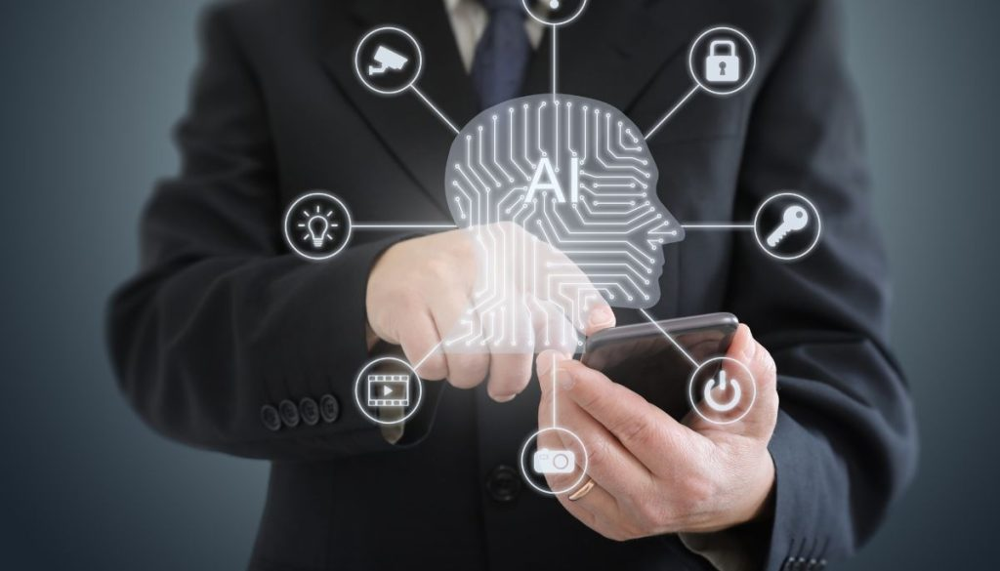

In fact, over 70% of organizations worldwide have implemented AI-driven tools in some form, with virtual assistants ranking among the top three most deployed solutions​. These intelligent assistants streamline workflows and reduce human error, which translates to big gains in productivity and cost savings.

Amid this AI adoption wave, one question stands out: _How do core business processes like signing contracts keep up?_ E-signatures have already replaced pen-and-paper signing in many companies, especially after a global shift to remote work. But as AI agents take over more steps of document handling and approval, where does **electronic signing (e-signing)** fit into this evolving landscape? The following sections explore the rise of AI agents in office automation and dive into how e-signing becomes the cornerstone of an end-to-end automated workflow in the AI-driven office.

## **1\. The Rise of AI Agents in Office Automation**

AI “agents” and virtual assistants refer to software powered by AI that can perform tasks traditionally done by humans. These range from simple bots that automate repetitive actions to advanced digital assistants that understand natural language and make decisions. They’ve become digital team members in modern offices. For example, businesses now use AI assistants to schedule meetings, manage emails, and organize documents through voice or text commands​ ([loman.ai](https://www.loman.ai/blog/ai-generated-secretary#:~:text=An%20AI%20Generated%20Secretary%2C%20also,and%20respond%20to%20user%20requests), [softwareoasis.com](https://softwareoasis.com/ai-powered-virtual-assistants-in-the-workplace/#:~:text=AI,meetings%20to%20managing%20complex%20workflows)). Some organizations even experiment with AI handling first-level customer inquiries or generating routine reports, essentially acting as an AI-generated secretary​

Common applications of AI agents in offices include **document management**, **contract negotiation support**, and **approval workflows**. On the document front, AI can sort and file documents, extract key information, and even draft initial versions of documents using predefined templates. In contract negotiations, AI tools can compare versions, suggest clause changes, or highlight discrepancies, speeding up the review process. 

For approvals, AI-driven workflow tools route documents to the right people and send reminders, ensuring nothing falls through the cracks. Companies benefit greatly from these capabilities: tedious processes get faster and more accurate, and employees spend less time chasing paperwork. For instance, AI document automation has been shown to speed up processes and reduce errors associated with manual handling​ ([restack.io](https://www.restack.io/p/ai-for-business-process-automation-answer-ai-tools-office-task-automation-cat-ai#:~:text=One%20of%20the%20most%20impactful,errors%20associated%20with%20manual%20handling)). 

By delegating mundane tasks to reliable AI assistants, businesses can operate more efficiently, cut down on human errors, and often save costs by shortening project timelines.

**_AI-powered virtual assistants are increasingly handling routine office tasks – from scheduling meetings to managing documents – ushering in a new era of office automation. These intelligent AI agents can operate around the clock, streamlining workflows and reducing the burden of repetitive tasks on employees._**

‍

## **2\. How AI is Transforming Contract Management and Document Approval**

One area seeing dramatic AI-driven improvement is **contract management** and the document approval process. Traditionally, shepherding a contract from draft to final sign-off involves many labor-intensive steps and frequent bottlenecks. 

Consider the typical contract lifecycle: a contract is drafted, reviewed by multiple parties, revised through negotiations, approved internally, then signed and archived. In a manual workflow, each stage can stall—documents sit in email inboxes waiting for approval, or busy managers overlook an urgent signature request. 

Common bottlenecks in traditional approval processes include manual document routing (passing paperwork by email or hand, which is slow and error-prone) and unclear approval criteria that lead to back-and-forth revisions​ ([wrike.com](https://www.wrike.com/blog/streamlining-document-approval-workflow/#:~:text=,and%20complicate%20the%20approval%20process)). 

Hierarchical delays are also an issue; if a key approver is unavailable, the whole process halts​. These pain points not only slow business down but also increase the chance of missed obligations and errors.

AI is stepping in to streamline each phase of this process. Modern AI-driven contract management systems can _automate the contract lifecycle from drafting to approval_. 

For example, AI tools now assist in **contract drafting** by generating first drafts from templates and auto-filling key details like dates, names, and clauses based on context​ ([tnp.legal](https://tnp.legal/blogs/how-to-use-generative-ai-for-contract-drafting-reviewing-and-management/#:~:text=,suggestions%C2%A0based%20on%20legal%20best%20practices)). During **review**, AI algorithms analyze the text to flag risky clauses or ensure compliance with company policies, acting like a diligent junior lawyer scanning for issues​ ([legittai.com](https://legittai.com/blog/ai-in-contract-lifecycle-management#:~:text=2)). 

When it comes to **approvals**, AI can optimize the workflow by intelligently routing the contract to the correct stakeholders in the proper sequence and sending notifications or reminders automatically​. This means the right people get the document at the right time, without someone manually chasing approvals. 

### Example of AI agentic workflow

**One example workflow might look like this:**

- **Automated drafting:** The AI populates a contract template with relevant data, ensuring consistency and reducing manual errors.
- **AI review:** Key terms and any deviations from standards are highlighted by the AI for a legal team to quickly assess​. The AI might flag missing signatures or unusual terms (like an expiration date or payment term that isn’t standard).
- **Auto-routing for approval:** Once ready, the contract is automatically sent to managers or clients who need to approve, according to rules set by the organization. No more “who do I send this to next?” confusion – the AI knows the chain of approval.
- **Reminders and tracking:** If an approver delays, the system sends polite reminders and can even escalate to an alternate approver if needed to avoid stalling​. Everyone can see where the document stands in a dashboard, adding transparency.
- **Archiving and analysis:** After signing, the contract is stored in a digital repository, and AI indexes its key metadata (parties, dates, obligations) for easy retrieval and analysis later.

By automating these stages, AI-driven contract systems eliminate many traditional delays. A recent guide on enterprise document automation illustrates this clearly: AI can draft and populate contracts with accurate data, flag important clauses for review, track all version changes, and automatically route the contract to stakeholders for approval with deadline reminders – finally even formatting it and sending for signature digitally​. 

The result is a **streamlined contract lifecycle** that moves in days or hours instead of weeks. Businesses report significantly reduced review times and fewer errors when these AI tools take over routine checks. In short, AI is turning contract management from a notorious bottleneck into a faster, smoother operation.

## **3\. E-Signing as the Cornerstone of Automated Document Workflows**

Amid all this automation, **e-signing** plays a pivotal role: it is the keystone that completes a fully digital workflow. Imagine automating a contract’s creation, review, and approval only to have to print it out for a pen-and-ink signature – it would break the chain and kill the efficiency gains. That’s why electronic signatures are crucial; they enable agreements to be finalized seamlessly within digital systems.

In fact, e-signatures have become practically standard in modern business. In a 2021 study, 95% of organizations reported either already using e-signature or planning to do so, underscoring that digital signing is now an expected, essential part of the contract process​. E-signing technology has _exploded_ in use and is ubiquitous across industries​, ensuring that automated workflows don’t hit a paper-based roadblock at the very end.

But e-signatures aren’t just about convenience; they carry legal and security weight that is vital in automated processes. A well-implemented e-signature solution provides secure, **legally compliant, and traceable** signing of documents. Thanks to laws like the ESIGN Act in the U.S. and the eIDAS regulation in the EU, e-signatures are legally recognized and enforceable in most business and personal transactions​ ([agrello.io](https://www.agrello.io/post/simplifying-document-signing-processes-the-magic-of-e-signatures#:~:text=early%202000s,valid%20as%20the%20inked%20version)). 

This means a contract signed electronically holds the same validity as one signed with pen on paper, as long as the e-signing process meets the established standards. Leading platforms ensure each signature is accompanied by an audit trail – a detailed log of who signed and when, plus cryptographic evidence that the document wasn’t altered afterward​. Such audit trails and encryption techniques make digital signatures **secure and verifiable**, giving confidence that an automated workflow still produces a trustworthy, binding agreement.

E-signing thus becomes the **cornerstone** of automated document workflows by closing the loop. It enables the final approval (the signature) to happen instantly and remotely, often with just a click or a biometric check, without ever exiting the digital realm. For example, consider an AI-driven contract management system in action: it might automatically prepare a contract and gather all necessary internal approvals; then, as a last step, trigger an e-signature request to the client. The client gets an email, signs electronically on their phone or computer, and the deal is done within minutes. 

The entire process—from drafting to the final signature—is handled in one integrated flow. One case study described an AI contract workflow that, after internal approvals, **automatically formatted the document and sent it for e-signature** to the external party, with the signed copy then archived without manual intervention​. This kind of integration shows how e-signing serves as the linchpin, ensuring that no efficiency is lost at the finish line of a fully automated process.

Moreover, the importance of secure digital signing grows as more steps are handled by AI. Businesses need to trust that the documents AI agents handle are properly authorized. By using robust e-signature solutions that include identity verification and tamper-proof seals, every contract or approval coming out of an AI-managed workflow is just as secure and compliant (if not more so) than a traditional process. In summary, e-signing enables the **completion of digital workflows with confidence**, making it truly the cornerstone that supports the whole structure of AI-driven office automation.

## **4\. Integrating AI agents  with E-Signing: Opportunities and Advantages**

When AI agents meet e-signing, the combination unlocks new levels of efficiency and intelligence in document workflows. Integrating AI agents capabilities with e-signature platforms offers many opportunities to enhance how documents are executed and managed. Already, we see **AI-powered features** improving the e-signing experience in various ways:

- **Intelligent reminders and follow-ups:** AI can ensure that signatories never miss a beat. The software can analyze signing patterns and send automated reminders at optimal times or escalate to an alternate approver if a deadline is looming. For instance, an AI-driven system might notice that a manager typically signs documents on Friday afternoons and adjust its reminders accordingly, or it might send a second alert if a signature is overdue by a day. This kind of smart nudging keeps workflows on schedule. In practice, AI solutions like Legitt AI do exactly this – they send automated reminders to approvers and even escalate stalled approvals, keeping the signing process on track​. Such proactive workflow management ensures documents don’t languish awaiting signatures.
- **Automatic routing and prioritization:** AI can automatically route documents to the correct person in the correct order, based on context like content or urgency. Traditional e-signature setups let you pre-define a signing order; AI takes it further by dynamically determining the route. Suppose a contract’s value exceeds a certain amount – an AI-enabled system might add a CFO as an additional signer per company policy, without anyone manually intervening. This **intelligent routing** accelerates approvals by getting the document in front of the right eyes at the right time​. It also reduces human error (like accidentally skipping a required approver), since the AI follows rules and learned patterns to include all necessary parties.
- **Predictive signing schedules and analytics:** With enough data on past signings, AI can forecast how long a new document will take to get signed and identify potential bottlenecks before they happen. It might predict that a contract sent to a particular client usually takes a week to turn around, and proactively suggest sending it a bit earlier or with a higher priority flag. Advanced platforms are starting to offer **predictive analytics** that estimate approval timelines and even suggest optimal times or methods to request signatures​. These predictions help managers intervene early if something is likely to stall, or allocate resources if a critical deal’s signing might be delayed. AI analytics can also provide real-time monitoring dashboards that show exactly where each document is in the signing pipeline. This kind of transparency, with AI highlighting if (for example) “Document X has been with the Sales VP for 5 days, which is longer than usual,” allows teams to tackle issues before they impact business. One AI solution provides real-time tracking of contract status from drafting through approvals, with detailed insight into any bottlenecks or delays in the process​.
- **Enhanced decision-making and workflow optimization:** As AI observes more signing workflows, it can learn and recommend improvements. It might notice, for example, that adding a particular person early in the CC list speeds up final approval, or that contracts of type Y get signed faster if a certain clause is included. Over time, the AI could suggest workflow tweaks or template changes to optimize the entire signing process. Additionally, AI can integrate external data – for instance, pulling in a signer’s availability from their calendar to propose the best moment to request a signature.

All these enhancements lead to concrete advantages. The obvious benefit is **speed** – documents get signed faster when reminders are timely and the routing is automatic. Organizations can shorten contract turnaround times, which means deals close sooner and projects start without delay. There’s also a gain in **visibility and control**. With AI tracking every step, managers have a real-time window into the signing pipeline and can make data-driven decisions to improve it. 

Efficiency is improved not just by moving faster, but by **reducing the administrative workload** on staff; they no longer need to play traffic cop for documents or spend time chasing signatures. The process becomes more _predictable_ as well – fewer surprises like “we didn’t realize John was on vacation, so the document sat unsigned for a week” because the AI would have escalated or rerouted it. Indeed, by monitoring the workflow continuously, AI can catch and resolve issues before they escalate, ensuring a smoother experience for all parties involved.

_AI integration brings a new level of intelligence to e-signing workflows. For example, AI analytics can monitor signing processes in real-time, providing dashboards and insights (as illustrated by the digital interface above) that help identify bottlenecks and optimize efficiency​. By learning from past signing data, AI can predict potential delays and suggest the best times to send documents for signature, leading to more proactive and streamlined management of contract workflows._

Looking ahead, even more exciting developments are on the horizon for AI-enhanced e-signing. **AI-driven identity verification** is one area seeing rapid progress. Instead of relying on a simple email confirmation or a manual ID check, AI can verify a signer’s identity using biometric methods or intelligent risk analysis. For instance, an AI system may use facial recognition or fingerprint scanning on a smartphone to confirm a signer’s identity before allowing them to sign, adding an extra layer of security with minimal friction​. 

We may also see **smart contracts** (self-executing agreements on blockchain) integrating with AI and e-signatures. In such a scenario, an agreement could automatically trigger certain actions once signed – for example, releasing a payment or updating a database – all verified via blockchain. 

Combining e-signatures with blockchain technology already enhances the immutability and transparency of signed documents, creating a tamper-proof audit trail​. In the near future, AI could help bridge traditional contracts with smart contracts, handling the complex logic and data exchange required to execute terms automatically. 

Additionally, AI will likely provide **advanced analytics** on signed documents: imagine being able to query an AI, “Show me all signed sales contracts that have a termination clause with less than 30 days notice,” and getting results instantly because the AI has indexed and understood every document. Such capabilities would turn signed archives into live, queryable databases of knowledge.

In sum, integrating AI with e-signing offers a smarter, faster, and more secure way to handle approvals. It enhances everything from how we remind and authenticate signers to how we analyze and learn from the signing process itself. Businesses that leverage these AI-driven enhancements can expect not only quicker turnaround on agreements but also a more resilient and optimized workflow that practically manages itself.

## **5\. Addressing Challenges and Building Trust**

While the fusion of AI agents and e-signing technology brings clear advantages, it also raises important considerations around security, privacy, and compliance. To fully embrace AI in office automation, organizations must trust the technology – and that trust is earned by addressing these challenges head-on.

**Data Security:** 

One concern is ensuring that sensitive documents and signatures remain secure in an AI-driven process. After all, contracts often contain confidential information, and digital signatures must be protected against forgery or tampering. Leading e-signing solutions recognize this and use robust security technologies to safeguard documents. This includes strong end-to-end encryption (so that documents in transit and at rest cannot be read or altered by unauthorized parties) and secure storage practices. Many platforms also implement **multi-factor authentication** and identity verification steps, like one-time passcodes or biometric checks, before allowing a signature. These measures prevent unauthorized signing and ensure the person e-signing is indeed who they claim to be. In AI-integrated systems, AI itself can assist in fraud detection – for example, by flagging unusual signing requests or detecting if a signature’s timing or location is suspicious compared to typical behavior​. Additionally, emerging integrations with blockchain, as mentioned, provide a tamper-proof ledger for signed documents. A blockchain-based e-sign record means once a document is signed, the signature record cannot be altered without detection, adding an extra layer of security and auditability​. By leveraging these technologies, modern e-sign platforms make sure that even as AI automates the process, the **security is ironclad** – often more so than traditional paper methods (which can be lost, stolen, or forged).

**Privacy:** 

With AI handling documents, companies must ensure that data is used responsibly and in compliance with privacy regulations. Contracts can contain personal data, so any AI analysis or storage has to respect laws like GDPR. Trustworthy AI systems in contract management are designed to limit access to data based on user roles and to anonymize or protect personal information when analyzing large sets of documents. Reputable e-signing services undergo regular security audits and maintain certifications (such as ISO 27001, SOC 2, or similar) to demonstrate their commitment to data protection. They also typically provide transparency to clients about where data is stored (for example, using regional data centers to comply with data residency laws) and how it’s processed. Building user trust also involves giving users control – for instance, allowing an organization to opt out of certain AI features if they prefer that some sensitive documents not be used even for AI training or pattern recognition. Leading solutions address privacy by design, meaning privacy considerations are baked into the product’s architecture and processes.

**Compliance and Legal Validity:** 

Companies rightly ask: are AI-assisted e-signatures compliant with the law and industry regulations? The answer is yes – top e-signing providers ensure their tools meet the strict requirements of laws worldwide. This includes adhering to eIDAS standards in the EU, the ESIGN/UETA acts in the US, and other local electronic transaction laws. Compliance also extends to industry-specific rules (like HIPAA for healthcare, or FINRA for finance) when documents involve those fields. AI doesn’t change the legal fundamentals; it augments the process while following the established frameworks. In fact, AI-powered e-signatures today **comply with global regulatory standards, making them legally binding in most jurisdictions​**. 

Organizations can be confident that an agreement executed via an AI-driven workflow has the same legal force as one signed traditionally – provided they use a compliant platform. To build trust, e-sign vendors often provide detailed evidence of compliance: audit trails for every document, digital certificates that can be independently verified, and options for signers to receive copies of everything they sign. The transparency of the e-sign process itself (with clear indications of when each person signed and what they signed) helps all parties feel secure that nothing was missed or altered. **Audit trails** are especially crucial; they log each step (viewed, signed, timestamped, IP addresses, etc.), creating a transparent record. These logs, combined with cryptographic hash checks that reveal any document tampering, mean there is a clear, trustworthy history for each signed document. 

Leading e-signing solutions build trust by being upfront and rigorous about security and compliance. Agrello, for instance, as a company at the forefront of e-signature innovation, emphasizes secure technology and legal compliance as core features of its platform. Its e-signing tools use strong encryption and digital certificates, and comply with eIDAS standards, ensuring signatures are legally valid and protected. By implementing AI carefully within these bounds, such solutions show that automation doesn’t come at the cost of security or compliance – instead, it can enhance them. Transparent communication is also key: users should know what the AI is doing. 

Reputable AI-driven systems will explain, for example, “This contract was flagged by AI for a missing clause” or “AI has sent a reminder to the signer,” so users remain in the loop and in control. This openness helps in **building trust** in the AI’s role.

Ultimately, addressing these challenges comes down to marrying advanced technology with robust governance. Businesses should look for e-signing providers that not only boast AI features, but also have clear answers on data protection and compliance. The good news is that many providers have risen to the challenge, employing security experts and compliance officers to keep the platform trustworthy. As a result, companies can confidently embrace AI-powered e-signing, knowing that their data is safe, their processes are legal, and the system’s behavior is transparent and accountable.

## **Conclusion: The Future is Integrated**

The trajectory is clear: the future of office work lies in **integrated, AI-driven automation** where digital processes flow end-to-end without manual breaks. In this future, AI agents handle the heavy lifting of preparation and routing, and **e-signing** enables instant, secure completion of agreements. The fusion of these technologies is not a distant fantasy—it’s happening now, and it’s accelerating. AI and e-signatures together allow organizations to move at the speed of digital, transforming how fast deals are closed, hires are onboarded, loans are approved, and more. The benefits in efficiency, accuracy, and agility are simply too significant to ignore. As AI-powered automation becomes the norm, having e-signing in the loop isn’t just a nice-to-have; it becomes an essential piece of the modern workflow puzzle.

Forward-thinking companies are at the forefront of this integration, innovating in the e-signing space with AI enhancements that streamline document processes even further. These pioneers exemplify how the combination of AI and e-signatures can create smarter workflows—such as automatically analyzing a document’s content, suggesting improvements, and then collecting signatures with minimal human intervention. By leveraging AI for everything from document analysis to identity verification, they’re pushing electronic signing into a new era of intelligence and convenience.

The message for businesses is compelling: 

_Embrace the synergy of AI automation and e-signing, or risk being left behind in a paper-bound past. Adopting AI-powered e-signing tools today can save time, reduce errors, and give your organization a competitive edge through faster cycle times and better insights. It also positions you for the future, where contracts and approvals might very well manage themselves with only strategic oversight from humans. The future of office automation is one where_ **_every contract, agreement, or form zips through creation, approval, and signing in a unified digital workflow_** _– no printing, no scanning, no chasing signatures – all while maintaining rock-solid security and compliance._

In conclusion, the integration of AI agents with e-signing is not just a trend; it’s the new paradigm for efficient business operations. Companies that ride this wave will find their offices running smoother than ever, their teams freed from drudgery to focus on innovation, and their agreement processes both faster and smarter. The path forward is clear. The future is integrated – and it’s time to explore how AI-powered e-signing solutions can transform your own organization’s workflow. **Now is the time to take action**: consider evaluating AI-enhanced e-signature platforms (such as Agrello’s) and pilot them in your document processes. By doing so, you’ll be joining the ranks of those who are not only keeping up with the future of office automation, but actively shaping it to their advantage. The pen may have been mighty in the past, but the combination of AI and e-signatures is mightier – and it’s here to stay.

‍
