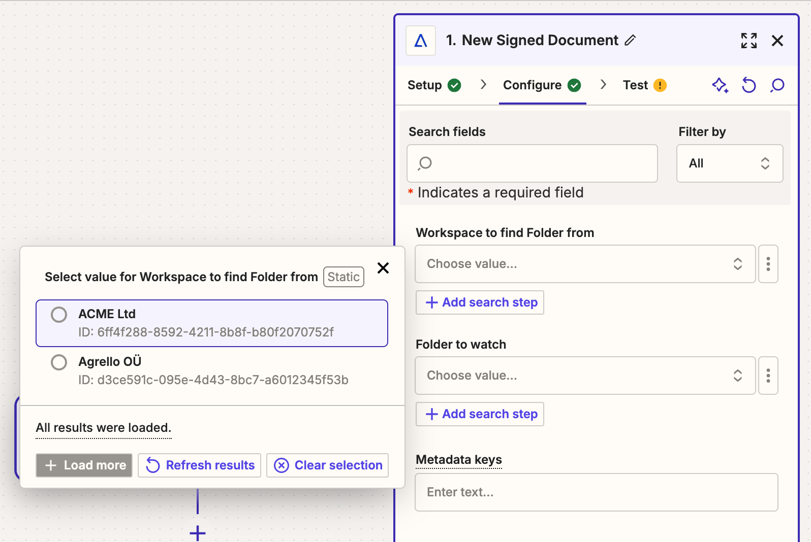
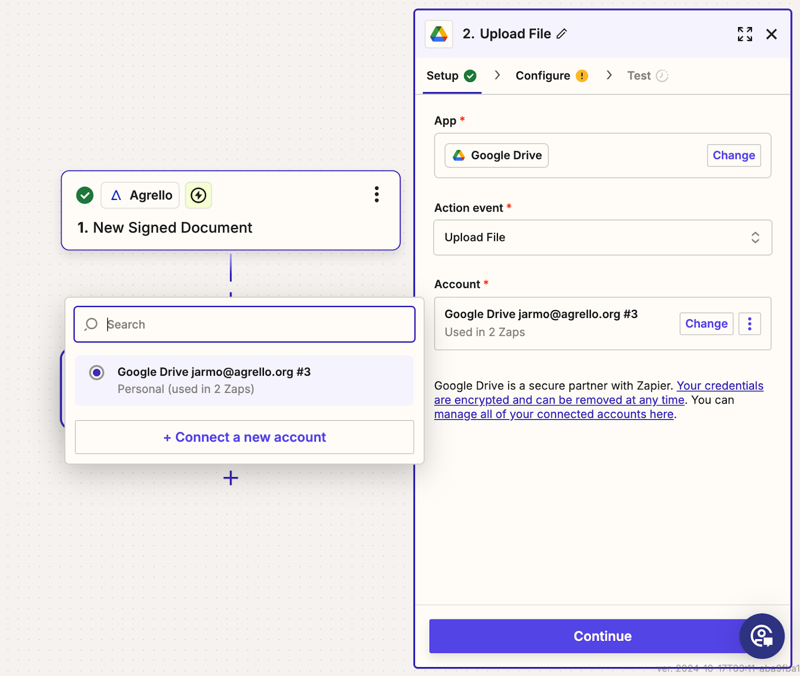
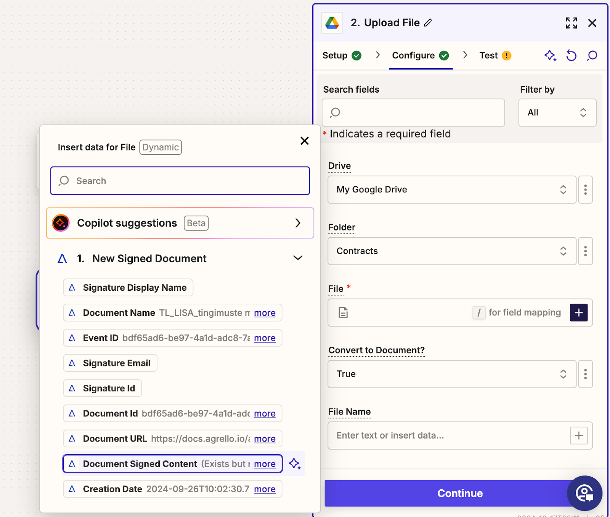

This step-by-step guide will show you how to:

1.  Set up Agrello as a trigger for detecting signed documents.
2.  Choose Google Drive as the destination for storing your signed files.
3.  Configure the Zap to upload the document's content to the correct folder in Google Drive.

By the end of this tutorial, you’ll have a fully automated system to streamline document management, saving you both time and effort!

## Prerequisite

Before starting the integration process, ensure that:

1.  You have an active Zapier account.
2.  You have an active Agrello account.

Now, let's move on to the first step in Zapier! 

**Getting started** 

In your Zapier dashboard, click the + Create button to start creating a new Zap (automation workflow).

‍

## Set up trigger in Agrello

### Step 1: Select the Agrello App in Zapier

In this step, you are starting the process of creating a Zap to automate the transfer of signed documents from Agrello to Google Drive.

1.  Click on the **Trigger** box of your workflow.
2.  In the pop-up window  search for the app you want to use as a trigger.
3.  Begin by typing "Agrello" into the search bar.
4.  Once "**Agrello**" appears, click on it to select it as your trigger app.

This sets up the workflow to listen for actions or events in Agrello that will initiate the automation.

### \*\*

Step 2: Select the Trigger Event for Agrello\*\*

In this step, you will choose the specific trigger event that will start your Zap when using Agrello.

1.  After selecting Agrello as your app, a list of trigger events appears.
2.  Scroll through the available triggers and select "New Signed Document".some text
    - This trigger starts the Zap when a document gets signed by all parties involved.

This ensures that your Zap will activate only after the document is fully signed in Agrello, which is key for the next step of sending it to Google Drive.

‍

### Step 3: Select or Connect Your Agrello Account

In this step, you will choose which Agrello account to use for the Zap.

1.  In the "Account" section, you can see a list of connected accounts. If your desired Agrello account is listed, select it.some text
    - In this case, the account "Agrello jarmo@agrello.org" is already connected and can be selected.
2.  If your account is not listed, click on "Connect a new account" and follow the steps to authorize Zapier to access your Agrello account.

This step ensures that Zapier has the correct permissions to trigger actions based on your Agrello documents.

‍

### Step 4: Confirm Account and Click Continue

After selecting or connecting your Agrello account:

1.  Verify that the correct account is displayed under the "Account" section.
2.  Once confirmed, scroll down to the bottom of the screen and click the "Continue" button.

This moves you forward in setting up the Zap, confirming that Zapier will use the specified Agrello account to trigger actions when documents are signed.

‍

### Step 5: Define the Agrello Workspace and Folder

In this step, you will specify the workspace and folder where signed documents will be monitored in Agrello.

1.  Select Workspace: Choose the workspace where your signed documents are stored. In the pop-up, select the appropriate workspace, such as "ACME Ltd" or "Agrello OÜ".some text
    - Click the radio button next to the correct workspace.
2.  Choose Folder: After selecting the workspace, pick the folder within that workspace where Zapier will watch for new signed documents.some text
    - Use the "Folder to watch" field to search and select the relevant folder.

This configuration ensures Zapier knows where to look for signed documents in your Agrello account.

‍

### Step 6: Click Continue and Test the Trigger

Before proceeding, ensure that the selected folder contains at least one fully signed document.

1.  Once you've confirmed that signed documents are present, click the "Continue" button.
2.  On the next screen, click "Test trigger" to check if Zapier can successfully detect a signed document in the specified folder.

This test confirms that your setup is correct and that Zapier is able to recognize signed documents for the next step in the automation.

Step 7: Review Test Results and Select a Signed Document

After running the trigger test, Zapier will display the signed documents found in the specified folder.

1.  Review the list of signed documents shown under "New Signed Document." Each record includes details like document name, URL, and signature content.
2.  Select the appropriate document from the list. In this example, you can choose "New Signed Document C" or any other relevant document.
3.  Click "Continue with selected record" to proceed.

This confirms that Zapier successfully detected a signed document, and you're ready to set up the action to send it to Google Drive.

‍

## Set up action in Google Drive

### Step 8: Choose Google Drive as the Action App

Now that the trigger is set up, it's time to define the action, which is to save the signed document to Google Drive.

1.  In the "Choose App & Event" section, search for "Google Drive" in the pop-up window.
2.  Once you see Google Drive in the list, click on it to select it as your action app.

This step ensures that Google Drive will be the destination where your signed documents from Agrello are automatically saved.

‍

### Step 9: Select the Action Event for Google Drive

Next, define what action will happen in Google Drive once a document is signed in Agrello.

1.  Under "Action event," choose "Upload File" from the list of available actions.some text
    - This action will copy the signed document from Agrello and upload it to Google Drive.
2.  Confirm your Google Drive account is selected under the "Account" section.

This step ensures that the signed document is automatically saved to Google Drive whenever it is completed in Agrello.

‍

### Step 10: Confirm Google Drive Account and Click Continue

In this step, verify the selected Google Drive account and proceed with the action setup.

1.  Ensure the correct Google Drive account is selected under the "Account" section. In this case, "Google Drive jarmo@agrello.org" is chosen.
2.  Once the account is confirmed, click the "Continue" button.

This finalizes the connection between Agrello and Google Drive, allowing signed documents to be automatically uploaded to your specified Drive folder.

‍

‍

### Step 11: Map the Signed Document Content to Google Drive

To correctly upload the signed document to Google Drive:

1.  In the "File" field, click the "+" button to open the dynamic data window.
2.  From the list of available data, select "Document Signed Content". This ensures that the actual content of the signed document from Agrello is uploaded to Google Drive.
3.  Confirm the correct Drive (e.g., "My Google Drive") and choose the Folder (e.g., "Contracts") where you want the document to be stored.
4.  Optionally, you can also set the File Name using dynamic data, such as the document name from Agrello.

Once these details are set, click "Continue" to finalize this step. This ensures that the signed document's content is accurately uploaded to the selected folder in Google Drive.

‍

### Step 12: Test and Publish the Zap

You are now at the final stage, where you can test the entire workflow and publish the Zap.

1.  Review the details in the test results to ensure that the signed document has been successfully uploaded to the specified Google Drive folder.some text
    - You can see the file URL, user permissions, and other metadata related to the uploaded document.
2.  If everything looks good, click "Publish" to activate your Zap.

Once published, your Zap will automatically upload any newly signed documents from Agrello to your Google Drive folder based on the setup you've configured.

‍

\*\*\*

‍  
Congratulations! You've successfully set up a Zap that automates the process of transferring signed documents from Agrello to Google Drive. With this integration, every time a document is fully signed in Agrello, it will automatically be uploaded to your specified Google Drive folder, ensuring that your documents are always organized and accessible.

This automation not only saves you time but also reduces the risk of human error in managing important files. Whether you're handling contracts, agreements, or other legal documents, you now have a streamlined workflow that keeps everything in one place.

Feel free to explore additional ways to expand this workflow with more integrations or customizations using Zapier. Happy automating!

‍
