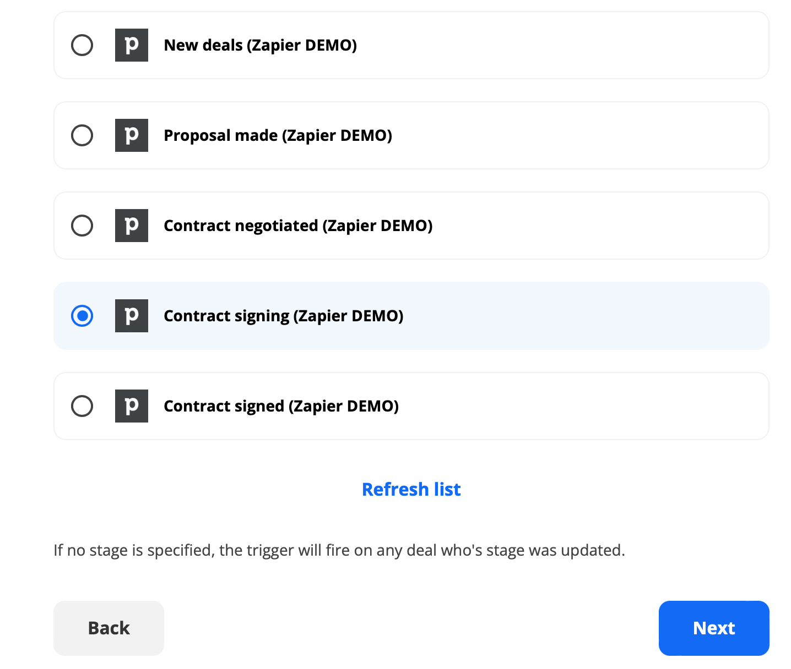
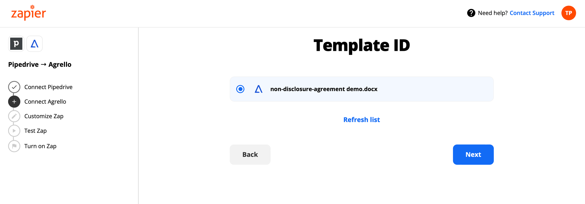
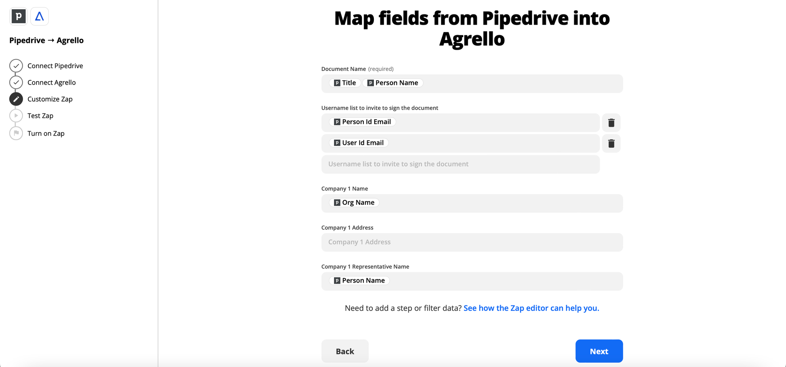

Agrello integratsioonid läbi Zapieri loovad lõputult võimalusi, kuidas meie teenuseid sinu äri jaoks kõige paremini tööle panna. Järgnevates blogipostitustes tutvustame lihtsaid, kiireid ja kasulikke integratsioone ning esimesena on võimalik lugeda selle kohta, kuidas saab integreerida Pipedrive’i Agrelloga.

‍

Pipedrive on laialdaselt kasutatav ja mugav müügitulu suurendamise programm. Selles artiklis näitame kuidas automaatselt luua Pipedrive’i andmete põhjal leping ning see Agrelloga allkirjastada.

‍

Näitena kasutame konfidentsiaalsuslepingut (NDA) ja proovime automatiseerida selle loomise ja allkirjastamise protsessi, kasutades Pipedrive’ist tulnud andmeid. Esmalt on sul vaja aktiivseid kontosid nii Pipedrive’s kui ka Agrellos. Kuna selles töövoos tahame saata andmeid Pipedrive’st Agrellosse, siis tuleb Zapieris esimese rakendusena valida Pipedrive ja teisena Agrello.

‍

Järgmisena tuleb valida trigger ehk tegevus, mis toob esile järgmise tegevuse. Lihtsustatult “Kui juhtub see” → “siis tee seda”.  Näiteks iga kord kui Pipedrive tehing jõuab teatud staadiumi, siis luuakse automaatselt leping kasutades Agrellos varasemalt valmis tehtud lepingupõhja. Meie näite puhul kasutame Pipedrives triggerit “Updated Deal Stage” ning Agrellos vastavalt “Create New Document From a Template”.

‍

Kaht rakendust omavahel ühendades tuleb valida ka täpne staadium Pipedrives, millal see trigger aktiveeritakse. Meie näite puhul “Contract signing”.

‍

‍

Järgmisena tuleb Agrellos valida lepingupõhi, mida soovid selle automatiseeritud töövoo jaoks kasutada, näiteks konfidentsiaalsusleping. See lepingupõhi peab olema sinu enda poolt Agrellos varasemalt valmis tehtud.

‍

‍

Soovitame dokumentide paremaks korrashoiuks valida ka kaust (space), kus sa sooviksid selle automatiseeritud töövoo käigus loodud dokumente hoiustada.

‍

‍

‍

Oluline on valida Agrello poolelt selles lepingupõhjas esinevad väljad, mida soovid Pipedrivest tuleva infoga täita. Samamoodi tuleb valuda väljad Pipedrive poolel. Kui see on tehtud, siis ei jää muud üle kui testida, testida, testida!Oluline on valida Agrello poolelt selles lepingupõhjas esinevad väljad, mida soovid Pipedrivest tuleva infoga täita. Samamoodi tuleb valuda väljad Pipedrive poolel. Kui see on tehtud, siis ei jää muud üle kui testida, testida, testida!

‍

‍

‍

Töövoo seadistamine võib veidi aega võtta, kuid arvestades kui palju aega on võimalik automatiseerimisega säästa, siis see tasub end ära.

‍

Võta julgesti ühendust kui vajad abi oma töövoo automatiseerimisega.
