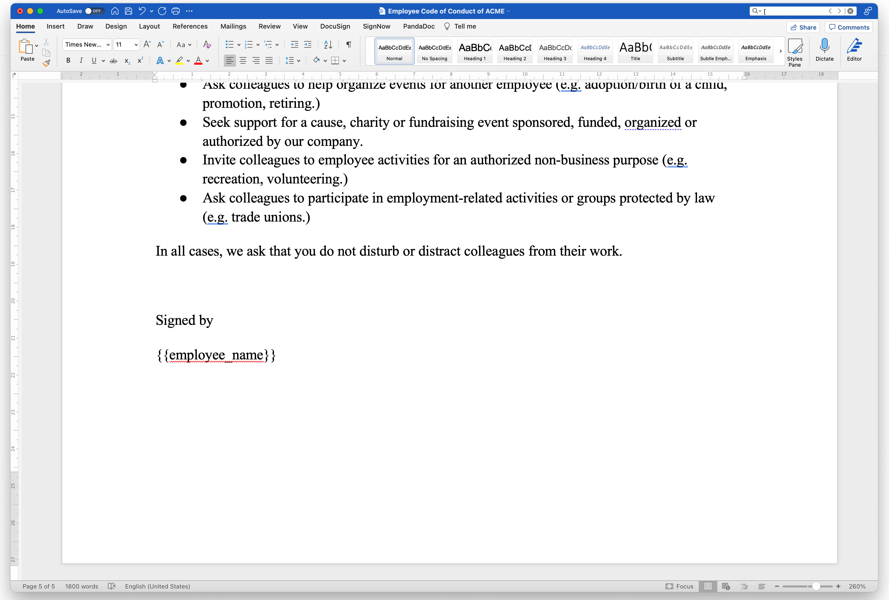
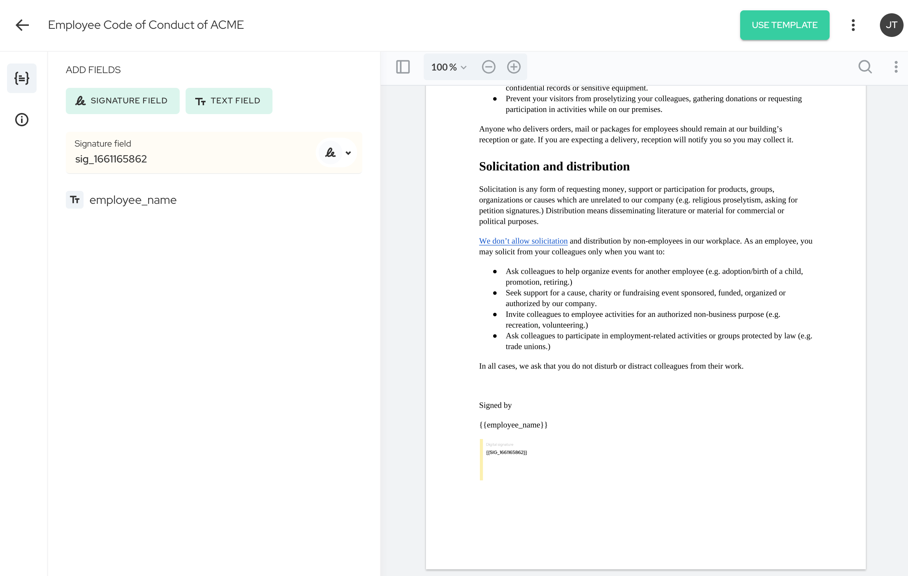
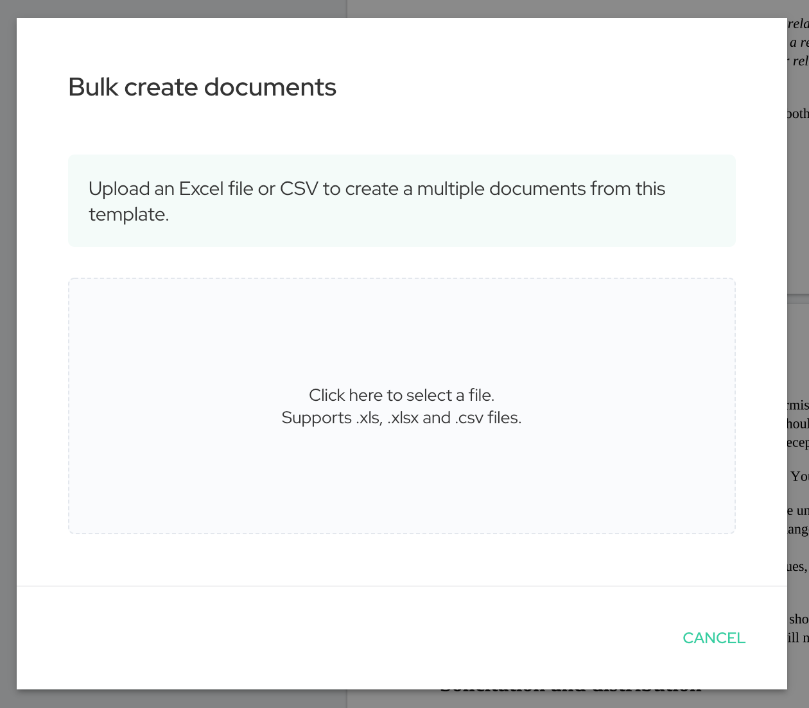
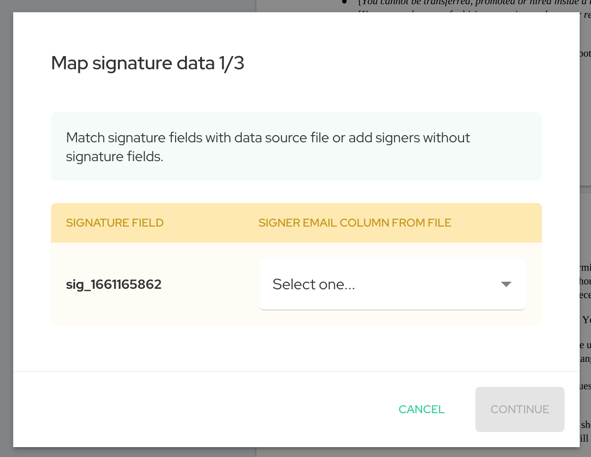
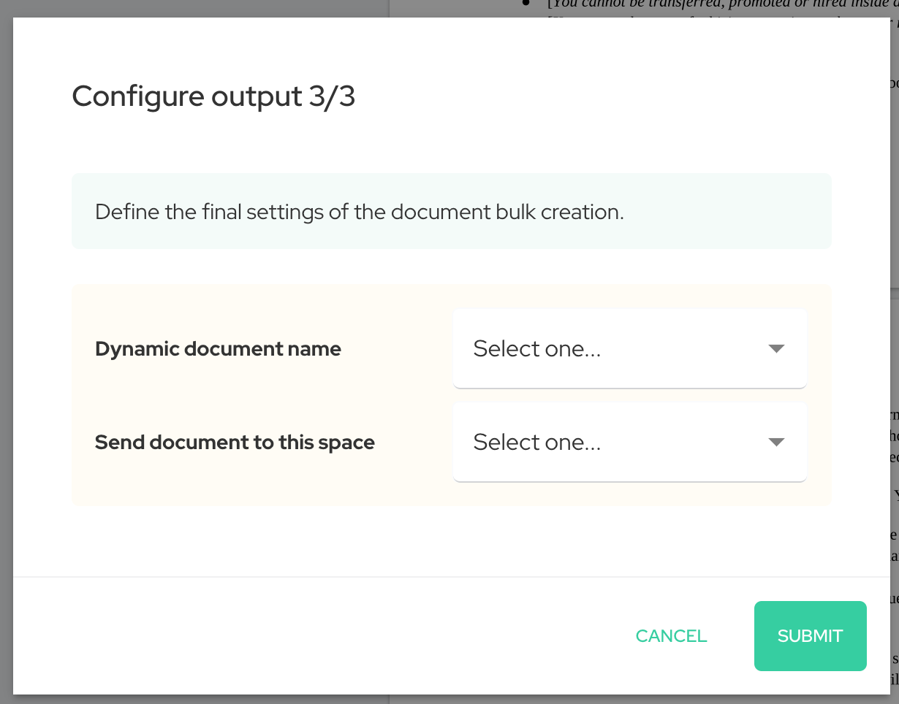

**Now you can use one template to automatically create multiple documents out of it. Furthermore, by importing data from Microsoft Excel, dynamic fields can be pre-filled for each document. This significantly reduces the time needed to create repetitive documents.**

When analysing our customers' needs and how they use Agrello integrations with Zapier, we noticed that one of the most popular use cases is to connect Agrello with Excel or Google Spreadsheet to quickly create dozens of documents from the same template and pre-fill the data fields.

However, one concern our users had was that setting up a Zapier account and paying extra for it, didn’t make sense for one-off bulk creation of documents.

Taking this into account, we started to design a solution for simpler one-off bulk creation and filling the documents for signing.

‍

[YouTube Video](https://www.youtube.com/watch?v=25hNc-OD0_o)

‍

## When should you use bulk created documents?

‍

Bulk creation is handy when you have the same document template where a few parameters change for each signer.

Whether you need thousands of customers to accept updated terms or hundreds of employees to sign off on a new employee handbook, bulk creation provides a seamless solution for companies of any size. Common scenarios in which a bulk creation of documents for signing benefits your organisation include:

- **Updating the general terms of your service:** Bulk creation helps when a sales team needs to get acceptance for the changes in general terms of service from all of their customers at once.
- **Sharing documents with employees:** When a human resources department needs to quickly send out a new company benefits package or work-from-home policy, bulk creation provides an easy way to customise and send documents to multiple recipients at the same time, even if they differ from employee to employee.
- **Pre-agreed agreements with multiple investors:** When your financial department raises funds from multiple investors and has pre-agreed consent for investment, they can use bulk creation to quickly send out loan terms to dozens of signers in one go.
- **Application forms from new signups:** If you're launching a new training course, you may need to collect the data and get applications signed by all the participants. Bulk creation can be used to prepare personalised application forms for filling and signing with a single click of a button.

These are just a few examples of how bulk creation of documents and sending them out for signing can make your life easier.

‍

### How to bulk create documents for signing in Agrello?

To better understand how you can bulk create documents from the template, let's go through an example where changes to the Employee Code of Conduct document are sent to employees for signature.

‍**The process consists of three steps:**

1.  Preparation of the document template and the Excel spreadsheet with the data.
2.  Creating a document template in Agrello
3.  Bulk creating the documents from the template

‍

#### Preparation

‍First, the template document must be prepared in Microsoft Word and the fields that are employee-specific can be marked as dynamic fields using **{{curly\_brackets}}**.

‍

‍

Dynamically filled fields must be entered in Word with curly brackets, for example **{{employee\_name}}**. To avoid errors, you mustn't use punctuation or spaces in the text enclosed in parentheses.

Next, we prepare an Excel file with a list of all employees and the data to be included in the document. A separate row must be created for each employee and a column for each dynamic field.

‍The table must contain the e-mail address of the employee to whom the invitation to sign should be sent.

‍

‍

‍

### Creating a document template in Agrello

#### **1\. Upload document template**

‍In Agrello you can easily create a document template. You need to select the **"Template"** option in the **"Create New"** menu and then simply upload the prepared Word file.

‍

‍

Anyone can create an Agrello account by themselves and for free. With a free account, you can create three documents per month. So, for automating larger quantities, a paid account is required.

‍

#### **2\. Placing signature fields**

Once you have uploaded the document template, place the signature fields. In the document template preview add the signature fields to the correct place - scroll to the page where the signature should be and click on the **“Signature field”** button on the left pane. Place the field in to correct position and click on **“Save field”.**

‍

‍

### Bulk creating documents from the template

Now you are ready to connect the Excel file and the Word template to create multiple documents for signing at once.

When you are still in the document template view click on the **“Use template”** button and choose **“Bulk create documents”.**

‍

‍

This will open a bulk creation wizard.

‍

#### **Step 1. Upload Excel**

Choose the Excel file with your employee records.

‍

‍

Note that our system allows importing 1000 rows from a single file.

‍

#### **Step 2. Map the signature fields**

In step 2 you need to define from which Excel column we will find the employee email.

‍

‍

Select the correct column and click Continue.

‍

#### **Step 3. Fill in the data fields**

In this step, you need to map available data fields in the template to the columns in Excel. This example only has one data field to be mapped - Employee name.

‍

‍

Click Continue to proceed.

‍

#### **Step 4. Document naming and destination**

In the final step, we define the dynamic name of each document and destination Space in Agrello. The dynamic document name is composed of the template name + one of the data columns. For example _Employee Code of Conduct - Jarmo Tuisk._

‍

‍

Once that is done, click Submit.

Depending on the number of rows in Excel the document creation process can take from a few seconds up to a couple of minutes. So if you do not see the documents immediately, wait a bit and then refresh the space screen.

All the documents are created as Drafts and you can safely review them before sending them off to counterparties. Once sent, you can track the process and completion of your documents in your document space Progress view. You can also send reminders to any party or signee who has not taken the required action on a document.

‍

### You can also view this video tutorial if it's more helpful.

‍

[YouTube Video](https://www.youtube.com/watch?v=GJ5DbZXV3d0)

‍

We believe that bulk creation of documents will significantly reduce the time spent on creating repetitive documents in companies so that the emphasis can be put on what really matters - better relations, higher efficiency, and work-life satisfaction.

**Let us know what you think about this feature.**

‍
