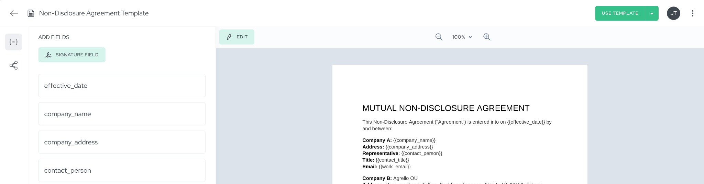
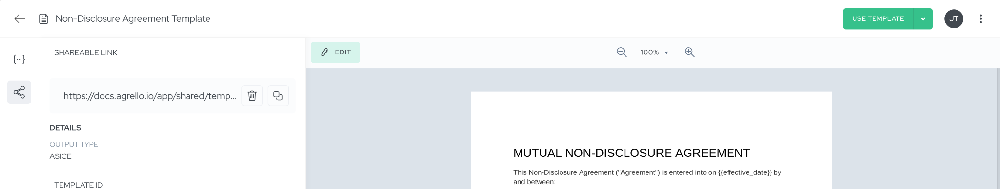
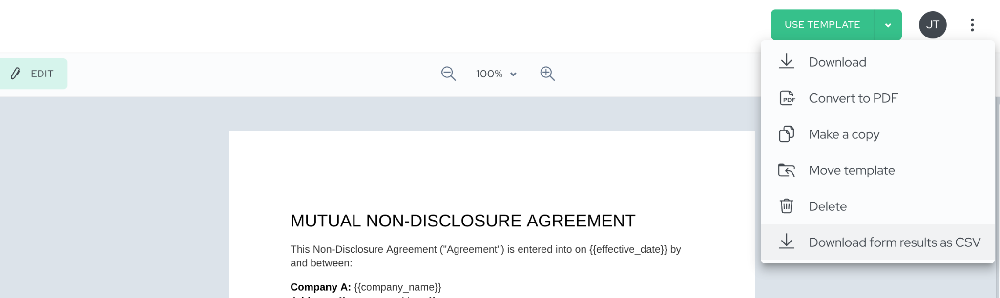

**TLDR:** **Agrello Forms' new CSV export feature lets you download all signed form responses as structured data that imports directly into your CRM, HRIS, or any business system** - eliminating manual re-entry of information that already exists.

**Want to explore what Agrello Forms allow you to accomplish?** **Read this** [**Agrello Forms overview**](https://www.agrello.io/post/share-to-sign-required-signatures-in-minutes-not-hours)

---

## The Data Trap That's Costing Your Business

Picture this: your HR team collects dozens of signed onboarding forms each month, your sales team processes NDAs for every new partnership conversation, and your operations team manages safety waivers for site visits. Each signature represents a successful interaction, but the valuable data within those forms - contact details, preferences, compliance confirmations, effective dates - remains locked away in individual PDF documents.

**This creates a frustrating cycle where teams manually recreate information that already exists**. An HR coordinator spends hours typing employee details from signed forms into HRIS systems. A sales manager copies company information from executed NDAs into CRM records. An operations specialist transcribes waiver details into compliance tracking spreadsheets. **Over 40% of workers spend at least a quarter of their work week on manual, repetitive tasks** ([Smartsheet automation research](https://www.smartsheet.com/content-center/product-news/automation/workers-waste-quarter-work-week-manual-repetitive-tasks)), yet most signature workflows still rely on this inefficient manual handoff.

The real cost isn't just time - it's the missed opportunities that come from delayed data access. When signature information sits trapped in document form, you can't quickly analyze trends, trigger automated follow-up processes, or gain insights that drive better business decisions. Your signed documents become data dead ends instead of the valuable business intelligence they should represent.

## Transforming Signatures Into Business Insights

Agrello Forms' CSV export capability changes this equation by treating every signature collection as a data generation opportunity. **When someone completes and signs your form, their submission automatically becomes a clean, structured row of information** that can immediately flow into your existing business systems and processes.

‍

_Illustration: Agrello template can be shares as a fillable form (or contract) to multiple signers with one link._

‍

This transformation creates powerful downstream effects across your organization. **Your HR team can process onboarding data 50% faster** ([onboarding automation research](https://www.flowforma.com/blog/onboarding-automation)) by importing signed form responses directly into HRIS systems, eliminating transcription errors and ensuring new employees appear in payroll systems without delay.

**Sales and partnership teams** experience similar efficiency gains when NDA and partner registration data flows automatically from signed forms into CRM systems. Instead of manually updating deal stages and contact records after each signature, **sales managers can trigger automated workflows** **that move prospects through pipeline stages,** schedule follow-up meetings, and send welcome sequences based on the specific information collected during the signature process.

For **operations and compliance teams**, CSV export transforms signature collection from a documentation exercise into a real-time business intelligence system. **Safety waiver data can feed directly into facility management dashboards**, policy acknowledgment responses can populate compliance reporting automatically, and consent logs can integrate with privacy management platforms to ensure ongoing regulatory compliance.

**Since the CSV export includes only submissions that reached signed status, you can trust that every row represents a completed, legally binding interaction** \- not abandoned or partial submissions that could skew your analysis.

_Illustration: Simply click on Shareable links tab in Template details view and with two clicks you have a working link for an Agrello Form to share with your signers._

‍

## Seamless Implementation That Works With Your Existing Workflows

The beauty of **Agrello Forms' CSV export** lies in its simplicity and integration with workflows your team already understands. **This feature works through the familiar template details view**.

Consider how this works for a typical sales NDA workflow. When you create your NDA template in Agrello, you design it with data collection in mind -company name, contact person, work email, country, agreement effective date, and any specific preferences like marketing communication opt-outs.

As prospects complete and sign your shared form, their information accumulates in a structured format behind the scenes. When you're ready to update your CRM, analyze partnership trends, or prepare for quarterly business reviews, you simply **return to your template view and click the CSV download button**.

Within seconds, you have a clean dataset that imports directly into Salesforce, HubSpot, or any other system your team uses for relationship management.

_Illustration: Once your signers have signed the NDA based on your template, simply return to this template detail view and from the upper right corner choose “Download form results as CSV”._

‍

The multi-signer capability adds another layer of business value, particularly for complex agreements involving multiple stakeholders.

While the CSV doesn't distinguish between individual signers (focusing instead on the document-level data collection), this approach actually simplifies integration by treating each completed form as a single business transaction with all relevant parties confirmed.

For organizations managing multiple form types, the per-template export structure provides natural data organization. Your HR onboarding forms generate one CSV dataset, your sales NDAs create another, and your operations waivers produce a third - each optimized for its specific business purpose and integration requirements.

This separation ensures clean data imports and prevents the field mismatches that can occur when different form types get mixed together.

**Workspace members with Editor role** can access CSV exports, ensuring appropriate data governance while maintaining operational flexibility. The system includes no artificial row limits or throttling, so even high-volume signature workflows can export complete datasets for comprehensive analysis.

## Building a Data-Driven Signing Strategy

**Maximizing the value of CSV export requires thoughtful template design that balances user experience with data collection goals**. The most successful implementations start with consistent field labeling conventions that make data integration predictable and reliable. When your onboarding forms, contract amendments, and policy acknowledgments all use standardized fields for common information like "Company Name" and "Effective Date," your downstream systems can process imports with minimal manual mapping.

**Required field strategies** become particularly important when building datasets for automated workflows. By marking critical inputs as required, you ensure complete records that can reliably trigger follow-up processes.

An incomplete email address might prevent automated welcome sequences, while a missing effective date could cause compliance tracking failures. **Strategic use of required fields significantly improves dataset completeness** while maintaining positive user experiences.

Data privacy considerations should inform your template design from the beginning. Collecting only the information you actively need not only improves user trust but also simplifies compliance with privacy regulations like GDPR and CCPA. When your CSV exports contain minimal, purposeful data, integration with privacy management systems becomes straightforward, and **data breach risks are naturally reduced**.

Template organization within your Agrello workspace also supports better data governance. Creating dedicated folders for different business functions - HR processes, sales workflows, operations management - makes CSV exports easier to locate and helps establish clear data ownership across your organization.

## Real-World Implementation: Sales NDA Workflow

To illustrate the practical impact, consider how CSV export transforms a typical sales NDA process. **Here's how the workflow operates within the Agrello platform:**

1.  **Create an NDA template** with fillable fields for company name, contact person, work email, country, agreement effective date, and marketing communication preferences.
2.  **Generate a shareable link** to your template.
3.  **Share the link with your prospect** via email or during initial conversations.
4.  **Prospect opens the link**, fills in all required fields, and signs the document.
5.  **Both parties receive the signed NDA** automatically upon completion.
6.  **At the end of the week**, return to your NDA template and download a CSV containing all data from NDAs signed during that period.

This streamlined process transforms each completed form into a structured data row that becomes immediately actionable business intelligence.

When a prospect completes your NDA form, their information becomes available for instant CRM import.

This **eliminates the traditional lag between signature completion and sales process advancement**, allowing your team to schedule discovery calls, move deals to appropriate pipeline stages, and trigger automated follow-up sequences without manual intervention.

The **legal evidence remains perfectly preserved** through Agrello's signed document and audit trail system, while the business data flows efficiently into operational systems. This dual benefit (legal compliance plus operational efficiency) represents the fundamental value of treating signature workflows as integrated business processes rather than isolated document transactions.

The CSV format's reliability becomes especially valuable during quarterly business reviews or compliance audits. Instead of manually collecting signature data from dozens of individual documents, **leadership teams can analyze partnership trends, geographic distribution, and compliance status through standard business intelligence tools**. The data integrity that comes from automated collection eliminates the errors that typically plague manual reporting processes.

## Ready to Transform Your Signature Workflows?

**If you're already using Agrello Forms, implementing CSV export is immediate: simply open any template you've used for signature collection and explore the download option to see your accumulated data.** For organizations new to digital form workflows, this capability represents an opportunity to **redesign signature processes around data value creation** rather than simple document completion.

The path forward depends on your current signature management maturity. Teams handling high-volume, repetitive signature workflows will see immediate ROI from CSV export implementation. Organizations with complex multi-step processes can use the feature to create data bridges between signature collection and downstream automation systems.

Start by identifying your highest-impact signature workflow, the process where manual data re-entry creates the most friction or where faster data access would enable significant business improvements. Create a test template with thoughtful field design, collect a few sample submissions, and export the results to see how structured signature data can enhance your specific business processes.

For guidance on template design, field naming conventions, or integration strategies that maximize your CSV export value, [Agrello's team](https://www.agrello.io/company/contact) provides consultation to ensure your signature workflows become genuine business intelligence assets.
