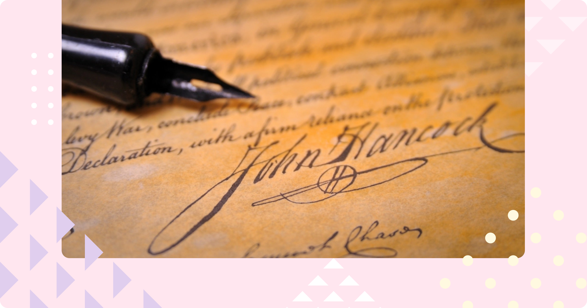

### Kiire kokkuvõte

- Agrello allkirjad on elektroonilised allkirjad, mis tuginevad krüptograafiale ja poolte vahel usaldatud digitaalsetele identiteetidele.

- Kui kasutaja allkirjastab Agrelloga, siis me lisame PDFi enda e-templi ja selle juurde allkirjastaja nime. See on üks levinumaid e-allkirjastamise viise maailmas.

- Lisaks Agrello allkirjale saab allkirjastada ka juba tuttavaid digiallkirjastamise lahendusi kasutades. Toetatud on Mobiil-ID, Smart-ID, ID-kaart.

- Kasutaja võib valida nii PDF kui ASIC formaadi vahel. PDFi puhul lisatakse digitaalne allkiri faili sisse ja kuvatakse ka visuaalselt. ASICu puhul pakitakse allkirjastatud failid ja digiallkirjad teineteisest eraldi. Visuaalselt allkirja ASIC konteinerisse ei lisata.

- PDFi puhul saab digiallkirju valideerida näiteks Adobe Acrobat Readeriga.

‍  
Agrello platvormi viimaste uuendustega kaasnesid ka muudatused elektroonilise allkirjastamise viisides, sealhulgas toetame nüüd ka PDF-allkirju. Lisaks sellele toetame siis ka ASIC digiallkirjastamise formaati. PDF-allkirjade puhul toetame nii Agrello enda digiallkirju kui ka Mobiil-ID ja Smart-ID allkirju. Ehk siis kokku kahte erinevat failiformaati ja kolme digiallkirja andmise viisi.  Miks seda kõike vaja on? Seda katsumegi selles artiklis lahti mõtestada.

‍

[YouTube Video](https://www.youtube.com/watch?v=-pB61XgekeA)

‍

### Turvaline allkirjastamine digitaalajastul

Iidsetest aegadest tähendab visuaalne allkiri või jäljend dokumendil, et allkirjastaja on tutvunud dokumendiga ja nõustunud seal kirjutatuga. Päris alguses püüti ka digiajastul läheneda allkirjastamisele samal moel – paigutades pildi allkirjast digitaalsesse faili.

‍

‍

Samas, digiajastul avastati ruttu, et allkirja pildi kopeerimine ei ole eriline probleem ja nii oli suhteliselt raske tõestada, et visuaalse allkirjaga seotud isik ka tegelikult dokumenti nägi või sellega nõustus.

Eestis arenesid asjad mõnevõrra teisiti. Ilmselt mõistsid meie e-riigi loojad koheselt probleemi, mis kaasneb nõrgalt turvatud allkirjadega ning rajasid digiriigi teenused koheselt tugevatele digitaalsetele allkirjadele, mis põhinevad isikustatud digitaalsetel allkirjastamise sertifikaatidel ning turvaliselt hoiustatud allkirjastamise võtmetel.

Agrellos alustasime me samuti alguses tugevate allkirjadega ja lõime iga kasutaja jaoks digiidentiteedi sertifikaadi ning võtmepaari. Siiski selles lähenemises oli üks suur miinus – allkirja loomiseks pidi kasutaja läbima isikutuvastuse, mis oli ilmselgelt liigselt ajakulukas. Nii hakkasimegi otsima alternatiive ja kombineerima oma teenust juba olemasolevate tugevate allkirjateenustega.

‍

### Kiire ja lihtne, või hoopis väga turvaline?

Selleks, et anda turvalist digiallkirja, on vaja isikuga seotud allkirjastamise digisertifikaati ja võtmepaari. Igal eestlasel on see sertifikaat talletatud ID-kaardil koos isikliku võtmega, mida saab kasutada vaid juhul, kui tead selle võtmega seotud PIN2 koodi.

Alternatiivina on osadel selline sertifikaat talletatud SIM-kaardile, et kasutada Mobiil-ID võimalust. Smart-ID omakorda on edasiarendus Mobiil-IDst, kus vastav allkirjastamise sertifikaat on talletatud turvalisse mobiili äppi. Kuid selle loomiseks on ikkagi vaja ID-kaarti või Mobiil-IDd.

Kui sul sünnist saati sellist ägedat ID-kaarti ei ole, siis tundub kogu see protsess ja turvalisus liigse ajakuluna. Aeg on aga raha ja seega otsivad inimesed alati võimalust aega kokku hoida.

Agrello enda allkirjad ongi mõeldud neile, kel ei ole ID-kaarti, Mobiil-IDd või Smart-IDd. Oma tehniliselt olemuselt on Agrello allkirjad elektroonilised allkirjad, mis lisatakse PDF faili PAdES standardile vastavalt.

Kuid selleks, et PAdES allkiri oleks valideeritav, peab see ikkagi põhinema allkirjastamise sertifikaadil. Seetõttu me kasutame enda (Agrello) allkirjastamise sertifikaati digiallkirja formeerimiseks ning lisame allkirja infosse allkirjastanud isiku nime.

Kui ID-kaardi, Mobiil-ID ja Smart-ID allkirjad on juriidilises määratluses kvalifitseeritud elektroonilised allkirjad ja seaduse silmis võrdsustatud käsitsi allkirjastamisega, siis Agrello allkirjad on lihtsad elektroonilised allkirjad, mis sobivad vormivabadele lepingutele.

‍

‍

### Kuidas Agrello allkirjad töötavad?

Erinevalt ID-kaardist, Mobiil-IDst ja Smart-IDst saab Agrello allkirju kasutada ainult siis, kui väljundformaat on PDF. PDF failil on unikaalne sisemine struktuur, mis võimaldab lisada digiallkirja info ilma otseselt faili tekste ja pilte muutmata. Siiski enamasti lisatakse PDFi ka allkirja visuaalne kuva.

Kuna allkirjade osa on PDFis eraldatud muust faili sisust, siis on ikkagi võimalik luua krüptograafiline räsi ülejäänud faili osast, mis tagab selle, et faili ei saa pärast allkirjastamist muuta nii, et allkirjad endiselt kehtiks.

Veidi keerulisem on lugu identiteediga. ID-kaardi, Mobiil-ID ja Smart-ID puhul saame PDFi lisada ka isiku sertifikaadi, mis ütleb, kes on allkirjastaja. Agrello allkirjade puhul me sellist sertifikaati ei saa lisada, sest allkirjastamise kiiruse huvides me loobusime isiku verifitseerimisest. Selle asemel lisame allkirja infosse allkirjastaja nime.

‍

‍

Eeldame, et kui keegi kutsub kedagi allkirjastama dokumenti, siis usaldatakse vastastikku teineteise identiteete ja peamine ülesanne on tagada, et allkirjal oleks ajatempel ja dokumendi sisu ei muutuks.

Praegusel hetkel loob Agrello enda allkirjastamise sertifikaadi ise vastavalt PAdES standardis nõutud tingimustele. Tehniliselt tähendab see seda, et sertifikaat ei ole väljastatud usaldusteenuse osutaja poolt ja seetõttu Adobe Acrobat Reader võib seda näidata nö „punasena“.  Samas on kasutajal alati võimalik lisada Agrello sertifikaat oma usaldatud sertifikaatide nimekirja.

‍

‍

### Kiire, turvaline, universaalne või spetsiifiline – valik on sinu

Selleks, et tagada allkirjastamise lihtsus ja kiirus, kuid säilitada vajalikku usaldusväärsust olemegi pidevalt oma allkirjastamise portfelli täiendanud. Nii on meie kasutajatel võimalik alati valida, millist allkirjastamise formaati kasutada.

Eriti kasulik on Agrello allkirjastamine juhul, kui tegeletakse piiriüleste lepingutega ja erinevatel pooltel on erinevad allkirja mehhanismid, mis peaks kokku saama siiski ühes failis, mida mõlemal poolel oleks lihtne kasutada.

Kuigi Agrello põhitehnoloogia on seotud digiallkirjastamisega, siis lisaks sellele pakume ja arendame edasi ka oma lepingute haldamise ja koostöö funktsioone, ning täiendame ja arendame integratsioone ja APIt.

Loodame teid peagi näha meie platvormi kasutamas oma lepingu protsesside kiirendamiseks ja automatiseerimiseks. Kui tekib ideid, mida juurde lisada või paremaks muuta, siis emailid on teretulnud aadressile [support@agrello.io](mailto:support@agrello.io).

‍
