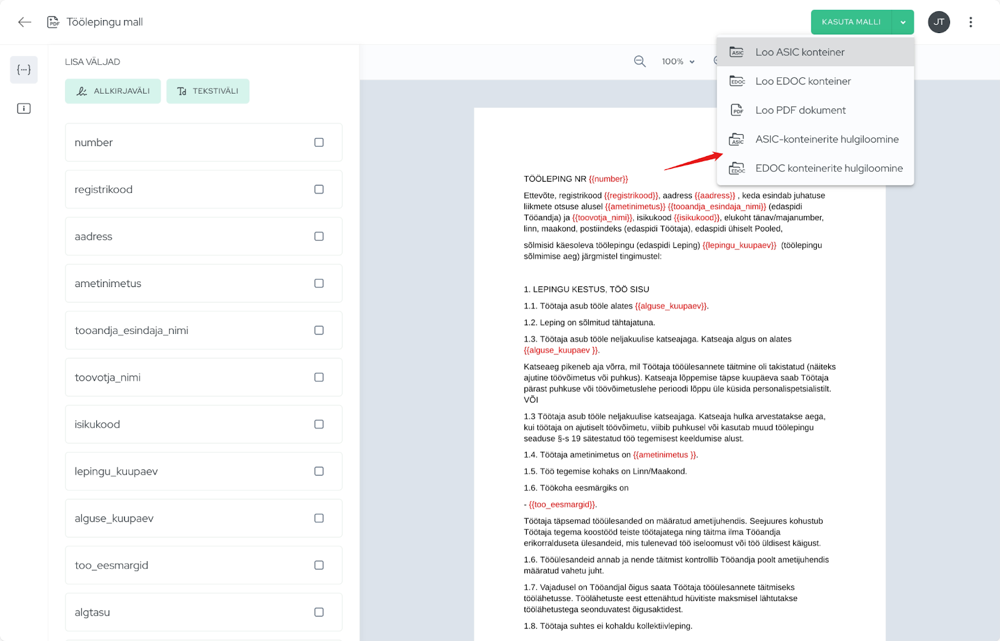
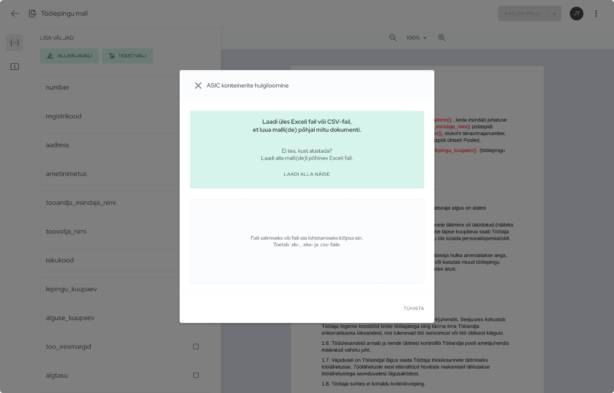
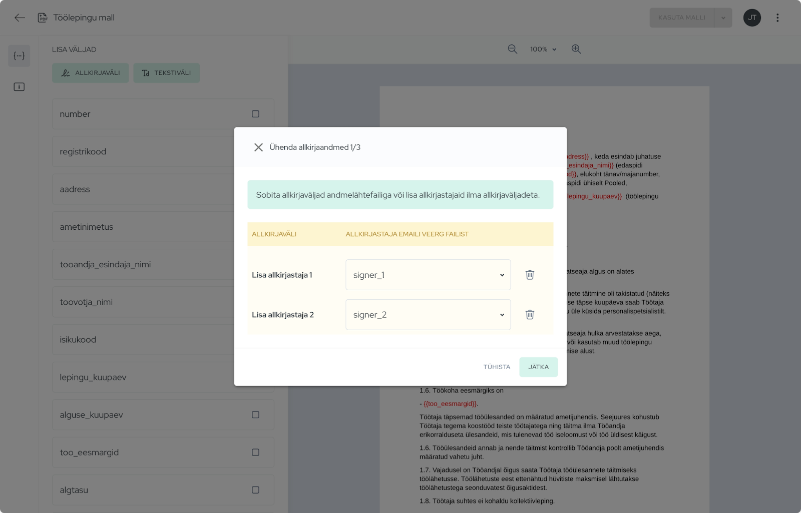

Selles juhendis näitame samm-sammult, kuidas:  
✔️ **Valmistada ette Exceli fail**, mis sisaldab nii dokumendi andmeid kui ka allkirjastajate e-posti aadresse.  
✔️ **Siduda Exceli andmed Agrello PDF-malliga**, et iga dokument täituks automaatselt õige info ja allkirjastajatega.  
✔️ **Läbi viia hulgiloomine**, mis genereerib dokumendid ja saadab need automaatselt allkirjastamiseks.

See protsess säästab väärtuslikku aega ja aitab vältida käsitsi sisestamise vigu. **Alustame!**

## Ettevalmistus

Enne kui alustad dokumentide hulgiloomega, veendu, et sul on olemas vajalikud andmed ja mallid.

1️⃣ **Valmista ette Exceli fail**

- Esimesel real peavad olema **veerupealkirjad**, mis vastavad dokumendis kasutatavatele väljadele.
- Kui sul pole veel valmis Exceli faili, saad **Agrello hulgiloome wizardis** alla laadida **näidisfaili**, kus on juba õiged veerunimed olemas.
- **Ära unusta lisada veerge allkirjastajate e-posti aadresside jaoks**, et süsteem saaks need automaatselt dokumendi allkirjastamise protsessi lisada.

2️⃣ **Loo Agrellosse PDF-mall**

- Hulgiloome kasutamiseks peab sul olema **Agrellos loodud PDF-mall**, kus on määratud muudetavad väljad.
- Kui sul veel malli ei ole, [vaata eelnevat juhendit](https://www.agrello.io/post/kuidas-luua-ja-kasutada-microsoft-wordi-malle-agrellos-allkirjastatavate-dokumentide-loomiseks), kuidas see luua.

Kui ettevalmistused on tehtud, saad alustada dokumentide hulgiloomisega!

‍

## Samm 1: Hulgiloome funktsiooni valimine

Dokumentide hulgiloomise alustamiseks:

1.  Ava Agrellos oma **PDF-malli detailvaade**.
2.  Klõpsa paremas ülanurgas nuppu **"Kasuta malli"**.
3.  Vali sobiv hulgiloome funktsioon:
    - **ASIC-konteinerite hulgiloome** – kui soovid, et loodavad dokumendid oleksid digitaalselt allkirjastatavas formaadis.
    - **EDOC-konteinerite hulgiloome** – Eesti e-allkirjade jaoks sobiv konteiner.

Kui oled valiku teinud, saad järgmisena üles laadida oma **Exceli faili**, mis sisaldab dokumendi loomiseks vajalikke andmeid.

## Samm 2: Exceli faili üleslaadimine

Nüüd saad oma **Exceli või CSV-faili** üles laadida, et luua malli põhjal mitu dokumenti korraga. Selleks:

1.  **Kui sul pole veel valmis faili**, saad klõpsata nupul **"Laadi alla näide"**, et alla laadida malli põhjal loodud Exceli näidis.
2.  Kui su fail on valmis, lohista see **üleslaadimisalale** või klõpsa sellel ja vali fail oma arvutist.
    - Toetatud failitüübid: **.xls, .xlsx, .csv**
3.  Kui fail on üles laetud, liigume edasi andmete sidumise juurde, et veenduda, et Exceli veerud vastavad õigetele malliväljadele.

## Samm 3: Allkirjastajate e-kirjade sidumine Exceli andmetega

Pärast Exceli faili üleslaadimist peate määrama, millised veerud sisaldavad allkirjastajate e-kirju. Selleks:

1.  Iga allkirjavälja kõrval valige rippmenüüst **vastav veerg Exceli failist**, kus on allkirjastajate e-posti aadressid (nt signer_1 ja signer_2).
2.  Kui Exceli failis on rohkem allkirjastajaid, saate vajadusel lisada täiendavaid allkirjavälju.
3.  Kui kõik e-kirjad on õigesti määratud, klõpsake **"Jätka"**, et liikuda edasi andmete sidumise juurde.

**Näpunäide:** Veenduge, et Exceli failis olevad e-kirjad on õigesti vormistatud, et vältida vigasid dokumendi saatmisel! 

## Samm 4: Andmeväljade sidumine Exceli veergudega

Selles etapis tuleb määrata, millised Exceli veerud vastavad dokumendi mallis olevatele väljadele. Kui Exceli veergude pealkirjad on samad mis Agrello malli väljade nimed, tehakse see sidumine **automaatselt**.

1.  **Kontrolli, kas kõik väljad on õigesti seotud.**
    - Veerg "Andmeväli" näitab malli väli.
    - Veerg "Andmete veerg failist" näitab, millise Exceli veeruga see on seotud.
2.  Kui mõni väli ei ole automaatselt seotud, vali rippmenüüst õige Exceli veerg.
3.  Kui kõik väljad on seotud, klõpsa **"Jätka"**, et liikuda dokumentide loomise eelvaatesse.

**Näpunäide:** Kontrolli Exceli tabelis, et kõik vajalikud andmed oleksid olemas, et vältida puudulike dokumentide genereerimist! 🚀

## Samm 5: Dünaamilise dokumendi nime määramine

Hulgiloomise käigus luuakse mitu dokumenti, seega on oluline, et igal dokumendil oleks unikaalne ja loogiline nimi. Selleks:

1.  **Vali dokumendi nimi** – vaikimisi on selleks malli nimi (nt _Töölepingu mall_).
2.  **Lisa Exceli väli dokumendi nime osana** – rippmenüüst vali väli (nt {{toovotja\_nimi}}), et iga loodud dokument saaks unikaalse nime, näiteks **"Töölepingu mall - Mari Maasikas"**.
3.  Kui kõik on määratud, klõpsa **"Loo dokumendid"**, et alustada hulgiloomist.

**Näpunäide:** Kasuta unikaalseid välju, nagu töötaja nimi või lepingunumber, et vältida sarnaste failinimede tekkimist!

## Samm 6: Hulgiloomise protsess

Kui oled klõpsanud **"Loo dokumendid"**, hakkab Agrello süsteem dokumente genereerima.

✅ **Mida teada:**

- Dokumendi loomise kiirus sõltub dokumentide arvust – väiksemad kogused valmivad mõne minutiga, suuremad võivad võtta kauem aega.
- Kui dokumente kohe kaustas ei näe, ära muretse – süsteem töötab taustal ja lisab need järk-järgult.

**Näpunäide:** Kui soovid jälgida protsessi, saad mõne aja pärast kausta uuesti avada ja värskendada, et näha, millised dokumendid on juba loodud! 

‍

## Kokkuvõte

Agrello **hulgiloome funktsioon** aitab sul kiiresti ja tõhusalt luua suure hulga dokumente, kasutades Exceli andmeid ja PDF-malli. Selle protsessi abil väldid käsitsi sisestamise vigu ning säästad väärtuslikku aega.

📌 **Peamised sammud, mida tegime:**

✔️ **Valmistasime ette Exceli faili**, kus olid kõik vajalikud andmed ja allkirjastajate e-kirjad.  
✔️ **Lõime Agrellosse PDF-malli**, mis võimaldab dokumente automaatselt täita.  
✔️ **Sidusime Exceli andmed malliga**, et iga dokument saaks õige info.  
✔️ **Käivitasime hulgiloomise**, mis genereeris dokumendid ja valmistas need ette allkirjastamiseks.

**Mida edasi teha?  
**Kui dokumendid on loodud, saad jälgida nende olekut Agrello keskkonnas. Kui kõik allkirjad on kogutud, saad allkirjastatud dokumendid alla laadida ja vajadusel arhiveerida.

**Nii lihtne see ongi!** Kui sul on vaja pidevalt sarnaseid dokumente luua, siis tasub see töövoog endale sisse seada – nii muutub kogu protsess kordades kiiremaks ja sujuvamaks!
