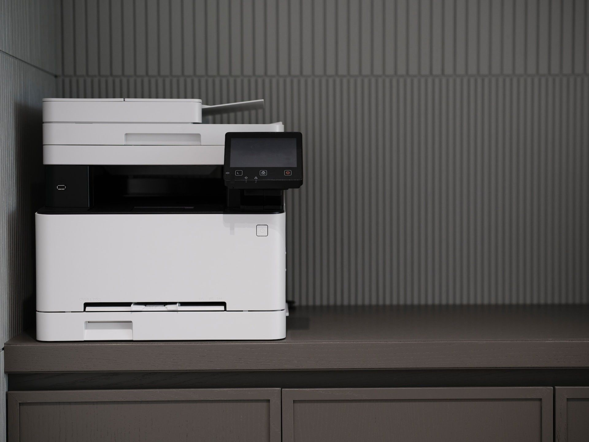
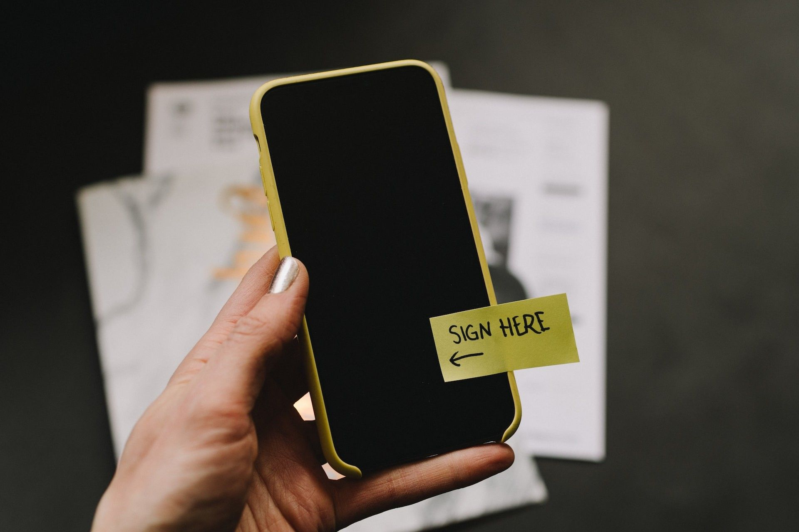

Ajaloost oleme kuulnud, kui lepingu koostamiseks tuli maha istuda nind kasutada selleks sulge ja tindipotti.  Ja seejärel tuli see hobuse seljas viia teiselepoole maad teisele poolele allkirjastamiseks. Õnneks need päevad on möödas. Selles postituses vaatame lähemalt, kuidas allkirjastamine on ajas edasi arenenud.

## Esimesed elektroonilised allkirjad

Esimene reaalne juhtum, kus inimesed kasutasid allkirja andmiseks midagi muud peale pliiatsi ja paberi, leidis aset 1869. aastal USA-s New Hampshire'i Ülemkohtus. See on teadaolevalt esimene kord, kui allkiri anti elektroonilise vahendi abil.

Selles kohtuasjas kasutati telegraafi teel antavaid allkirju ja kohus otsustas järgmiselt:

_„Pole vahet, kas operaator kirjutab tavalise pliiatsihoidja külge kinnitatud tolli pikkuse teraspliiatsiga või on tema kirjutusvahend tuhande miili pikkune vasktraat. Samuti ei ole vahet, kui ühel juhul kasutatakse tavalist tinti, teisel juhul teeb aga sama töö ära peenem vedelik, mida nimetatakse elektriks.”_

Tavakeeles tähendab see põhimõtteliselt seda, et kohus leidis, et ei ole vahet, kuidas inimesed midagi allkirjastavad, olgu selleks siis pliiatsihoidja külge kinnitatud kirjutusvahend või antakse allkiri telegrammi kaudu üle vasest elektrijuhtme. Mõlemad on juriidiliselt samad allkirjad. See juhtum on tavaliselt üllatav inimestele, kes ei teadnud, et esimene elektroonilise allkirjastamise juhtum leidis aset juba nii varakult, kuid huvitav on teada, et inimkond on püüdnud allkirjastamise protsessi mugavamaks muuta juba 150 aastat tagasi!

## Telefoni ja faksi abil antavad allkirjad

Elektrooniliste allkirjade ajalugu jätkub telefoni teel antavate allkirjadega. Telefoni teel antavad allkirjad on selline elektrooniline allkirjatüüp, mis kasutab kellegi salvestatud suulist nõusolekut või kokkulepet kirjalikult antava allkirja asemel. Need olid eriti populaarsed 20. sajandi alguses. Telefoni teel antavad allkirjad tegid allkirjastaja identiteedi kontrollimise üsna lihtsaks, kuna võimaldasid hiljem võrrelda allkirjastaja tegelikku häält salvestisega.

20\. sajandi lõpu poole muutusid aga faksiaparaadid laialt levinud vahendiks, mille abil sai anda nö märja tindi allkirju. Faksiaparaat on nimelt palju vanem, kui võiks arvata.

Allkirjastamine faksi teel

Faksimasina leiutas 1846. aastal Šoti leiutaja Alexander Bain. Kes selle aparaadiga ei ole kokku puutunud, siis nimelt kasutab faksiaparaat telefoniliini. Masin skaneerib dokumendi ja loeb sellelt, mitu valget ja musta ala seal on (nagu vöötkood). Seejärel saadab see need ühe elektriimpulssina mööda telefoniliini vastuvõtvasse masinasse. Ning siis saadab vastuvõttev masin selle elektroonilise impulsi oma printerile, mis selle välja prindib ja taastoodab.

Dokumendi allkirjastamiseks faksiaparaadiga tuleb anda dokumendile kirjutusvahendiga nö märja tindi allkiri, panna dokument faksiaparaati ja valida selle isiku faksinumber, kellele soovitakse allkirjastatud dokument saata. Seejärel skaneerib faksiaparaat dokumendi ja suhtleb vastuvõtva faksiaparaadiga. Vastuvõttev masin reprodutseerib dokumendile koopia, millel on allkiri. See oli levinud viis juriidiliste dokumentide allkirjastamiseks sel ajal, kui meil veel ei olnud arvutipõhist e-allkirja lahendust. Seda loetakse siiski tehniliselt elektrooniliseks allkirjaks, kuna see antakse elektroonilise protsessi kaudu.

## Kaasaegsed elektroonilised ja digitaalsed allkirjad

1970\. ja 1980. aastate paiku hakati arvuteid laialdasemalt kasutama. Esimese algelise digitaalallkirja lõid 1978. aastal Ronald Rivest, Adi Shamir ja Len Adleman.

Esimene elektroonselt allkirjastatud leping kahe riigi, USA ja Iirimaa vahel sõlmiti 1998. aastal, rõhutades elektroonilise kaubanduse edendamise kasvavat tähtsust.

1990\. ja 2000. aastatel hakkasid kehtima elektroonilise allkirja regulatsioonid. 2000. aastal kirjutas USA alla föderaalsele e-allkirja seadusele. Sisuliselt sätestati see, millal saab või võib USA-s elektroonilisi allkirju kasutada.

Eestis hakkas digitaalallkirja seadus kehtima 2000. aastal (hiljem asendas selle eIDAS) ja esimene digiallkiri anti Eestis 2002. aastal.

## Euroopa Komisjon: eIDAS

2014\. aastal hakkas Euroopa Liidus kehtima e-identimise ja e-tehingute määrus ehk paremini tuntud kui eIDAS. Sellega kehtestati erinevad eeskirjad digitaalallkirjade ja digiteenuste kohta Euroopa Liidus.

eIDAS sätestas digiallkirja erinevad tasemed. Need on: lihtsad elektroonilised allkirjad, täiustatud elektroonilised allkirjad ja kvalifitseeritud elektroonilised allkirjad.

Lihtsad elektroonilised allkirjad vastavad standardites kehtestatud tehnonõuetele, aga allkirja andmiseks kasutatud sertifikaadi omaniku taust ja sertifikaadi väljaandja taust ei pruugi olla teada.

Täiustatud elektroonilised allkirjad tuvastavad usaldusväärselt allkirjastaja ning loovad unikaalse lingi allkirja ja allkirjastaja vahel. Nende puhul on kontrollitud nii allkirja omaniku taust kui ka sertifikaadi väljaandja taust.

Kvalifitseeritud elektroonilised allkirjad on allkirja kõrgeim tase. Need on samaväärsed käsitsi kirjutatud allkirjaga, nende puhul on kontrollitud nii allkirja omaniku taust kui ka sertifikaadi väljaandja taust ning allkiri on antud sobivaks tunnistatud vahendi abil (Eestis on selleks ID-kaart, digi-ID, Mobiil-ID, kvalifitseeritud Smart-ID konto).

Kvalifitseeritud elektroonilised allkirjad tuginevad avaliku võtme infrastruktuurile (PKI). Avaliku võtme infrastruktuuri puhul on dokumendi allkirjastamiseks olemas avalik ja privaatne võti. Privaatvõtit kasutab ainult allkirjastaja elektrooniliste allkirjade andmiseks. Avalik võti on avalikult kättesaadav ja seda kasutavad need, kes peavad allkirjastaja elektroonilist allkirja kinnitama.

Euroopa Komisjon määrab täpselt kindlaks, millised digitaalallkirjad ja elektroonilised allkirjad on kehtivad, ning vastavus kehtiva õigusraamistikuga tähendab, et inimesed saavad usaldada seda vahendit, mida nad allkirjastamiseks kasutavad. Elektroonilise allkirja tarkvaral on nüüd tavaliselt täiustatud ja kvalifitseeritud elektroonilise allkirja andmise meetodid, nagu BankID, Smart-ID ja Mobiil-ID.

Elektroonilise allkirja andmise meetodid BankID, Smart-ID ja Mobiil-ID.

## Elektrooniliste allkirjade eelised dokumentide allkirjastamisel

Isegi moodsamal ajal, kui faksiaparaadid olid tavalised, oli dokumentide allkirjastamine endiselt üsna ebamugav protsess. Kui puudus faksiaparaat, siis tulidokumendid allkirjastada paberkandjal ja saatma need posti teel teisele osapoolele. Sellega kaasnes terve hunnik turvariske, nagu näiteks oluliste ja konfidentsiaalsete dokumentide kadumine, kuna kurjategijad või kelmid need ära varastasid. Posti teel saadetud dokumendid tähendasid asjaosalistele ka aeglast protsessi ning puudus dokumentide elektrooniline säilitamine.

Nagu me kõik teame, jätab paberi päris suure jälje ka keskkonnale. Paberi valmistamiseks kulub umbes 5 grammi süsinikku. See tundu just väga palju. Aga kui ettevõttel on 20 uut töötajat ja iga tööleping on umbes 8-leheküljeline, siis teeb see kokku juba 160 lehekülge ehk 800 grammi süsinikku. See on sama, mis diiselautoga 8-kilomeetrise vahemaa läbimine. Lisaks aeglasematele tööprotsessidele ja elektrooniliste dokumentide säilitamisele ei tahaks keegi meist ju oma allkirjastamisprotsessiga toota rohkem kahjulikke süsinikdioksiidi heitkoguseid.

Elektrooniliste allkirjade üha laialdasem kasutamine on kindlasti muutnud inimeste ja ettevõtete elu palju lihtsamaks ja mugavamaks. Tänapäeval saab printimise või faksimise asemel dokumendid lihtsasti hetkega teisele osapoolele saata ning vastaspool saab need e-allkirja tööriista abil kiiresti allkirjastada. See tähendab, et inimesed hoiavad hulgaliselt kokku väärtulikku aega, kasutades sobivat e-allkirjastamise tööriista dokumentide loomiseks ja jagamiseks.

## Olemasolevate e-allkirjastamise tööriistade puudused

Erinevates e-allkirjastamise tööriistades laetakse dokumendid allkirjastamiseks tavaliselt üles kasutaja arvutist. Tavapäraselt teisendatakse need PDF-vormingusse. Pärast seda tuleb läbida protsessi, mille käigus määratakse allkirjaväljad inimestele, kes peavad dokumendi allkirjastama. Seejärel saadatakse dokumendid allkirjastamiseks välja. Osapooled saavad lingi dokumendile, kuhu klikkides saavad seejärel allkirjastada, tavaliselt kasutades selleks oma allkirja kirjutamiseks virtuaalset pliiatsi.

Kuid isegi sellega kaasnevad mõningad väljakutsed ja ka nö käsitöö. Kui kasutatav e-allkirja tööriist on mõeldud ainult e-allkirjade kogumiseks, siis tuleb enne allkirjastamist kulutada aega ka dokumendi saatmisele e-kirja teel. Seda näiteks läbirääkimise pidamiseks tingimuste üle või lepingu klauslite kontrollimiseks väliste juristidega. Samuti tuleb kasutada ka tekstitöötlusprogrammi.

Kõik-ühes platvormi kasutamine elektrooniliseks allkirjastamiseks aitab lahendada nii mõndagi neist probleemidest.

## Agrello kasutamine digitaalallkirja jaoks

Agrello platvormil saab kasutada dokumendi loomise funktsionaalsust ja redigeerida oma dokumente mustandi faasis nii palju kui vaja. See toimub Office'i integreerimise kaudu – teil on põhimõtteliselt juurdepääs täielikule Office'i tööriistade komplektile, sealhulgas Microsoft Wordile ja seda otse oma e-allkirjastamise platvormil.

Kui liigute valikule "allkirjastamiseks heaks kiidetud", saate seejärel dokumenti jagada väliste osapooltega, kes saavad teiega koos lepingut kontrollida. See tähendab, et e-kirjade edasi-tagasi saatmist ei toimu, saate lihtsalt kutsuda koostööle neid, keda on vaja dokumendi koostamise protsessi kaasata.

Kui saadate aga dokumendi allkirjastamiseks välja, siis saab teine ​​osapool kutse. Ta saab kerge vaevaga luua endale konto, et dokumendile juurde pääseda ja allkirjastada. Samuti saab teine pool ka ilma sisselogimiseta kiiresti ja lihtsalt allkirjastada. See tähendab, et kõiki dokumente hoitakse ühes kohas ja millegi allkirjastamiseks ei pea kasutama mitut erinevat tööriista. Saate kõike lihtsalt ja kiiresti elektrooniliselt allkirjastada.

Pärast allkirjastamist saate kõiki oma dokumente ühes kohas vaadata ja hoiustada. Erinevad haldusfunktsioonid (nt kaustad) võimaldavad teil dokumente hõlpsasti korraldada. Lubade ja juurdepääsuõiguste haldamine võimaldab teil ka teisi liikmeid oma tööruumi kutsuda. Õigused saate määrata eraldi erinevates kaustades, olenevalt sellest, milliseid dokumente keegi peaks nägema või saama muuta. See võimaldab kasutajatel näha just ainult konkreetseid dokumente, mida soovite neile näidata.

Kui avate Agrelloga allkirjastatud dokumendi aga näiteks Acrobat Signis või Adobe Acrobatis, näete ka oma allkirjaga seotud digisertifikaati. Digisertifikaat ütleb teile allkirjastaja identiteedi, PDF-allkirja kellaaja ja kuupäeva ning selle, kas dokumenti ja elektroonilisi allkirju on muudetud või mitte.

Agrello Zapieri integratsioonide abil saate ühendada allkirjastatud dokumendid ja elektroonilise allkirjastamise protsessid paljude erinevate võrguteenustega. Näiteks saate luua Zapieri ühenduse, mis saadab teie allkirjastatud dokumendid Google Drive'i. Või võite luua Google'i vormid, mille abil luuakse leping iga kord, kui vormide kirje esitatakse. See sobib suurepäraselt väikeettevõtetele, kes peavad suhteliselt väheste või eraldi seisvate tööriistadega palju ära tegema.

## Kokkuvõtteks

Dokumentide allkirjastamine on läbi teinud pika tee ja palju arenenud. Peamine tõsiasi on aga see, et dokumentide allkirjastamine erinevatel eesmärkidel ei kao kuhugi.

Kunagi oli dokumentide allkirjastamine keeruline protsess. Selleks tuli kasutada näiteks vahapitsatit või telegraafi. Hilisematel aegadel kasutati faksiaparaati dokumentidele algeliselt allkirjade lisamiseks. Tänapäeval tuleb tihti aga kasutada mitmeid erinevaid tarkvarasid dokumentide loomiseks ja allkirjastamiseks.

Nüüd, kui allkirjade loomise meetodid on märkimisväärselt arenenud, on aeg hakata mõtlema, kuidas saaksite oma äriprotsesse arendada. Kuidas saaksite mõnda allkirjastamisprotsessi tõhusamaks muuta?

Kui soovite meiega rääkida oma ettevõtte allkirjastamise ja lepinguprotsesside arendamisest, [võtke meiega ühendust siin](https://www.agrello.io/company/contact).
