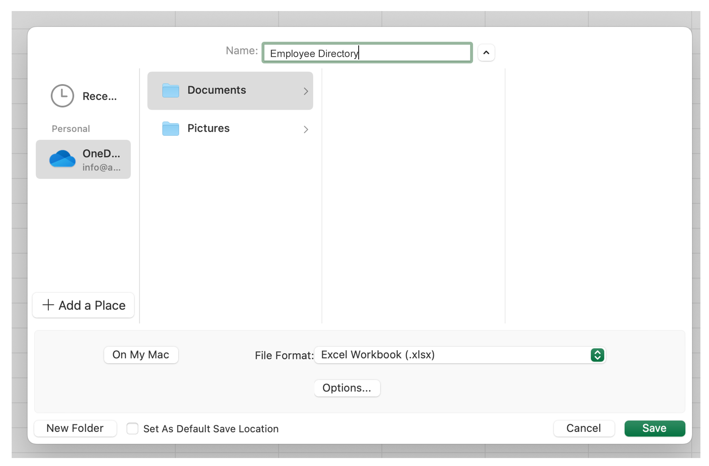
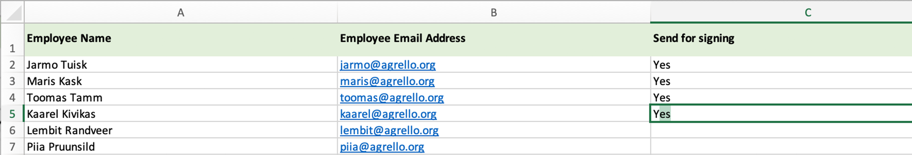

Dažkārt mēs nonākam situācijās, kad nepieciešams ātri izveidot desmitiem vai simtiem dokumentu, kas jāparaksta pēc vienas un tās pašas veidnes. Vai nu tas ir iekšējo darba noteikumu atjaunošana, izmaiņu veikšana klientu līgumos vai abonēšanas līgumu parakstīšana. Šādos gadījumos Agrello savienošana ar Excel failu Microsoft OneDrive mākoņa mapē, izmantojot Zapier, ievērojami paātrina dokumentu apstrādi.

‍

## Kas ir Agrello un kas ir Zapier?

‍

Agrello ir elektroniskā paraksta pakalpojums, kas ļauj ērti un ātri nosūtīt dokumentus parakstīšanai, izmantojot drošu tiešsaistes vidi. Dokuments tiek augšupielādēts Agrello mākoņa pakalpojumā, un parakstītājs saņem e-pasta uzaicinājumu parakstīt. Jūs varat parakstīt, izmantojot Mobile-ID, Smart-ID un Agrello pašu digitālo parakstu.

Zapier ir tīmekļa pakalpojums, kas ļauj savienot dažādus tīmeklī bāzētus rīkus un automatizēt biznesa procesus bez programmētāja palīdzības. Zapier var savienot vairāk nekā 5000 dažādas tīmekļa lietotnes.

Agrello savienojums ar Zapier tika pabeigts 2022. gada sākumā, un tas jau ir izmantots vairāk nekā tūkstoš dokumentu izveidošanai.

Excel un Agrello sasaistīšana ietaupa daudzas stundas, kas citādi tiktu pavadītas, veidojot un izplatot katru dokumentu atsevišķi. Turklāt var izvairīties no manuālu kļūdu riska, un, kad savienojums ir izveidots, Excel var jebkurā laikā papildināt ar jauniem datiem, automātiski veidojot jaunus dokumentus, kas tiek parakstīti Agrello.

‍

## Piemērs: Kā var automatizēt iekšējo noteikumu parakstīšanu?

‍

Lai labāk izprastu, kā darbojas Excel savienojums ar Zapier, izskatīsim piemēru, kur izmaiņas iekšējos noteikumos tiek nosūtītas darbiniekiem parakstīšanai.

‍

### Process sastāv no trim soļiem:

1.  Dokumenta veidnes un Excel izklājlapas sagatavošana.
2.  Dokumenta veidnes izveidošana Agrello
3.  Excel un Agrello savienošana Zapier

‍

### Sagatavošana

‍

Vispirms jāsagatavo iekšējo noteikumu dokumenta veidne Microsoft Word, un tur jāatzīmē lauki, kas ir specifiski katram darbiniekam.

‍

‍

Dinamiski aizpildāmie lauki Word jāievada figūriekavās, piemēram **{{darbinieka\_vards}}**. Lai izvairītos no kļūdām, iekavās ietvertajā tekstā nedrīkst izmantot pieturzīmes vai atstarpes.

Pēc tam mēs sagatavojam Excel failu ar visu darbinieku sarakstu un datiem, kas jāiekļauj dokumentā. Katram darbiniekam jāizveido atsevišķa rinda un katram dinamiskajam laukam - atsevišķa kolonna.

‍

Tabulā jābūt darbinieka e-pasta adresei, uz kuru jānosūta uzaicinājums parakstīt.

Mēs arī iesakām izmantot tā saukto kontroles kolonnu (piemēram, **"Nosūtīt parakstīšanai"**), ar kuru jūs varat norādīt Excel, vai šī rinda jānosūta uz Agrello vai nē.

Excel fails jāsaglabā jūsu uzņēmuma **OneDrive** direktorijā, jo tikai tur **Zapier** var piekļūt failam.

‍

### Dokumenta veidnes izveidošana Agrello

‍

Agrello varat viegli izveidot dokumenta veidni. Jums jāizvēlas opcija **"Veidne"** izvēlnē **"Izveidot jaunu"** un pēc tam vienkārši jāaugšupielādē sagatavotais Word fails.

‍

Ikviens var patstāvīgi un bez maksas izveidot Agrello kontu. Ar bezmaksas kontu jūs varat izveidot trīs dokumentus mēnesī. Tātad, lielāku apjomu automatizēšanai ir nepieciešams maksas konts.

‍

## Iestatīšana Zapier

‍

Ikviens var arī izveidot bezmaksas Zapier kontu. Kad konts ir izveidots, jāizveido pirmais savienojums ("Zap"). Darbvirsmas ekrānā tam ir ātra veidlapa.

Meklēšanas lodziņā kreisajā pusē ierakstiet Excel un labajā pusē - Agrello.

‍

Nākamajā rindā laukā **"Kad tas notiek..."** ierakstiet **Atjaunināta** rinda un laukā **"Tad dari šo!"** ierakstiet **Izveidot jaunu dokumentu no veidnes** un pēc tam noklikšķiniet uz pogas **"Izmēģināt"**.

‍

Pēc tam jums jāpasaka Zapier, kuru Office 360 kontu izmantot (**"Izvēlēties kontu"**) un kuru failu tur meklēt (**Iestatīt triggerus**).

‍

Pievienojiet jaunu kontu vai izvēlieties esošo, nospiediet **"Turpināt"** un pēc tam izvēlieties failu.

‍

Visbeidzot, izvēlieties **"Triggera"** kolonnu. Šī ir kolonna, kurā, mainoties saturam, tiek aktivizēts konkrēts triggeris un Agrello tiek izveidots līgums. Šim nolūkam mēs izvēlamies C kolonnu **"Nosūtīt parakstīšanai"**.

‍

## Kā darbojas "Triggera" kolonna?

‍

Kad mēs iestatījām Excel savienojumu, mēs norādījām **"Nosūtīt parakstīšanai"** kā C triggera kolonnu. Tas nozīmē, ka Zapier izveidos jaunu līgumu Agrello, kad jūs kaut ko ierakstīsiet šajā kolonnā.

Šādā veidā mēs varam Excel pārbaudīt, kuru dokumentu nosūtīt uz Agrello. Viss, kas jums jādara, ir ierakstīt, piemēram, **"Jā"** pēc noteiktas rindas, un tad Zapier zina, ka tas var paņemt šo rindu un izveidot dokumentu Agrello.

‍

Visbeidzot, jūs nospiežat Tālāk un pārbaudāt savu triggeri.

‍

\---

‍

Nākamais solis ir iestatīt Agrello savienojumu Zapier. Tāpat kā ar **Excel** un **OneDrive**, vispirms jāpie
