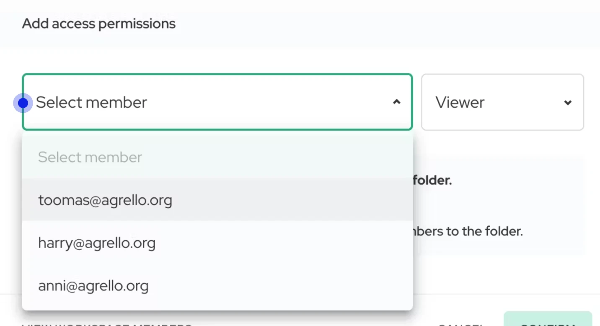

Ja tā, jūs neesat vienīgie. Daudzas komandas saskaras ar izaicinājumiem efektīvā dokumentu pārvaldībā un sadarbībā.

Šis raksts jūs iepazīstinās ar Agrello jaudīgajām sadarbības funkcijām, kas izstrādātas, lai optimizētu jūsu komandas darba plūsmu un uzlabotu produktivitāti.

Jūs uzzināsiet, kā:

- Izveidot centralizētu centru visām jūsu komandas līgumu darbībām
- Efektīvi pārvaldīt piekļuvi dokumentiem un atļaujas
- Izmantot viedos rīkus līgumu termiņu izsekošanai un progresa vizualizācijai
- Ieviest labākās prakses nevainojamas komandas sadarbības nodrošināšanai

Neatkarīgi no tā, vai vēlaties uzlabot komunikāciju, pastiprināt dokumentu drošību vai vienkārši ietaupīt laiku ikdienas darbībās, Agrello sadarbības funkciju apgūšana pārvērtīs jūsu komandas darbu ar dokumentiem. Iedziļināsimies un apskatīsim, kā vislabāk izmantot šos rīkus, lai apmierinātu jūsu komandas specifiskās vajadzības.

## Darba vietu un mapju izpratne

### Darba vietas: jūsu komandas centrālais mezgls

Darba vieta Agrello kalpo kā centrālā vieta jūsu komandas sadarbības centieniem. Tā apvieno koplietotās mapes, līgumus, dokumentu veidnes un komandas locekļus zem viena jumta. Galvenās darba vietu priekšrocības ietver:

- Līgumu centra izveide visam uzņēmumam ar vienu abonementu
- Iespēja uzaicinātajiem dalībniekiem veidot un rediģēt saturu bez atsevišķiem abonementiem
- Centralizētas vietas nodrošināšana visām ar līgumiem saistītajām darbībām

### Mapes: organizēta dokumentu pārvaldība

Darba vietā mapes palīdz organizēt un koplietot konkrētas dokumentu un veidņu kopas ar atbilstošajiem komandas locekļiem. Tas nodrošina drošu un efektīvu dokumentu pārvaldību. Mapes piedāvā tādas funkcijas kā:

- Kanban tipa progresa pārskats dokumentu statusa izsekošanai
- Dokumentu saraksta skats ērtai pārskatīšanai
- [Koplietotas veidnes konsekventai dokumentu izveidei](https://www.agrello.io/post/how-to-create-agrello-templates)
- Piekļuves kontroles funkcijas dokumentu koplietošanai ar pareizajiem cilvēkiem
- Agrello Codriver - mākslīgā intelekta asistents, kas palīdz izsekot līgumu termiņiem, pusēm un citam

## Komandas iestatīšana Agrello

### Komandas locekļu pievienošana darba vietai

1.  Dodieties uz savas darba vietas iestatījumiem
2.  Noklikšķiniet uz cilnes "**Komanda**"
3.  Izvēlieties "**Pievienot dalībnieku**"
4.  Ievadiet komandas dalībnieka e-pasta adresi
5.  Izvēlieties atbilstošo lomu (piemēram, Dalībnieks, Administrators)
6.  Nosūtiet uzaicinājumu

### Par atļaujām un darba vietas lomām

- **Dalībniekiem** būs piekļuve mapēm, kurās viņi ir uzaicināti, un viņi neredzēs nevienu citu mapi
- **Administratori** var redzēt visas mapes darba vietā un pievienot jaunus dalībniekus mapēm
- **Darba vietas īpašniekiem** ir visas administratoru tiesības, bet viņi var arī pārvaldīt abonementus

## Piekļuves koplietošana un sadarbība

### Mapju koplietošana

1.  Piekļuves tiek pārvaldītas tikai augstākā līmeņa mapēm
2.  Atveriet mapi, kuru vēlaties koplietot
3.  Noklikšķiniet uz cilnes "**Atļaujas**" mapes skatā
4.  Noklikšķiniet uz pogas "**Pievienot piekļuves atļaujas**"
5.  Izvēlieties komandas locekļus, kuriem vēlaties piešķirt piekļuvi
6.  Izvēlieties atbilstošo lomu katram dalībniekam:**‍**
    1.  **Skatītāji** var tikai apskatīt dokumentus un pievienot komentārus**‍**
    2.  **Redaktori** var veidot jaunus dokumentus un veidnes un nosūtīt tos parakstīšanai
7.  Saglabājiet iestatījumus, un tie stājas spēkā nekavējoties

## Labākās prakses komandu sadarbībai Agrello

1.  **Organizējiet stratēģiski**: Izveidojiet loģisku mapju struktūru, balstoties uz nodaļām, projektiem vai dokumentu veidiem, lai atvieglotu navigāciju
2.  **Izmantojiet veidnes**: Glabājiet un koplietojiet bieži izmantotās dokumentu veidnes mapēs, lai nodrošinātu konsekvenci un efektivitāti visā komandā
3.  **Rūpīgi pārvaldiet atļaujas**: Regulāri pārskatiet un atjauniniet komandas dalībnieku piekļuves līmeņus, lai saglabātu dokumentu drošību
4.  **Izmantojiet Agrello Codriver**: Izmantojiet MI asistentu, lai sekotu līdzi līgumu atjaunošanai un termiņiem, iegūtu informāciju par pusēm un veiktu citas darbības
5.  **Veiciniet aktīvu sadarbību**: Apmāciet savu komandu efektīvi izmantot koplietotās mapes, veidnes un sadarbības funkcijas
6.  **Izmantojiet Kanban skatu**: Izmantojiet Kanban tipa progresa pārskatu, lai sekotu dokumentu statusiem un identificētu jebkādus procesa šķēršļus
7.  **Izmantojiet filtrus saraksta skatā:** Ātri filtrējiet līgumus pēc to statusiem vai pēdējo atjauninājumu datumiem

## Secinājumi

Agrello spēcīgās sadarbības funkcijas ļauj jūsu komandai efektīvi sadarboties dokumentu izveidē, pārvaldībā un e-parakstīšanas procesos. Izmantojot darba vietas, mapes un dažādos pieejamos sadarbības rīkus, jūs varat optimizēt savas komandas darba plūsmas, uzlabot dokumentu pārraudzību un paaugstināt vispārējo produktivitāti.

Atcerieties, ka efektīva sadarbība Agrello balstās uz skaidru komunikāciju, labi definētiem procesiem un regulāru platformas funkciju izmantošanu. Kad jūs un jūsu komanda kļūsiet arvien pieredzējušāki Agrello lietošanā, jūs atklāsiet jaunus veidus, kā optimizēt savu dokumentu pārvaldību un e-parakstīšanas darba plūsmas, kas novedīs pie efektīvākas un produktīvākas komandas sadarbības.

‍
