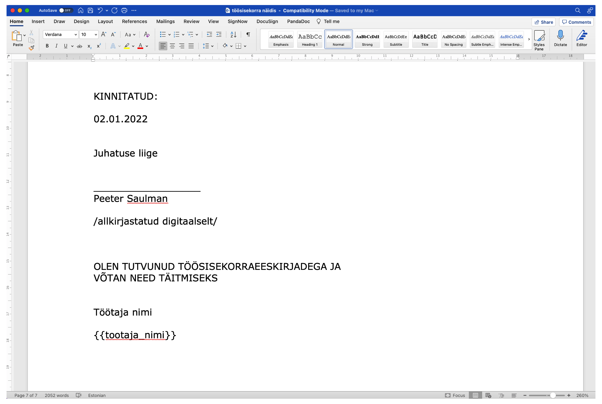
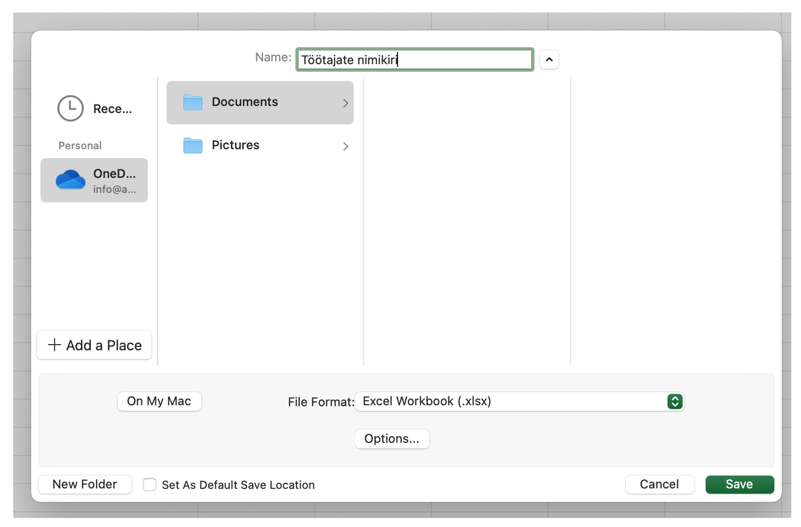
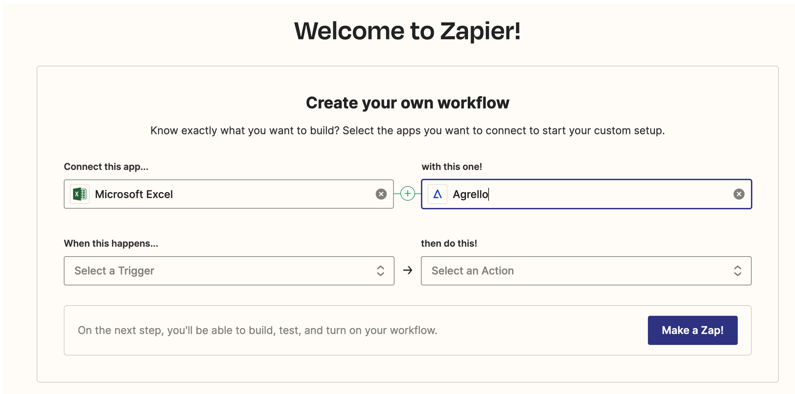
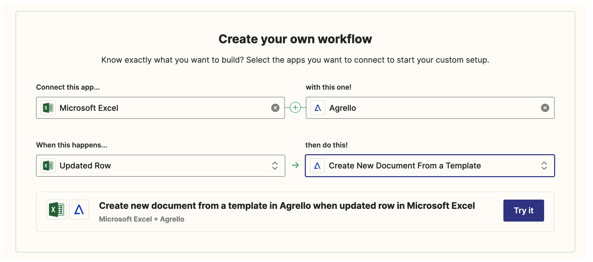
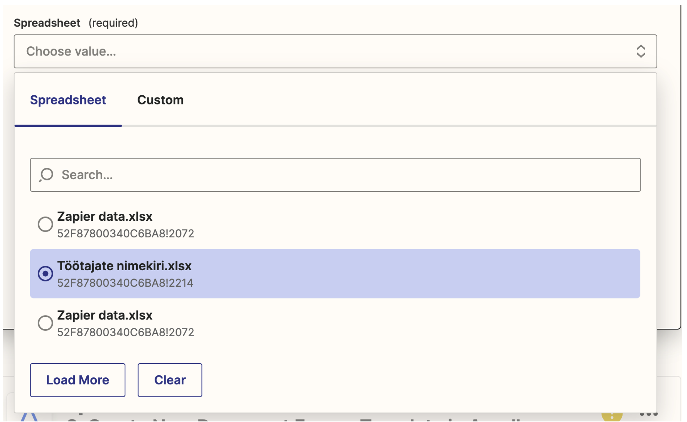
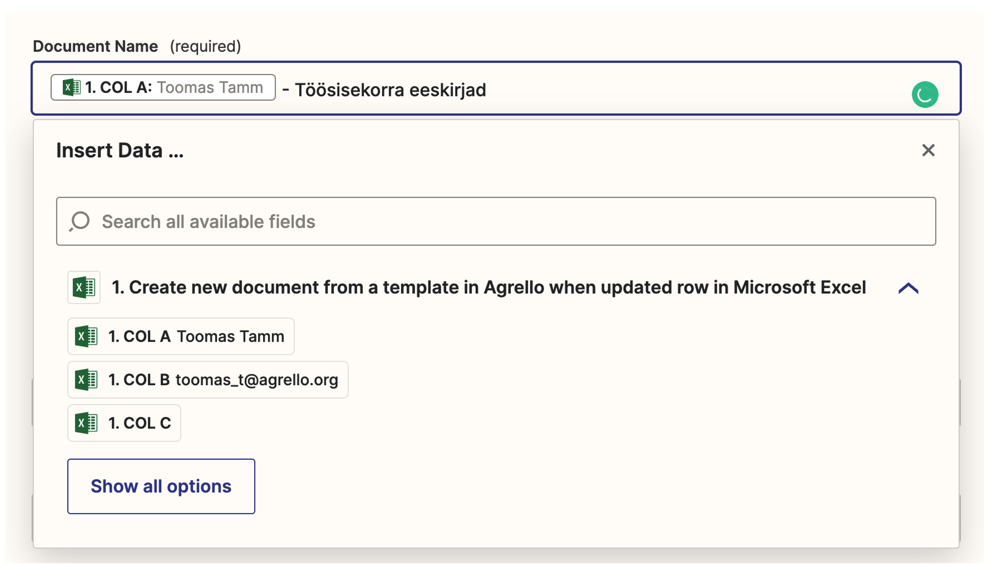
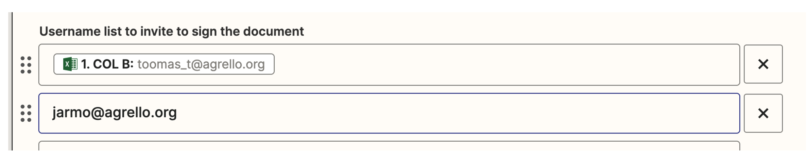
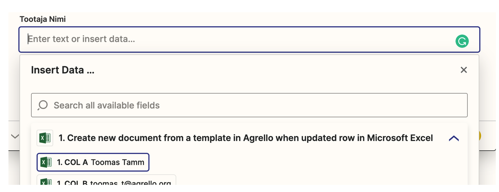
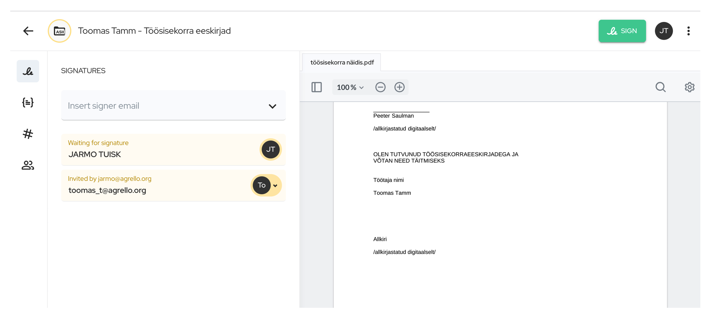

Mõnikord tuleb meil ette olukordi, kui on vaja kiiresti luua kümneid või sadu allkirjastamisele minevaid dokumente ühe ja sama põhja peale. Olgu selleks juhuks siis töösisekorraeeskirjade uuendamine, kliendilepingute muudatused või liitumislepingute allkirjastamine. Selliste juhtude puhul kiirendab paberimajandust oluliselt **Agrello** ühendamine Microsoft Onedrive pilvekaustas asuva **Excel** failiga läbi Zapieri.

‍

## Mis on Agrello ja mis on Zapier?

‍

Agrello on e-allkirjastamise teenus, mis võimaldab mugavalt ja kiiresti saata dokumente allkirjastamiseks läbi turvalise veebikeskkonna. Dokument laetakse üles Agrello pilveteenusesse ja allkirjastajale saadetakse kutse allkirjastamiseks emailile. Allkirjastada saab nii Mobiil-ID, Smart-ID kui ka Agrello enda digiallkirjaga.

**Zapier** on veebiteenus, mis võimaldab ilma programmeerija abita ühendada omavahel erinevaid veebipõhiseid tööriistu ning automatiseerida äriprotsesses. Zapieris on võimalik omavahel siduda üle 5000 erinevad veebiäpi.

Agrello Zapieri ühendus sai valmis 2022. aasta alguses ja praeguseks on seda kasutatud juba enam kui tuhande dokumendi loomiseks.

Exceli ja Agrello omavahel ühendamine aitab säästa mitmeid tunde, mis muidu kuluks dokumentide ükshaaval loomisele ja laiali saatmisele. Lisaks saab vältida käsitööga kaasnevate vigade tekkimise ohtu ning kui ühendus on korra loodud, siis saab Excelit alati täiendada uute andmetega, mis automaatselt loovad uusi allkirjastamisele minevaid dokumente Agrellosse.

‍

## Näide: kuidas automatiseerida töösisekorraeeskirjade allkirjastamine?

‍

Selleks, et paremini aru saada, kuidas Exceli ühendamine Zapieriga käib, teeme läbi ühe näite, kus töötajatele saadetakse allkirjastamiseks töösisekorraeeskirjade muudatused.

Protsess koosneb kolmest etapist:

1.  Dokumendipõhja ja Exceli tabeli ettevalmistamine
2.  Agrellos dokumendipõhja loomine
3.  Zapieris Exceli ja Agrello omavahel ühendamine

### Ettevalmistamine

‍

Alustuseks tuleb valmistada ette sisekorraeeskirjade põhi Microsoft Wordis ning seal markeerida väljad, mis on töötajaspetsiifilised.

‍

‍

Dünaamiliselt täidetavad väljad tuleb Wordi sisestada loogeliste sulgudega, näiteks {{tootaja\_nimi}}. Vigade vältimiseks ei tohi sulgudes olevas tekstis kasutada täpitähti ega tühikuid.

Järgmisena valmistame ette Exceli faili, kus on nimekiri kõigist töötajatest ja andmed, mis lähevad dokumenti. Iga töötaja kohta tuleb luua üks eraldi rida ja iga dünaamilise välja kohta üks veerg.

‍

‍

Kindlasti peab tabelis olema töötaja meiliaadress, kuhu saadetakse allkirjastamise kutse.

Lisaks soovitame kasutada nö kontrollveergu (näiteks „Saada allkirjastamisele“), mille abil saab Excelis öelda, kas see rida saata Agrellosse või mitte.

Exceli fail tuleb salvestada oma ettevõtte **Onedrive** kataloogi, sest ainult sealt on Zapieril võimalik failile ligi pääseda.

‍

‍

### Agrellos dokumendipõhja loomine

‍

Agrellos saab dokumendipõhja luua kerge vaevaga. **Create new** menüüst tuleb valida **Template** ja siis lihtsalt üles laadida eelnevalt ettevalmistatud Wordi fail.

‍

Agrello konto saab igaüks luua ise ja tasuta. Tasuta kontod võimaldavad luua kolm dokumendi kuus, seega automatiseerimiseks suuremate mahtude puhul on vajalik tasulise konto olemasolu.

### Seadistamine Zapieris

‍

Zapieri konto saab igaüks samuti tasuta luua. Kui konto on loodud, tuleb luua esimene ühendus („Zap“). Töölaual on selle jaoks olemas kiire vorm.

Sisesta otsingukasti vasakule poole Excel  ja paremale Agrello.

‍

Järgmisel real sisesta kasti „When this happens...“ **Updated row** ja „then do this!“ kasti, **Create New Document From a Template** ning seejärel kliki **Try it** nupule.

Järgmisena tuleb Zapierile öelda, millist Office 360 kontot kasutada („Choose account“) ja millist faili sealt otsida (_Set up trigger_).

‍

Ühenda uus või vali juba eksisteeriv konto ja vajuta **Continue** ning seejärel vali fail.

‍

Lõpetuseks vali Trigger veerg. See on veerg, milles sisu muutumisel aktiveeritakse konkreetne ajend ja luuakse leping Agrellos. Valime selleks veeru C „Saada allkirjastamisele“.

**Kuidas töötab Trigger veerg?**

Kui me seadistasime Exceli ühendust, siis ütlesime, et trigger veerg on C „Saada allkirjastamisele“. See tähendab seda, et Zapier loob uue lepingu Agrellos siis, kui sinna veergu midagi kirjutada.

Sedasi saame kontrollida Excelis, et milline dokument Agrellosse saata. Piisab vaid, kui konkreetse rea taha kirjutada näiteks „Jah“ ja siis Zapier teab, et võib võtta selle rea ja luua dokumendi Agrellosse.

‍

Lõpetuseks vajuta **Continue** ja siis **Test your trigger**.

Järgmine etapp on seadistada Agrello ühendus Zapieris. Sarnaselt Excelile ja Onedrive’ile tuleb ühendada kõigepealt Agrello konto.

Järgmise sammuna tuleb valida dokumendipõhi (_Template ID_) ja siduda omavahel Exceli väljad ning dokumendipõhja väljad. Valime Töösisekorra näidise põhja, mille olime eelnevalt Agrellosse laadinud. Põhja valikul tuvastab Zapier automaatselt, millised dünaamilised väljad on dokumendis kasutusel.

‍

Seejärel saame sisestada dünaamiliselt loodava dokumendi nime (Document name), mis võib olla näiteks töötaja nimi ja staatiline tekst.

‍

Järgmised kaks valikut määravad, mida Agrello peaks ette võtma, kui Zapier ta “välja kutsub”.

- **_Publish Document and send invitation after creation_** määrab ära, kas kutse allkirjastamisele saadetakse koheselt välja (vali väärtus „True“) või jääb dokument _Draftina_ Agrellosse ootele (vali väärtus „False“).

- **_Output type_** määrab, kas allkirjastamiseks valitakse digikonteineri formaat (asice), mis on Eestis tavaline, või PDF-formaat, mida eelistatakse mujal maailmas.

Seejärel tuleb täita allkirjastajate väljad

**Username list to invite to sign documents** esimesele väljale peab Excelist valima emaili veerust töötaja meiliaadressi.

Kui on üks valitud, siis saab lisada järgmisele reale järgmise allkirjastaja. Antud näites on see ettevõttepoolne esindaja ja ei muutu – seega lisame selle staatilise tekstina.

Ning lõpetuseks lisame dokumendi dünaamilisele väljale töötaja nime Excelist.

‍

Ning seejärel vajutame **Continue** ja edasi **Test zap**. Selle tulemusena tekib uus allkirjastamisele saadetud dokument Agrellos.

Kui kõik töötab, siis tuleb vajutada **Publish zap**.

### **Kokkuvõtteks**

‍

Kui see seadistus on tehtud, siis on ühendus Agrello ja Exceli vahel valmis ja töötab nii kaua, kuniks see Zap on aktiivne. See tähendab seda, et sul on võimalik igal ajal sinna Excelisse uusi ridu lisada, mis automaatselt loovad allkirjastamisele mineva dokumendi Agrellos.

Seda laadi püsivat ühendust on tänaseks kasutanud juba mitmed väikeettevõtted, et säästa paberimajandusele kuluvat aega. Ühest näitest oleme pikemalt kirjutanud siin: [**Kuidas Agrello abiga kiiremini investoritega lepinguid sõlmida.**](https://www.agrello.ee/kuidas-agrello-abiga-kiiremini-investoritega-lepinguid-solmida)

### Head integreerimist!

‍
