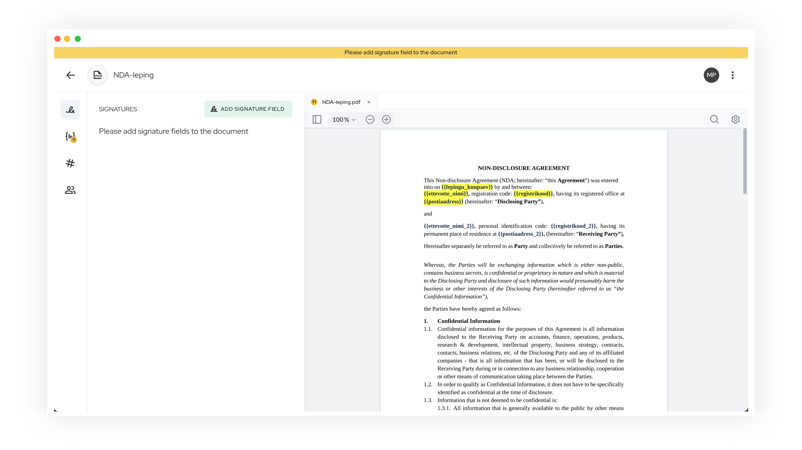
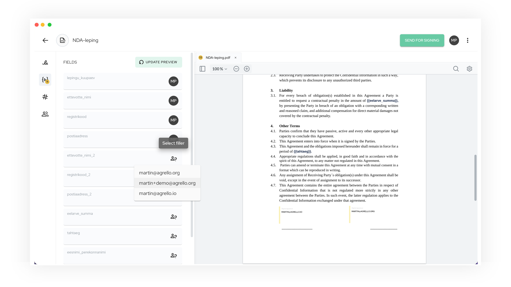
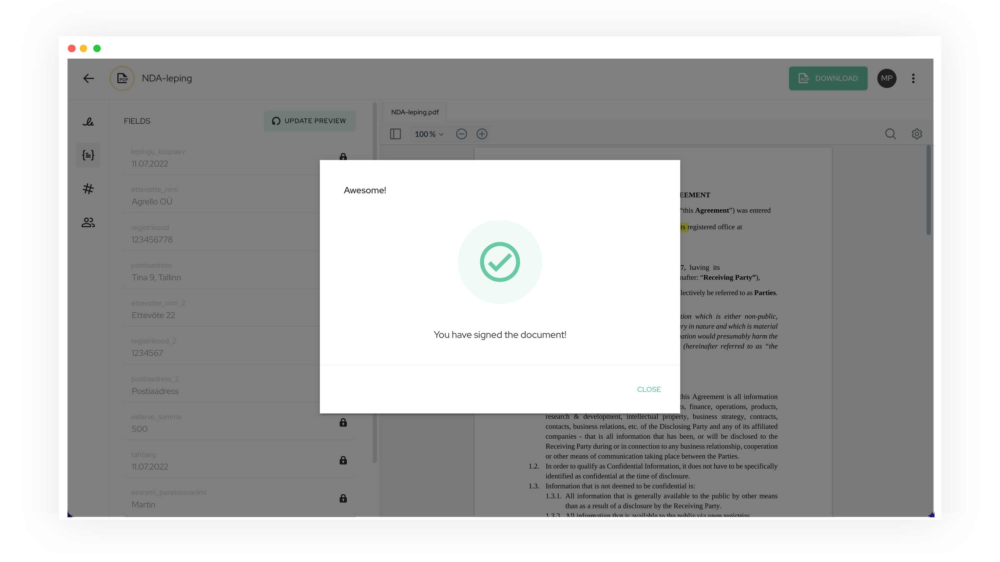
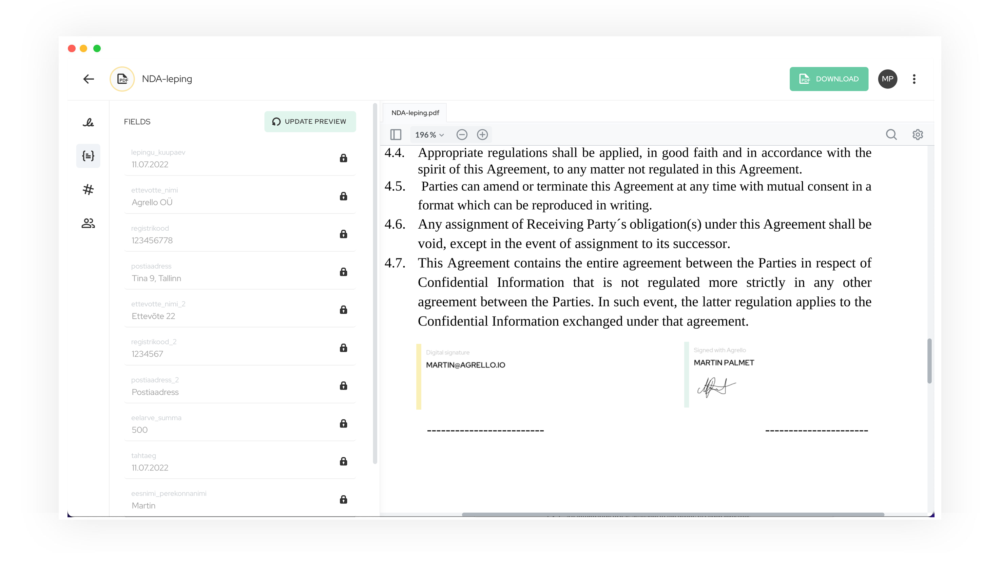

**Pole kahtlustki, et enamlevinud töövahend dokumentide ettevalmistamiseks on Microsoft Word,**  kuid üllataval kombel kulub lepingute ettevalmistamisele, dokumentide ja lepingute kopeerimisele ning kaustadesse organiseerimisele endiselt väga palju aega. Samuti on lepingute edasi-tagasi saatmine e-kirja teel ning printimise ja arhiveerimisega tegelemine ajamahukas.

Agrello saab abiks olla just lepingute ettevalmistamise ja allkirjastamisega, seega keskendume eelkõige just sellele osale, kuidas toimub lepingupõhjade täitmine töötajate poolt, kes seda teevad, kuidas on ettevõttes lepingute ettevalmistamine korraldatud ning kuidas ja milliste tööriistadega lepingud allkirjastatakse.

‍

[YouTube Video](https://www.youtube.com/watch?v=BLwajy4XM9U)

‍

## Kuidas tavapraktikas lepinguid allkirjastamiseks ette valmistatakse?

‍

Tõenäoliselt algab lepingupõhja ettevalmistamine nii, et kõigepealt luuakse dokumendipõhi Microsoft Wordis, kus muutmist vajavad väljad jäetakse tühjaks. Neid võivad täita allkirjastajad ise enne lepingu sõlmimist või lepingu ettevalmistaja, kui tal on olemas vastav info. Selliseid lepingupõhjasid hoitakse tihti jagatud kaustades, et kõikidel töötajatel oleks ligipääs vajaminevatele dokumentidele.

‍

‍

Iga uue lepingu sõlmimiseks tuleks teha lepingupõhjast koopia ning täita muutuvad väljad käsitsi Microsoft Wordis. Seejuures tuleb olla hoolikas, et lepingu teksti ei ununeks mõne teise kliendi või lepingupartneri andmeid. Kui lepingupõhi on valmis, siis saadetakse see tavaliselt e-kirja teel vastaspoolele ülevaatamiseks, täiendamiseks ja allkirjastamiseks. Niimoodi on lepingute sõlmimise praktika välja näinud aastakümneid ning tõenäoliselt kestab selline korraldus veel kaua, sest Microsoft Wordile on raske leida võrdväärset vastast.

‍

‍

Kui sõlmitavaid lepinguid on kümneid või sadu, siis võtab nende ettevalmistamine ka tüüplepingu puhul väga palju aega, sest tühjad väljad on vaja korrektselt täita ükshaaval, seejärel dokument salvestada ning õige versioon vastaspoolele saata. Allkirjastamisele eelnev kirjavahetus võib tihti venida ning dokumendi staatusel on raske silma peal hoida.

‍

## Kuidas lepingute ettevalmistust allkirjastamiseks lihtustada?

‍

Agrello on loonud viisi, kuidas juba tuttavat tööriista Microsoft Wordi veel paremini ära kasutada ning lepingute ettevalmistamisele kuluvat aega vähendada. Agrello platvormile on võimalik üles laadida lepingupõhjasid, milles sisalduvad dünaamilised väljad. Sellist lepingupõhja on võimalik korduvkasutada ning dünaamilisi välju iga kord uute andmetega täita meie platvormilt lahkumata. Samuti saab ettevalmistatud dokumendi kohe vastaspoolele allkirjastamiseks saata ning ka digitaalne allkirjastamine toimub samas keskkonnas.

‍

‍

Dünaamiliste väljadega lepingupõhja ettevalmistamine nõuab sinult ühekordset pingutust ja tööd dokumendiga. Selleks, et tekitada täidetav väli sinu poolt ettenähtud kohale dokumendi teksti sees, tuleb kasutada **{{loogelisi sulge}}**. Ära muretse, need loogelised sulud ei jää dokumendis nähtavale, vaid indikeerivad ainult välja asukohta enne selle täitmist. Sulgude sisse võid kirjutada selle välja nime, näiteks **{{ettevotte\_nimi}}, {{registrikood}}** vms. Seda infot näeb ka sinu dokumendi vastaspool.

Kui laed dokumendi Agrello platvormile üles, siis tunneb meie tarkvara dünaamilised väljad ära ja võimaldab sul neid lihtsasti täita või vastaspoolele täitmiseks määrata. Sellistest dünaamiliste väljadega dokumentidest on Agrello platvormil võimalik luua ka korduvkasutatavaid lepingupõhjasid - nii ei ole vaja faili iga kord uuesti üles laadida.

Eestis on inimesed digitaalse allkirjastamisega juba harjunud ning selleks kasutatakse erinevaid vahendeid nagu Mobiil-ID, Smart-ID ja ID-kaart. Agrello platvormil on toetatud Mobiil-ID ja Smart-ID, millega on võimalik tuttaval viisil dokument allkirjastada. Suurem peavalu kaasneb sellega, kui teine lepingupool on välisriigist, aga ka sellisel juhul on Agrellot mugav kasutada, sest kõigile on allkirjastamiseks kättesaadav Agrello allkiri.

‍

## Miks selline lahendus hea on?

‍

Oleme aru saanud, et enamus inimesi, kes dokumentidega ja lepingutega töötavad, eelistavad alati Microsoft Wordi, sest see on tuttav, paindlik ja laialdaselt kasutatav. Erinevate uute tööriistade tundma õppimine võtab kaua aega ning seal võib ette tulla mõningaid piiranguid, mis ei too lõppkokkuvõttes rahuldavat tulemust. Seetõttu tundub meile kõige mõistlikum lasta inimestel rahulikult Microsoft Wordi edasi kasutada, anda neile vabadus luua täpselt selline dokumendipõhi nagu neile sobib või kasutada ettevõttes juba standardiks saanud olemasolevaid lepingupõhjasid.

‍

‍

Toome ka ühe numbritega illustreeritud näite. Kui sul on vaja luua näiteks **üle 20 lepingu igakuiselt**, siis Agrelloga on võimalik lepingute ettevalmistamise protsessi pealt säästa **ligi 10-20 töötundi**. Kui me võrdleme näiteks mõne platvormiga, kus lepinguid saab PDF-põhise lahendusega luua, siis Agrello platvormil toimub lepingute allkirjastamiseks **ettevalmistamine 25-50% kiiremini**.

Agrello platvorm sobib eelkõige ettevõtetele, kes kasutavad samu lepingupõhjasid korduvalt ning suurtes kogustes, levinumad sellised lepingutüübid on:

- konfidentsiaalsuslepingud;
- müügilepingud;
- töölepingud;
- erinevad vormid ja avaldused.

‍

## Kokkuvõtteks

‍

Agrello dünaamilised väljad Microsoft Wordi failidele muudavad kasutamise väga kiireks ja lihtsaks. Ainus ettevalmistus, mida sul on vaja allkirjastamiseks teha, on märkida dokumendi tekstis **{{loogeliste** **sulgudega}}** ära täidetavad väljad. Need väljad muutuvad Agrello platvormile üles laadides dünaamilisteks täidetavateks väljadeks, mida on mugav ja lihtne täita.

Kogu lepingu allkirjastamise protsess, alustades ettevalmistamisest kuni allkirjastamiseni, toimub ühes mugavas keskkonnas. Samuti on allkirjastatud dokument kättesaadav kõikidele osapooltele - see on hoiustatud Agrello pilves ning vajadusel on seda võimalik ka alla laadida.

**Agrello kasutamise plussid:**  

- lepingute ettevalmistamisele kulub kordades vähem aega;
- vähem ruumi inimlikele eksimustele;
- kõik toimub ühes keskkonnas;
- jääb ära tüütu kirjavahetus.

‍
