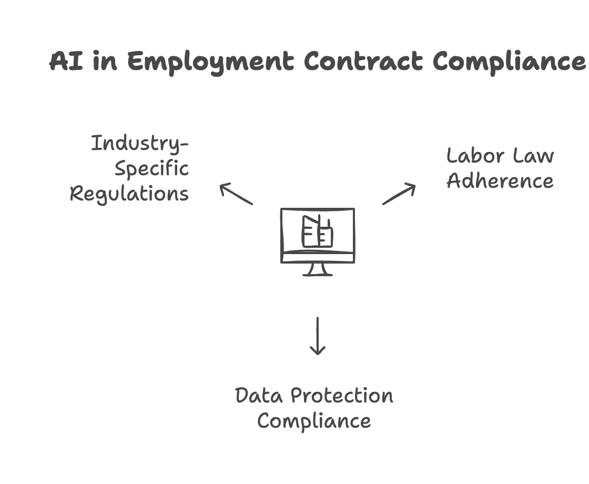

Traditional contract management processes can be **time-consuming and prone to errors**, increasing the risk of legal disputes or compliance issues. AI-powered tools like **ChatGPT** and contract automation platforms offer a way to handle contracts more effectively by reducing manual work, standardizing agreements, and flagging potential legal risks.

This article explores how AI can support **efficiency, compliance, and risk mitigation** in employment contract management. We’ll also outline **Standard Operating Procedures (SOPs)** for integrating AI-driven automation and provide **ChatGPT prompts** that HR teams can use to streamline contract-related tasks.

By leveraging AI within a structured framework, companies can improve contract accuracy, speed up processing times, and reduce administrative burden—**helping HR teams manage employment agreements more effectively in fast-paced environments.  
‍**

**‍  
‍\*\***Scroll down for:\*\*

- **HR Standard Operating Procedures (SOP) for AI in contract management**
- **Five essential prompts for HR teams to effectively use ChatGPT in contract management**
- **Frequently asked questions about AI in HR contract management**

\*\*\*

## **1\. Enhancing Efficiency with AI in Employment Contract Management**

Handling employment contracts manually can be a slow and resource-intensive process, especially in industries with high employee turnover. AI-powered tools like **ChatGPT** can improve efficiency by automating repetitive tasks, organizing contract data, and assisting with document review. This allows HR teams to focus on more strategic responsibilities while maintaining accuracy and compliance.

Here are three key ways AI enhances efficiency in **employment contract** management:

### **1.1 Automated Contract Generation**

Drafting employment contracts manually takes time, particularly when hiring in large volumes. AI can streamline this process by generating standardized agreements based on predefined templates and company policies.

**How it works:**

- HR teams input key details such as job role, salary, location, and contract type (full-time, part-time, contractor).
- AI generates a **tailored contract** using structured templates that align with labor laws and company policies.
- The initial draft is **consistent and complete**, reducing the need for manual revisions.

By automating contract creation, companies can shorten the time between offer acceptance and onboarding while ensuring that agreements follow **consistent legal and policy standards**.

### **1.2 Faster Document Processing and Review**

Reviewing employment contracts for compliance, accuracy, and completeness can be labor-intensive. AI-powered tools assist by **quickly scanning documents** to extract key terms, detect inconsistencies, and flag missing clauses.

**Key benefits:**

- **Accelerated contract review** – AI can highlight **critical clauses** such as termination policies, confidentiality agreements, and benefits provisions, allowing HR to focus on **decision-making** rather than manually reading every detail.
- **Error detection** – AI tools can identify inconsistencies, such as mismatched salary figures or missing required clauses, before contracts are finalized.
- **Clause comparison** – AI can compare contracts against previous versions or **industry benchmarks** to ensure consistency and compliance.

This reduces the risk of overlooked details and speeds up the review process, particularly when handling **large volumes of agreements**.

### **1.3 Scalable Contract Management**

In high-turnover industries, HR teams often manage hundreds—or even thousands—of employment contracts simultaneously. AI-based contract management platforms can help track **contract lifecycles**, including:

- **Renewals and expirations** – AI alerts HR when contracts are due for renewal or require updates.
- **Version control** – AI maintains a record of contract changes, ensuring that all agreements remain up to date.
- **Centralized storage** – AI-powered systems can categorize contracts based on employee type, region, or industry requirements, improving document retrieval and organization.

By integrating AI into contract management workflows, HR teams can scale their processes without compromising **efficiency or compliance**.

‍

## **2\. Ensuring Compliance with AI in Employment Contract Management**

Compliance is a key concern in employment contract management, especially for companies operating across multiple jurisdictions. Labor laws, data protection regulations, and industry-specific requirements change frequently, making manual contract oversight challenging.

AI tools, including **ChatGPT**, can help HR teams maintain compliance by analyzing contract language, ensuring adherence to labor laws, and flagging potential risks. While AI does not replace legal review, it serves as a **valuable assistant** in identifying gaps and inconsistencies.

### **2.1 Labor Law Adherence**

Employment regulations vary by country, state, and industry. AI can assist by checking whether **employment contracts** align with relevant labor laws and automatically incorporating jurisdiction-specific clauses.

**Key compliance areas AI can support:**

- **Working hours and overtime policies** – Ensuring terms comply with regional labor laws.
- **Termination and notice periods** – Confirming that contracts include legally required notice provisions.
- **Non-compete and confidentiality clauses** – Checking whether restrictive covenants meet enforceability standards.

For example, if an HR team drafts a contract for a remote employee in California, AI can highlight that **non-compete clauses are generally unenforceable under state law**, prompting legal teams to adjust the wording.

### **2.2 Data Protection and Privacy Compliance**

Employment agreements often contain **sensitive personal information**. AI can help ensure that contracts include necessary privacy clauses to comply with regulations such as **GDPR (Europe), HIPAA (U.S. healthcare), or local data protection laws**.

**How AI enhances data privacy compliance:**

- **Detects missing data protection clauses** related to employee records.
- **Identifies overly broad or vague language** that may not meet regulatory standards.
- **Flags potential conflicts** between company policies and external data privacy laws.

By automating these checks, organizations reduce the risk of **non-compliance fines** and improve their ability to protect employee data.

### **2.3 Industry-Specific Regulations**

Different industries impose **specific compliance requirements** on employment contracts. AI tools can be trained to recognize and apply these requirements, ensuring HR teams remain aligned with sector-specific obligations.

**Examples:**

- **Healthcare** – Ensuring contracts include **HIPAA** confidentiality clauses for handling patient data.
- **Finance** – Verifying compliance with **anti-money laundering (AML) regulations** and ethical standards.
- **Construction** – Confirming compliance with **occupational safety laws** and union agreements.

By integrating AI-driven compliance checks, HR teams can ensure that employment contracts meet **legal and industry-specific requirements** while minimizing manual oversight efforts.

‍

## **3\. Reducing Legal Risks Through AI in Employment Contract Management**

Poorly structured employment contracts can lead to **legal disputes, misclassification errors, and compliance violations**, which can be costly for businesses. AI-powered contract management tools help HR teams identify potential risks early, ensuring that agreements are clear, enforceable, and aligned with company policies.

### **3.1 Risk Detection and Prevention**

AI can analyze contract language to flag **potential legal risks** before an agreement is finalized. This includes identifying:

- **Ambiguous terms** – AI highlights vague or contradictory language that could lead to disputes.
- **Non-compliant clauses** – AI checks whether clauses meet current labor laws and regulations.
- **Inconsistent obligations** – AI compares new contracts against previous agreements to detect **unexpected deviations**.

For example, if a contract includes **an overly broad termination clause** that conflicts with local labor laws, AI can flag it for HR or legal review before the contract is signed.

### **3.2 Avoiding Employee Misclassification**

High-turnover industries often hire **contractors, freelancers, and part-time employees**, increasing the risk of **misclassification**. Misclassifying workers as independent contractors instead of employees can lead to legal penalties, back pay claims, and tax liabilities.

AI can assist by:

- **Assessing contract terms** to ensure they align with the worker’s legal classification.
- **Highlighting potential misclassification risks**, such as exclusivity requirements in a contractor agreement.
- **Cross-referencing employment laws** to determine whether a worker meets the legal definition of an independent contractor or employee.

For example, AI can detect if a contractor agreement **includes benefits typically reserved for full-time employees**, signaling a misclassification risk that HR should address.

### **3.3 Early Dispute Detection**

Employment disputes often arise from **unclear contract terms or missing provisions**. AI can help prevent these issues by:

- **Identifying missing dispute resolution clauses** (e.g., mediation or arbitration agreements).
- **Flagging inconsistent language** related to salary, benefits, or termination terms.
- **Analyzing employee queries and complaints** to detect potential contract-related disputes before they escalate.

For instance, if multiple employees raise concerns about unclear **overtime policies**, AI can flag the issue and recommend a contract revision to prevent future misunderstandings.

By integrating AI-driven risk analysis into contract management workflows, companies can **reduce legal exposure and improve contract clarity**, ultimately lowering the risk of disputes and compliance penalties.

‍

## **4\. Standard Operating Procedures (SOPs) for AI-Driven Contract Management**

Implementing AI in employment contract management requires a structured approach. Without clear **Standard Operating Procedures (SOPs)**, AI tools may be underutilized or applied inconsistently. A well-defined process ensures that **employment contracts** remain accurate, compliant, and legally sound while benefiting from AI-driven automation.

Below is a step-by-step framework for integrating AI into contract management.

### **4.1 Step 1: Assess Needs and Set Objectives**

Before adopting AI tools, HR and legal teams should evaluate their **current contract workflow** and identify pain points.

**Key questions to address:**

- What contract-related tasks consume the most time (e.g., drafting, reviewing, tracking renewals)?
- What compliance risks have been identified in past contracts?
- How can AI assist in reducing errors, improving efficiency, or strengthening compliance?

Defining clear **objectives**—such as reducing contract turnaround time by 50% or eliminating compliance errors—helps align AI adoption with business goals.

### **4.2 Step 2: Select the Right AI Tool**

Choosing an AI solution depends on an organization’s **contract volume, complexity, and compliance needs**.

**Common options include:**

- **Contract Lifecycle Management (CLM) software** – Platforms that automate drafting, tracking, and compliance monitoring.
- **AI-powered document review tools** – Software that scans contracts for risks, inconsistencies, and compliance gaps.
- **ChatGPT and generative AI** – AI assistants that generate contract templates and refine legal language based on prompts.

The selected tool should integrate with **HR and legal systems**, support industry-specific requirements, and ensure **data security** when handling employee agreements.

### **4.3 Step 3: Prepare Templates and Legal Data**

To maximize AI effectiveness, organizations should standardize contract templates and provide AI with **accurate legal references**.

**Recommended actions:**

- Update **contract templates** to align with current labor laws and company policies.
- Establish a **clause library** with pre-approved language for common contract sections.
- Provide AI tools with **jurisdiction-specific legal guidelines** to ensure compliance.

For example, if an organization operates in multiple states or countries, AI should be programmed to **automatically adjust contract terms** based on regional labor laws.

### **4.4 Step 4: Pilot AI Integration and Adjust Workflows**

Before full-scale implementation, organizations should test AI-driven contract management on a **small scale** to assess accuracy and usability.

**Pilot phase recommendations:**

- Use AI to draft a batch of contracts and compare them against manually created agreements.
- Apply AI-powered compliance checks to detect **common risks** or missing clauses.
- Gather feedback from HR and legal teams to refine AI-generated outputs.

Once the pilot is successful, AI workflows should be **integrated into existing HR and legal processes** for drafting, reviewing, and approving contracts.

### **4.5 Step 5: Train HR and Legal Teams on AI Usage**

Effective AI adoption requires **proper training** for HR professionals, hiring managers, and legal teams.

**Training topics should include:**

- How to input contract details and use **AI-generated templates**.
- How to interpret AI recommendations for compliance and risk mitigation.
- Best practices for **human oversight and final contract approval**.

Organizations should also define **when to rely on AI vs. when to escalate contracts for manual legal review**, ensuring a **balanced approach** between automation and human expertise.

### **4.6 Step 6: Maintain Human Oversight and Regular Audits**

AI should be viewed as an **assistive tool, not a replacement for legal expertise**. Contracts should always undergo **human review** before finalization.

**Key oversight measures:**

- HR or legal teams should **validate all AI-generated contracts** before they are signed.
- Compliance teams should **audit AI-assisted contracts periodically** to detect recurring issues.
- AI models should be **updated regularly** with new labor laws and contract policies.

By maintaining human oversight, organizations can **ensure contract accuracy, compliance, and enforceability** while leveraging AI for efficiency.

### **4.7 Step 7: Monitor AI Performance and Optimize Workflows**

As AI-driven contract management matures, organizations should track **performance metrics** to measure effectiveness.

**Suggested KPIs to track:**

- Time saved per contract generated or reviewed.
- Error detection rate in AI-assisted compliance checks.
- Reduction in contract disputes or compliance violations.

By monitoring these metrics, businesses can refine AI workflows, **update contract templates**, and continuously improve contract management efficiency.

‍

## **5\. ChatGPT Prompts for HR Teams**

To effectively use AI tools like **ChatGPT** in employment contract management, HR teams need well-structured prompts. The quality of AI-generated content depends on how clearly instructions are given. Well-crafted prompts ensure that contracts are accurate, compliant, and aligned with company policies.

Below are **practical prompt examples** HR professionals can use for drafting, reviewing, and managing employment contracts.

### **5.1 Contract Drafting Prompt – Automating Employment Agreement Creation**

Creating new employment contracts manually is time-consuming, especially in high-turnover industries. AI can generate **customized employment agreements** using predefined templates and relevant legal standards.

📌 **Example Prompt:**

_"Draft an employment contract for a \[Job Title\] at a \[Company Name\] in \[Jurisdiction\]. Include clauses covering duties, compensation, benefits, termination, confidentiality, and non-compete restrictions. Ensure compliance with \[Applicable Labor Laws\]. Use clear, professional language suitable for an \[Employment Type: full-time, part-time, contractor\]."_

**Use case:** This prompt helps HR generate a **first draft** of an employment contract that is structured and legally sound.

‍

### **5.2 Contract Review Prompt – Identifying Compliance Issues**

AI can assist in reviewing contracts for **legal risks, inconsistencies, and missing clauses** before final approval.

📌 **Example Prompt:**

_"Analyze the following employment contract for compliance with \[Jurisdiction\] labor laws. Identify any potential risks, missing clauses, or unclear terms. Highlight areas that may require legal review, such as overtime policies, non-compete enforceability, or benefits provisions. Provide recommendations for necessary revisions."_

**Use case:** HR teams can use this prompt to **automate contract audits**, ensuring agreements meet labor law requirements.

‍

### **5.3 Compliance Audit Prompt – Verifying Regulatory Alignment**

Regulations change frequently, and outdated contract terms can lead to **compliance violations**. AI can assist in verifying whether contracts align with the latest employment laws and company policies.

📌 **Example Prompt:**

_"Check the following contract against \[Jurisdiction\] labor laws and company policies. Verify compliance with minimum wage requirements, employee classification (contractor vs. full-time), termination terms, and data privacy regulations (GDPR, HIPAA, or relevant laws). List any discrepancies or potential risks."_

**Use case:** This prompt helps HR ensure contracts **stay up to date** with regulatory changes and internal policies.

‍

### **5.4 Dispute Resolution Prompt – Assessing Contract-Related Issues**

Contract disputes can arise due to **unclear terms or legal misalignment**. AI can analyze employment agreements and provide risk assessments before conflicts escalate.

📌 **Example Prompt:**

_"An employee has raised a dispute regarding \[Issue: unpaid overtime, unclear termination terms, etc.\]. Below is the relevant section of their employment contract. Analyze whether the contract language supports the claim and suggest possible solutions (e.g., contract clarification, negotiation, legal review)."_

**Use case:** HR teams can use this prompt to **assess legal risks proactively** and determine next steps before engaging legal counsel.

‍

### **5.5 Contract Amendment Prompt – Modifying Existing Agreements**

Employment agreements often require updates due to **policy changes, promotions, or contract extensions**. AI can assist by generating revised contract clauses.

📌 **Example Prompt:**

_"Modify the following employment contract to reflect a salary increase from \[Old Salary\] to \[New Salary\], an updated job title from \[Old Title\] to \[New Title\], and an extension of the employment term by \[Time Period\]. Ensure all related sections are adjusted accordingly."_

**Use case:** This prompt simplifies **contract modifications**, ensuring consistency across related clauses.

‍

### **Optimizing AI Usage for HR Teams**

For the best results, HR professionals should:  
✔ **Provide specific details** in prompts (e.g., job titles, jurisdictions, policy requirements).  
✔ **Review AI-generated outputs** for legal accuracy before finalizing contracts.  
✔ **Continuously refine prompts** based on business needs and compliance updates.

By integrating **AI-powered prompts** into HR workflows, companies can **reduce contract processing time, minimize legal risks, and improve compliance oversight**—all while maintaining human oversight where needed.

‍

## **6\. Conclusion**

Employment contract management is a critical function for HR teams, particularly in **high-turnover industries** where frequent hiring and employee transitions require efficient, accurate, and compliant contract handling. Traditional processes can be slow, prone to errors, and resource-intensive. **AI-powered tools like ChatGPT** provide a practical way to streamline contract workflows, ensuring that agreements are drafted, reviewed, and maintained with greater speed and consistency.

By integrating AI, companies can achieve:

- **Improved Efficiency** – Automating contract generation, reviewing agreements faster, and managing large volumes of contracts at scale.
- **Stronger Compliance** – Ensuring contracts adhere to **labor laws, industry regulations, and data protection requirements** while reducing legal risks.
- **Risk Mitigation** – Flagging **contract inconsistencies, misclassification risks, and dispute-prone clauses** before issues arise.

However, successful AI adoption requires a structured approach. Following **Standard Operating Procedures (SOPs)** ensures that AI tools are used effectively while maintaining **human oversight and legal review**. AI is not a replacement for HR or legal professionals—it is an assistive tool that helps teams work more efficiently while reducing administrative burdens.

By leveraging **AI-driven contract automation**, organizations can adapt to fast-paced hiring environments, improve compliance, and reduce legal exposure—allowing HR teams to focus on strategic initiatives rather than repetitive document processing.

### **Final Thought**

The integration of AI into employment contract management is a **practical step forward**, helping businesses handle contracts with greater accuracy and efficiency. As AI technology continues to evolve, HR teams that adopt **structured AI workflows** will gain a competitive advantage in managing employment agreements effectively.

‍

## **Frequently Asked Questions (FAQ) on AI-Powered Employment Contract Management**

### **1\. How can AI help with employment contract management?**

AI can assist HR teams by **automating contract drafting, reviewing agreements for compliance, and managing contract lifecycles**. AI tools like **ChatGPT** generate standardized contracts based on predefined templates, check for missing clauses or inconsistencies, and flag legal risks before agreements are finalized.

### **2\. Is AI-generated contract drafting legally reliable?**

AI can produce **legally structured contracts** using approved templates and compliance guidelines, but human oversight is essential. AI-generated agreements should always be **reviewed by HR and legal professionals** to ensure accuracy and jurisdictional compliance before they are signed.

### **3\. Can AI check employment contracts for compliance with labor laws?**

Yes, AI tools can scan contracts and highlight **potential compliance issues**, such as incorrect termination clauses, wage violations, or misclassification risks. However, AI should be used as a **preliminary review tool**, with final validation conducted by legal experts.

### **4\. How does AI help prevent employee misclassification?**

AI analyzes contract terms to determine whether an agreement aligns with **employee vs. contractor classifications** under labor laws. It can flag contracts that **contain inconsistencies**, such as requiring exclusivity for a freelancer, which may signal a misclassification risk.

### **5\. Can AI assist with contract renewals and amendments?**

Yes, AI-powered contract management tools track **renewal deadlines** and assist in modifying agreements. For example, HR can prompt AI to adjust a contract for a **salary increase, job title change, or term extension**, ensuring consistency across all clauses.

### **6\. How secure is AI when handling employment contracts?**

Security depends on the AI tool used. **Enterprise-grade AI platforms** typically follow strict **data protection standards (GDPR, HIPAA, SOC 2)**. Companies should ensure that AI tools comply with their internal **data privacy policies** and avoid processing sensitive employee information on unsecured platforms.

### **7\. Can AI be used to resolve contract disputes?**

AI can analyze contract language to identify **ambiguous terms or missing dispute resolution clauses** that may contribute to legal conflicts. While AI can provide **preliminary assessments and recommendations**, dispute resolution should still involve **legal professionals or HR specialists**.

### **8\. What types of employment contracts can AI generate?**

AI can draft various types of employment agreements, including:

- **Full-time and part-time contracts**
- **Freelancer and independent contractor agreements**
- **Internship and temporary worker contracts**
- **Remote work agreements**
- **Confidentiality and non-compete agreements**

### **9\. How do HR teams integrate AI into their contract management process?**

HR teams can follow **Standard Operating Procedures (SOPs)** to integrate AI efficiently:

1.  **Assess contract workflow needs** (identify pain points).
2.  **Select AI-powered contract tools** (ChatGPT, contract lifecycle management software).
3.  **Prepare templates and compliance guidelines** for AI reference.
4.  **Pilot AI-generated contracts** with human review before full implementation.
5.  **Train HR and legal teams** on AI usage and oversight.
6.  **Monitor AI performance and refine prompts** to improve accuracy.

### **10\. Does AI replace HR and legal professionals in contract management?**

No. AI serves as a **support tool** to enhance efficiency but does not replace **HR or legal professionals**. AI can automate repetitive tasks, but human oversight is necessary for **complex legal decisions, negotiations, and final approvals**.
