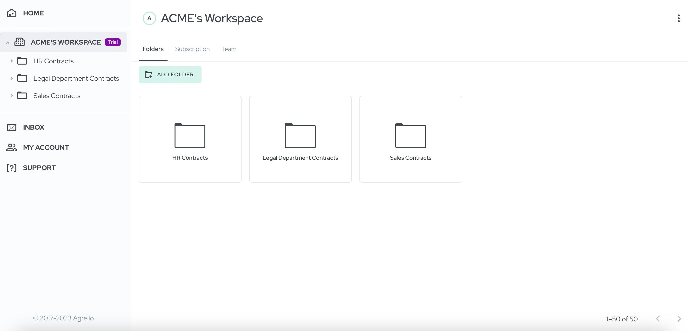
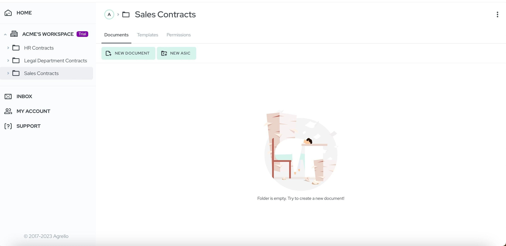
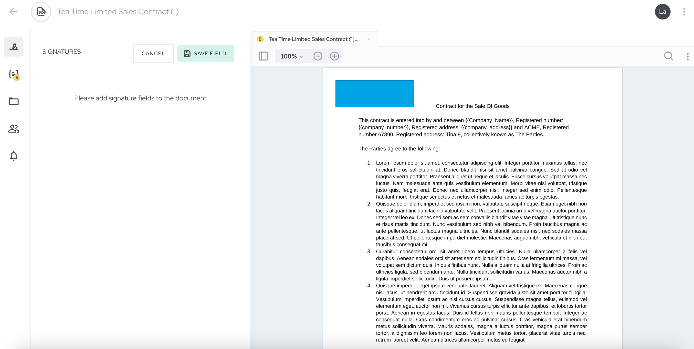
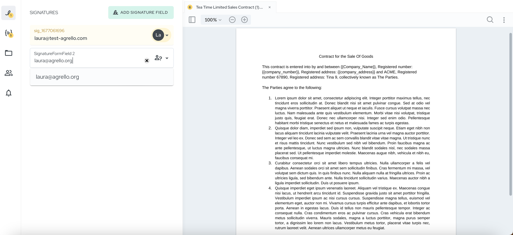
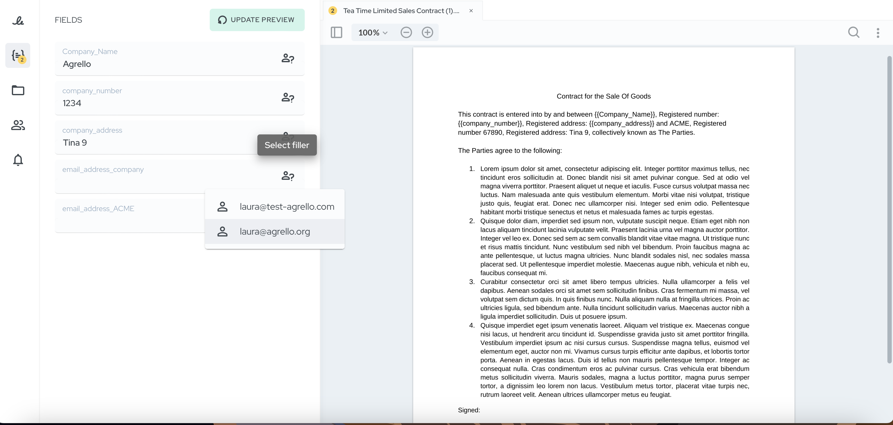
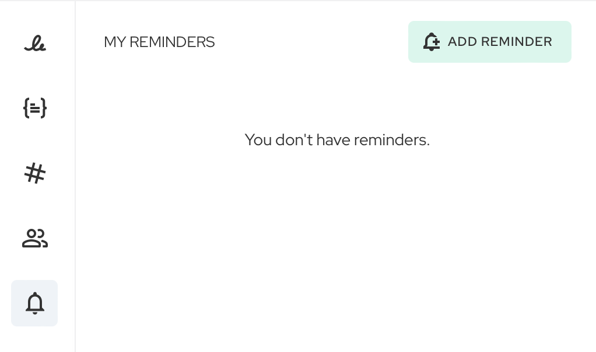
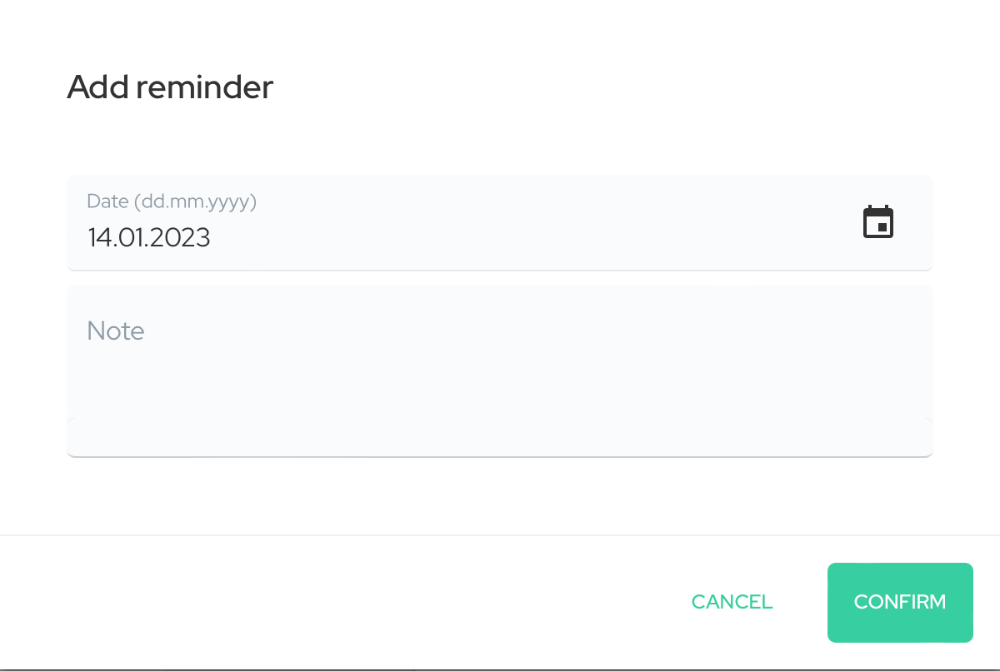

Nüüd kui oleme oma lepingu elutsüklit puudutavas blogiartiklite seerias teinud ülevaate lepingu elutsüklist tervikuna, on aeg asuda iga eraldiseisva osa tutvustamise juurde ning vaadata lähemalt, kuidas Agrello saab aidata neid etappe vähema vaevaga läbida. Esmalt räägime kõige olulisemast sammust - selleks, et lepingu elutsükkel saaks alguse, on vaja lepingut. Seega esimene samm on lepingu loomine.

## Lepingutingimustes kokkuleppele saamine

Lepingu sõlmimise eelduseks on kokkulepe osapoolte vahel, olgu nendeks poolteks kas eraisikud või ettevõtted. Ka enne lepingutingimuste kokkuleppimist ja kirjapanekut on mitu sammu, mis on vaja läbida. Illustreerime seda näidet väljamõeldud Firma A ja Firma B kokkuleppega, kus esimene neist on riiete tootja ja teine edasimüüja, kes soovib neid Firma A toodetud riideid osta.

Enne tehingusse minekut on pikk läbirääkimiste protsess, mille käigus tuleb kokku leppida mitmetes lepingutingimustes. Sealhulgas on lihtsamad asjad nagu lepingu kestvus ja toodete hind ning ka keerulisemad klauslid, mis puudutavad konkurentsikeeldu ja konfidentsiaalsusega seotud punkte.

Kui ettevõtete juristid on tingimustes kokku leppinud, tuleb see kõik kirja panna. Ja see ongi punkt, kust lepingu elutsükkel algab.

## Lepingupõhja loomine Agrello platvormil

Meie näite puhul on Firma A ja Firma B suured ettevõtted, mille nimel tegutsevad ettevõtte juristid, kelle jaoks lepingute kokkukirjutamine ei ole mingi probleem. Kuid loomulikult on olemas palju väiksemaid ettevõtteid, kellel ei ole oma juristi. Sellisel juhul kasutatakse mingeid varasemalt olemasolevaid lepingupõhjasid või tellitakse lepingu ettevalmistamine-ülevaatamine teenusena mõnelt juristilt või advokaadibüroolt. Mõlemal juhul peab olema keegi, kes lepingu enne lepinguhalduse platvormile üleslaadimist üle vaataks.

Enamasti valmistatakse lepingud ette Microsoft Wordis või mõnes sarnases tekstitöötluse programmis, näiteks ka Google Docs on väga levinud tasuta tööriist. Lepingutekstis on kokkulepitud tingimused ning muu oluline info, nagu näiteks poolte nimed, aadressid, registrikoodid jms.

Agrello platvormil on väga lihtne luua taaskasutatav lepingupõhi, millel on täidetavad väljad ja mille saab meie keskkonnas mugavalt digiallkirjastada. Täidetavate väljade tekkeks on vaja Wordi failis kasutada soovitud kohtadel **{{loogelisi sulge}}** ning Agrellosse üleslaadides muutuvad need täidetavaks. Korra loodud lepingupõhja on võimalik taaskasutada nii mitmeid kordi kui vaja.

## Lepingu ettevalmistamine Agrello platvormil

Selleks et alustada uue dokumendi ettevalmistamist Agrello keskkonnas, tuleb sul logida sisse alustada 14-päevast tasuta prooviperioodi (trial) ning luua oma _workspace_.

Järgmisena tuleb luua eraldi kaust dokumentide jaoks. Foldereid saab luua vastavalt vajadusele ja nende loomisel piiranguid ei ole, näiteks võid luua eraldi kausta oma ettevõtte HR dokumentidele, müügilepingutele ja õiguse osakonna dokumentidele.

Esialgu on kõik folderid tühjad ning sa saadki hakata sinna dokumente looma. Ava soovitud folder ning vajuta nuppu “New document” et luua PDF formaadis dokument või “New ASIC”, et luua ASIC konteineri formaadis dokument. Viimast kasutatakse enamasti töölepingute jaoks ning korraga on võimalik lisada mitu dokumenti. Samuti saab ASICut allkirjastada ainult kvalifitseeritud allkirjastamise meetodite Smart-ID või Mobiil-IDga.

Kui valisid PDF-i, siis tuleb nüüd lisada allkirjastamise väljad ja määrata neile allkirjastajad.

Ka dokumendis sisaldunud täidetavad väljad on muutunud Agrello platvormil täidetavaks. Võid need täita ise või määrata vastaspoolele täitmiseks.

## Meeldetuletuste lisamine

Lepingu elutsükli töövoo oluline osa on funktsionaalsused, mis aitavad sul lepingutega seotud tähtaegu ja olulisi kohustusi meeles pidada.

Agrellos on võimalik dokumentidele meeldetuletusi lisada vastavalt vajadusele - näiteks terve rodu meeldetuletusi lepingu lõppemise lähenedes. Meeldetuletuste lisamiseks kliki kellukese ikoonil “Add reminder”, vali sobiv kuupäev ning lisa meeldetuletuse sisu. Valitud kuupäeva saabumisel saad sa e-kirja teel meeldetuletuse.

## Dokument on ettevalmistatud

Kui oled kõik eelnevad sammud läbinud, siis on sinu dokument valmis allkirjastamiseks saatmiseks. Selleks vajuta nuppu “Send for signing” ning sinu poolt lisatud allkirjastajad saavad e-kirja teel dokumendi allkirjastamise kutse.

Sellega loeme dokumendi ettevalmistamise lõppenuks. Järgmise sammuna lepingu elutsüklis järgneb allkirjastamine ning sellest räägime lähemalt järgmises artiklis.

‍
