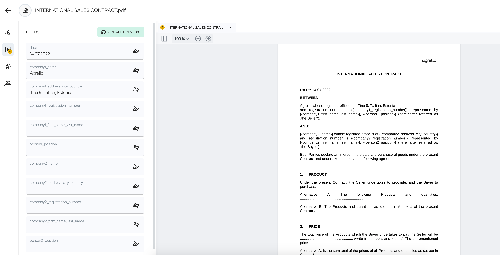

Nii mõnigi ettevõte võib seista silmitsi vajadusega allkirjastada leping või mõni muu koostöö dokument rahvusvaheliselt - mõne teisest riigist pärit ettevõttega või isikuga. Kui samast riigist pärit teise osapoolega on allkirjastamine lihtsam, seda saab teha kasutades kohalikke e-allkirjastamise vahendeid või teatud juhtudel ka võrdlemisi mõistlikult isegi paberil, siis rahvusvaheliselt on asi keerukam. Paberil allkirjastamiseks kulub palju aega, sest see eeldab kulleriga dokumentide edasi-tagasi saatmist või hoopis reisimist vastaspoolega kohtumiseks, et dokumente allkirjastada.

Mõningad näited, millal võib olla vajadus piiriülese lepingu sõlmimiseks:

- kaupade ostmisel või müümisel;
- välismaise tootja kaasamisel toodete valmistamiseks;
- töötaja, kes sõlmib töölepingu välismaal asuva ettevõttega;
- ettevõte, kes palkab töötajaid välismaalt;
- intellektuaalomandi litsentsimisel välismaal asuvale ettevõttele;
- intellektuaalomandi litsentsi ostmisel välismaiselt ettevõttelt.

Piiriüleste dokumentide allkirjastamisel tuleb appi Agrello. Nimelt on Agrello loonud allkirjastamise formaadi, mis on sobilik kasutamiseks juhul, kui **pooltel on erinevad allkirjastamise meetodid**, kuid allkirjad peaksid siiski kokku saama ühes failis ning mida mõlemal poolel oleks lihtne kasutada.

‍

## Mis on Agrello allkiri ja kuidas see toimib?

‍

Agrello allkirjad on lihtsad elektroonilised allkirjad, mis **sobivad vormivabadele lepingutele**. Nagu varem juba mainitud, siis eriti kasulik on Agrello piiriüleste lepingute allkirjastamiseks, kuna üldiselt on lepingupooltel kasutusel erinevad allkirjastamise viisid. Agrello võimaldab aga poolte allkirjadel kokku saada ühes failis ning seda on mõlemal poolel ka lihtne kasutada.

Agrello allkiri tugineb krüptograafiale ja **poolte vahel usaldatud digitaalsetele identiteetidele**. Oma tehniliselt olemuselt on Agrello allkirjad elektroonilised allkirjad, mis lisatakse vastavalt PAdES standardile PDF faili. Agrelloga allkirjastamisel lisame PDF dokumenti enda e-templi ja selle juurde ka allkirjastaja nime. See on ka üks **levinumaid e-allkirjastamise viise maailmas**.

PDF failil on unikaalne sisemine struktuur, võimaldades lisada digiallkirja info ilma otseselt tekste ja pilte muutmata. Enamasti siiski lisatakse PDF-faili ka allkirja visuaalne kuva. Kuna aga allkirjade osa on PDFis eraldatud muust faili sisust, siis on võimalik luua krüptograafiline räsi ülejäänud faili osast, mis tagab selle, et faili ei saa pärast allkirjastamist muuta nii, et allkirjad endiselt kehtiks.

‍

## Agrello ei ole ainult piiriüleseks allkirjastamiseks

‍

Agrello ei ole ainult vahend piiriüleste dokumentide allkirjastamiseks. See pakub ka mugavat võimalust kõigil osapooltel juba eelnevalt koos dokumendi ettevalmistamisel osaleda, näiteks lepingu täitmisel vajalike andmetega, kasutades dünaamilisi väljasid. Nii jääb ära meilivahetus vajalike detailide täpsustamiseks, **kiirendades lepingu ettevalmistamise aega** märkimisväärselt. Erinevates ajavööndides resideeruvate poolte puhul võib kirjavahetuse ja vajalike andmete kogumise peale kuluda päevi.

Kui dokument on välismaise partneriga allkirjastatud, siis pakub Agrello ka mugavat võimalust oma **lepingute hoiustamiseks** ning seda mõlemale osapoolele. Nii dokumendi looja kui ka vastaspool pääseb enda dokumentidele igal ajal mugavalt ligi Agrello platvormil.

‍

## Toome näite…

‍

Võtame näiteks kaupade ostu-müügilepingu sõlmimise Hiinas asuva ettevõttega. Läbirääkimised ja lepingutingimused on juba mugavalt peetud videokõne vahendusel. Nüüd oleks vaja tehing kinnitada lepingu sõlmimisega. Spetsiaalselt selle jaoks kohtumise korraldamine ning Hiinasse kohale lendamine oleks väga kulukas ning äärmiselt aeganõudev. Rääkimata sellest, kui kurnav on teise ajavööndiga riiki reisimine. Postiga saaks küll dokumente üksteisele saata, kuid seegi kulutab ebamõistlikult palju aega.

Antud juhul on igati nutikas allkirjastada dokumendid digitaalselt. Agrello platvormil saab seda mugavalt teha - alustades dokumentide ettevalmistamisest, ülevaatamisest ja täiendamisest kuni allkirjastamiseni. Üks osapool koostab dokumendi ning vastaspoole andmete saamiseks lisab sinna dünaamilised väljad, mille saab hiljem vastaspoolele täitmiseks suunata. Kui taoliste lepingute sõlmimist piiriüleste partneritega tuleb ettevõttel ette tihedamini, siis on otstarbekas luua endale ka korduvakasutatav lepingupõhi.

[**Loe rohkem Agrello lepingupõhjade kohta siit.**](https://www.agrello.ee/artiklid/kuidas-microsoft-wordis-lepingud-allkirjastamiseks-ettevalmistada)

‍

‍

Agrello kasutamine on lihtne ja mugav kõigile. Sinu lepingu vastaspool saab e-kirjaga kutse dokumendi allkirjastamiseks ning juurdepääsu dokumendile.

‍

‍

Dokumendi saab allkirjastada lihtsalt, kasutades Agrello allkirja või anda kvalifitseeritud digitaalne allkiri Smart-ID, Mobiil-ID või ID-kaardi lahendust. Rahvusvahelisel tasemel saab kvalifitseeritud digitaalseid allkirju anda Belgia, Horvaatia ja Soome ID-kaardiga. Oluline on dokumendi formaadi valik. ASiC konteinerit saab allkirjastada ainult kvalifitseeritud allkirjadega, kuid PDF-formaadis dokumendile sobivad kõik allkirjatüübid.

Agrello platvormil kulub ka piiriüleste lepingute allkirjastamiseks vaid loetud minutid. Sõlmitud lepinguid saab turvaliselt hoiustada Agrello platvormil või soovi korral endale ka arvutis alla laadida.

‍

## Pea meeles

Rahvusvaheliste lepingute puhul tasub kindlasti tähelepanelik olla, millise riigi õigus lepingule kohaldub. Tasub uurida ka riigis kehtivate e-allkirjade regulatsioonide kohta ning konsulteerida kohaliku juristiga, et vältida ootamatuseid.

‍
