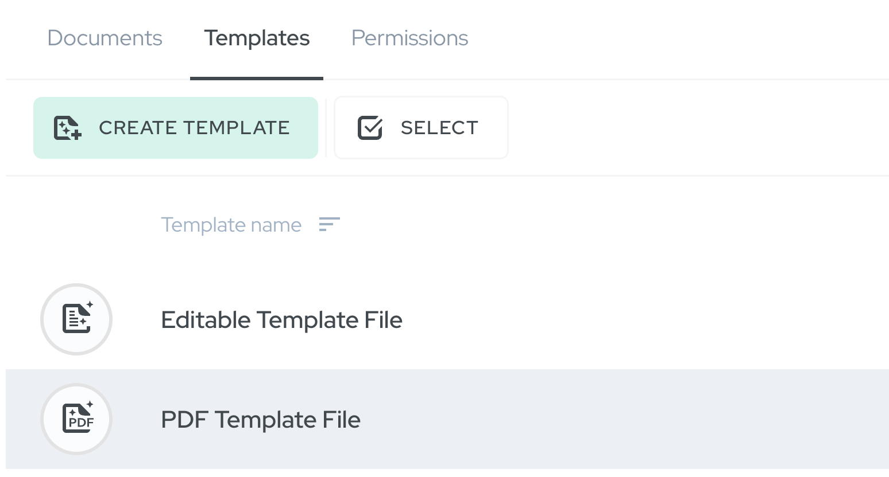

We're excited to announce the latest updates to Agrello - **editable templates!**

Our new feature allows editors to modify template files on the go, provided they are uploaded in Office format (such as .docx, .doc, .odt). Need to update a clause or correct minor typos? Agrello has you covered. You can make changes directly within the platform, or you can download the template file, modify it on your computer, and then re-upload it as a new template.

## Introducing Two Template Types: Editable and PDF Templates

With this new update, Agrello now supports two distinct template types: Editable and PDF templates. But what sets them apart?

### Support for Fields

One of the main differentiators between the two template types is the support for pre-defined signature field locations. PDF templates provide the advantage of defining where the signature fields should be positioned in a document. With editable templates, you can still use signature fields, but you need to first create a document from the editable template before placing the signature field.

The same holds for PDF text fields. To add them, the template needs to be converted into a PDF type. Don't worry; we've made this easy.

If you wish to add a signature field, we'll prompt you to convert the template into a PDF. With your approval, your editable template becomes a PDF template.

### Post-Creation Editing

Another key feature of our update is the ability to edit documents after they have been created from a template. If you generate an ASIC document from an editable template, you can continue to make changes to that file within the document itself as the original editable format of the template file is maintained.

## Bulk-Creation of Documents from Templates: Enhancing Efficiency and Flexibility

Our latest feature also addresses the bulk creation of documents from templates. While the overall process remains largely unaffected, the new functionality introduces a few handy adjustments. Firstly, ASIC documents can now be bulk-created from editable templates, extending the efficiency of the platform.

Secondly, our system now offers smarter document processing. If variables wrapped in {{curly\_brackets}} are detected in your original Office-formatted file, Agrello will automatically convert it to a fillable PDF during the bulk-creation process. This means your editable templates remain versatile and adaptable, depending on your needs. If there are no {{curly\_brackets}}, we simply add the original file format to the ASIC container.

Similarly, when bulk-creating documents from multiple template files, our platform performs the same smart detection and conversion. Any variables wrapped in {{curly\_brackets}} trigger a conversion to a fillable PDF file. If no such variables are detected, the original format is preserved.

This integrated approach ensures that Agrello's new feature, the editable templates, not only streamlines individual document creation and editing but also optimises larger-scale, bulk operations.

‍

## Summary

Agrello's latest update, editable templates, introduces more flexibility and efficiency in contract editing and management. This feature, supporting both direct on-platform edits and downloadable files for offline adjustments, now includes two template types: editable and PDF. Key differences include unique features like support for fields and post-creation editing. Furthermore, the update enhances bulk document creation with smart detection and conversion functionality, ensuring a seamless experience whether you're managing individual contracts or processing larger document volumes. This continuous evolution of Agrello underlines our commitment to simplifying contract management for SMEs.

‍
