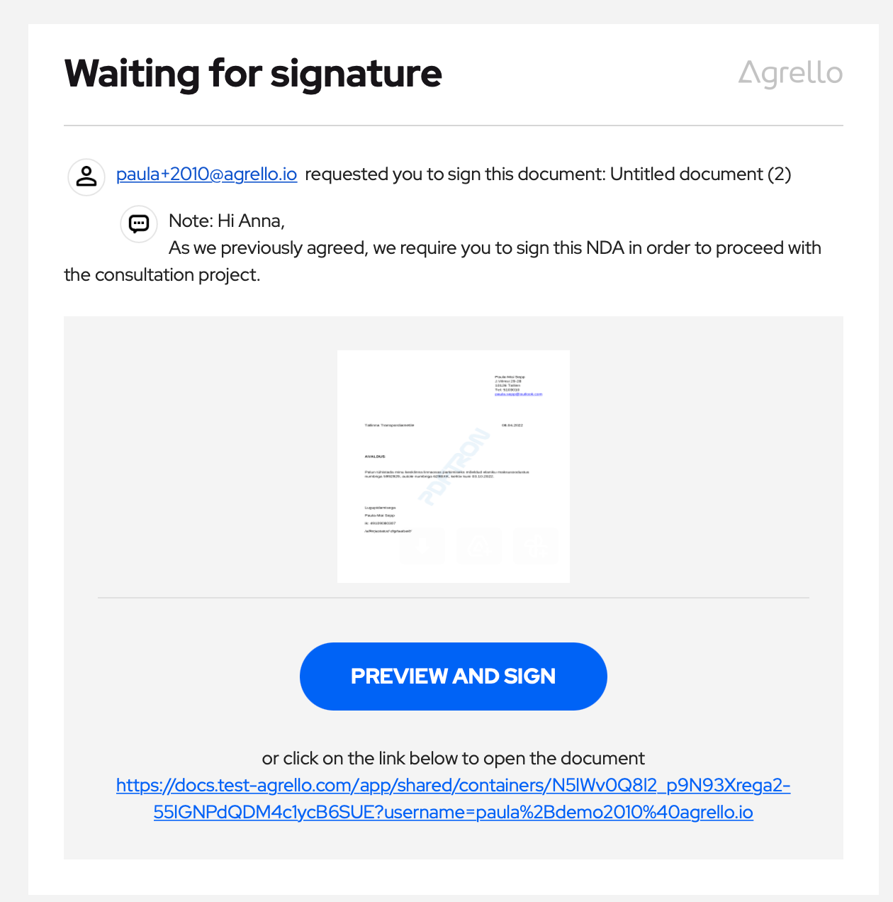

Proovime Agrello platvormi pidevalt paremaks ja mugavamaks muuta, mõeldes kõikidele meie kasutajatele. Seekordsed muudatused aitavad allkirjastamise teekonda kiirendada nii veebirakenduse kui ka mobiilirakenduste kasutajatele. Samuti oleme silmas pidanud tulevasi kasutajaid, kes on kutsutud dokumenti allkirjastama, kuid kellel hetkel veel Agrello kontot pole. Selles artiklis anname kiire ülevaate, millised on viimased uuendused Agrelloga allkirjastamisel.

### Allkirjastamine ilma kontot loomata

Üks viimase aja suurim muudatus on see, et nüüd võimaldame **allkirjastamist ka ilma sisse logimata** või **Agrello kontot loomata**. See on eriti sobilik ühekordsetele allkirjastajatele, kes peavad kiirelt dokumendi allkirjastama, kuid ei ole hetkel huvitatud uue konto loomisest. Kutsudes oma äripartnereid allkirjastama, tasub end alati nende kingadesse panna ning proovida ennetada võimalikke kitsaskohti, mis allkirjastamisel ette tulevad ja lepingu sõlmimist edasi lükkavad. Teadmine, et Agrelloga on võimalik dokument allkirjastada ka ilma kontot loomata, annab sulle kindlustunde, et protsess sujub kiirelt.

‍

‍

Peale allkirjastamise kutse saamist ja aktsepteerimist saab allkirjastaja valida, kas soovib enne allkirjastamist logida sisse oma kontole või allkirjastada koheselt. Kui valik langeb koheselt allkirjastamise kasuks, siis tuleb allkirjastajal Agrello allkirja kasutamiseks sisestada oma nimi. Valida saab ka Smart-ID või Mobiil-ID allkirja.  
‍

### Personaliseeritud allkirjastamise kutse

Vältimaks allkirjastamisele saadetud dokumendi kadumist postkasti põhja, oleme Agrello poolt saadetava allkirjastamise kutse personaalsemaks muutnud.  
‍

- Kutse saatja nimi või e-posti aadress kuvatakse ka e-kirja saatja nimena.
- E-kirja pealkiri sisaldab allkirjastamisele saadetud dokumendi nime.
- Dokumendi saatjal on võimalik enne väljasaatmist lisada personaalne sõnum, mis selgitab dokumendi sisu või allkirjastamise vajadust.

‍

‍

### Muudatused mobiiliga allkirjastamisel

Kas sina mäletad kõiki oma paroole ja PIN-koode peast? Tõenäoliselt mitte. See on üks põhjustest, miks Agrello mobiilirakenduses allkirjastamiseks enam 6-kohalist PIN-koodi vaja ei ole. PIN-koodiga kaasnenud turvalisuse kiht allkirjastamisel ei pakkunud meie klientidele nii palju lisaväärtust ning ei kaalunud üle mugavust ja kiiremat allkirjastmise võimalust, mistõttu otsustasime selle funktsionaalsuse eemaldada. Kui sul on mobiilirakendus, kuid allkirjastad veebis, siis enam ei ole ka veebirakenduses vaja allkirjastamist mobiiliga kinnitada.

Me loodame, et kõik sinu dokumendid saavad Agrelloga mugavalt allkirjastatud!

‍
