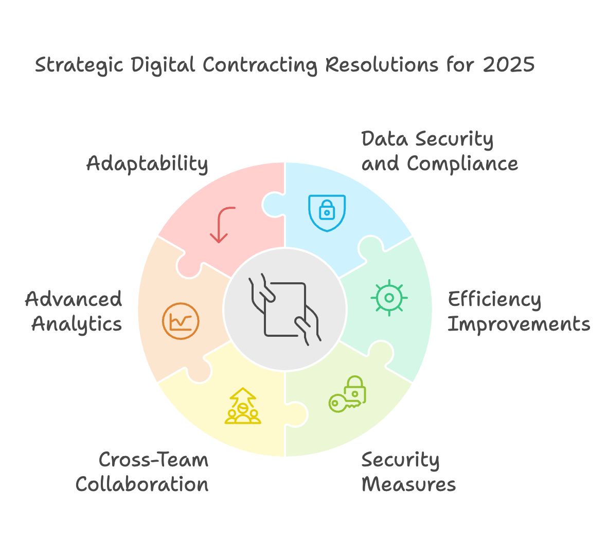
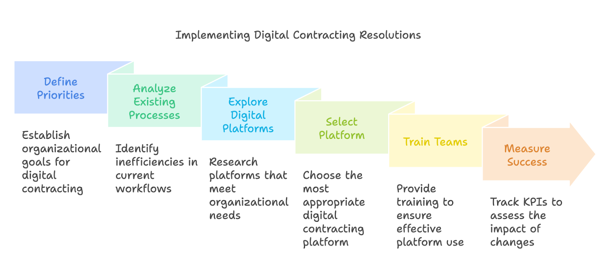

The end of the calendar year, marked by the flurry of festive greetings and seasonal promotions, is also a natural point of inflection. It encourages decision-makers to evaluate whether their current contracting processes truly support their broader vision. **Are your digital documents flowing smoothly from drafting to signature, or have they encountered unnecessary delays?** **Have your teams leveraged tools that offer both transparency and security, or are manual steps still slowing negotiations? And are you confident that your digital contracting strategy can evolve to meet the demands of an increasingly global and regulated marketplace?**

By taking stock now, you can more easily set meaningful resolutions for the upcoming year. As we look ahead to 2025, the goal is not only to adopt digital contracting technologies, but to use them in a way that fully aligns with organizational priorities. This involves carefully examining everything from how you protect sensitive data and maintain compliance, to how you utilize analytics to gain insights and stay ahead of market trends. It means ensuring that, as new regulatory standards emerge, you have the adaptability and foresight to modify your workflows without compromising speed or accuracy. Most importantly, it involves challenging old assumptions and embracing the idea that contracting is not just a formality, but a strategic process capable of driving sustainable growth.

Viewed through this lens, the coming year stands as an opportunity to refine and fortify the foundational elements of your digital contracting environment. By setting precise, forward-looking resolutions that address both current bottlenecks and future expansion plans, you create the conditions for a seamless, secure, and analytically driven system. In doing so, you equip your teams with the resources they need to excel, preparing them to handle rising volumes of contracts, meet evolving client expectations, and strengthen the trust that underpins every successful business relationship.

## Recap of the Past Year’s Digital Contracting Landscape

As the marketplace grew increasingly interconnected over the past year, digital contracting tools evolved from a helpful convenience into an integral aspect of modern business operations. This shift was evident not only in the heightened volume of documents exchanged online, but also in the increasing sophistication of the platforms that facilitated their creation, negotiation, and execution. 

With more organizations scaling their operations globally, the demand for swift, secure exchanges became the norm rather than the exception. The past twelve months saw innovative solutions emerge to meet these heightened standards, while existing services introduced upgraded functionalities to address common pain points.

**One of the most notable changes was the move towards more standardized, user-friendly workflows. Instead of relying on haphazardly integrated tools or piecemeal platforms, companies began consolidating their contracting processes into unified digital ecosystems.** This holistic approach did more than just streamline tasks; it laid a new foundation for transparency, where stakeholders could track contract statuses in real time and eliminate the guesswork once associated with ink-on-paper exchanges and back-and-forth email chains. More decision-makers realized that by placing all relevant data, templates, and draft versions in a single digital environment, teams could spend less time searching for information and more time negotiating meaningful terms.

This period of rapid transformation also brought renewed **attention to regulatory compliance and data integrity.** As emerging privacy laws and sector-specific regulations gained traction, organizations had to reassess their existing contract management strategies to ensure that every agreement would stand up to scrutiny. The past year saw a surge in encryption standards becoming more robust, audit trails more thorough, and authentication methods more reliable. **Security was no longer an afterthought, but a key differentiator** that influenced a buyer’s choice of a digital contracting platform. Businesses that lacked the appropriate safeguards found themselves at risk, while those that invested in top-tier data protection measures were well-positioned to build trust with new and existing clients.

All in all, the shifts observed in the **digital contracting landscape** over the past year underscored a few central truths. Efficiency was the new baseline, compelling vendors and users alike to seek faster, frictionless solutions. Security could no longer be an optional add-on; it needed to be woven into the very fabric of these digital platforms. And data, once dispersed and underutilized, rose to become a strategic asset, informing both day-to-day decisions and long-term planning. These lessons, learned through the challenges and opportunities of the previous twelve months, now serve as the bedrock upon which organizations can confidently define their digital contracting resolutions for the year ahead.

## Identifying Core Digital Contracting Resolutions for 2025

As the new year approaches, it is not enough to carry forward the practices and tools that helped you achieve steady results over the past twelve months. The rapid evolution of digital contracting demands that you consider targeted improvements and strategic enhancements, setting clear goals that will allow your organization to thrive in a changing commercial landscape. While the fundamentals of efficiency and security remain paramount, the time has come to push beyond the baseline and ensure that your resolutions for 2025 align with long-term growth, heightened compliance, and more insightful decisionmaking.

‍

### Data security and regulatory compliance

One essential resolution lies in the realm of data security and regulatory compliance. Recent shifts in privacy laws, sector-specific mandates, and global data exchange protocols underscore the importance of having airtight frameworks in place. Instead of viewing compliance as a cumbersome obligation, 2025 should be the year to recognize it as a value proposition—one that bolsters client trust, protects against legal risk, and preserves your brand’s credibility. By resolving to continually refine encryption methods, authentication processes, and audit trails, you create a stable foundation on which all other improvements can comfortably rest.

### Drive towards increased efficiency

Equally critical is the drive toward increased efficiency. If the past year taught us anything, it is that digital contracting is not truly digital if it still relies on half-measures or piecemeal solutions. Your 2025 vision should include the streamlining of internal processes, the elimination of redundant steps, and the adoption of automation wherever it can enhance accuracy and speed. Perhaps this means deploying contract templates that adapt to nuanced requirements, or integrating contract management tools directly with your organization’s primary resource planning systems. By reshaping workflows to run more smoothly, you free your teams from administrative burdens, enabling them to focus on negotiation, relationship-building, and strategic decision-making.

### Tightening security measures

While refining processes and tightening security measures are vital, the power of digital contracting also lies in its ability to bring people together. Collaboration does not happen by chance; it flourishes when platforms and protocols actively encourage the sharing of information, timely feedback loops, and collective input. Making enhanced cross-team collaboration a top resolution ensures that no department or individual sits in isolation. By harmonizing contract management interfaces with communication tools, you can help everyone within the organization maintain real-time visibility over contract progress, updates, and deadlines. In doing so, you not only preserve team alignment but also ensure that your contracting ecosystem is well-prepared to handle surges in workload and complexity

### Harness the value of advanced analytics

As you set your sights on the coming year, it becomes increasingly crucial to harness the value of advanced analytics. In 2025, a contract can no longer be viewed as a static document that simply memorializes an agreement. It should be a treasure trove of insight that, if properly analyzed, can inform better forecasting, highlight areas of opportunity, and pinpoint recurring negotiation challenges. Resolutions around leveraging analytics should aim not merely at extracting data, but at converting it into actionable intelligence. By employing analytical tools that break down large volumes of contract information into digestible metrics and trends, you empower decision-makers to refine strategies, anticipate client needs, and identify patterns that shape long-term planning.

### Keep adaptability at the forefront

Finally, as you put these resolutions into motion, keep adaptability at the forefront. The digital contracting ecosystem will continue to evolve throughout 2025 and beyond, with new technologies, market conditions, and compliance standards changing the rules of engagement. Commit to staying nimble enough to embrace novel features, integrate emerging technologies, or even pilot innovative functionalities that may not yet have wide industry adoption. By doing so, you reinforce that your resolutions are not static pronouncements, but dynamic goals designed to keep pace with the world around you.

In crafting these resolutions, the objective is not simply to respond to the current environment, but to anticipate the needs and challenges that await. With each advancement, from heightened security protocols and frictionless workflows to robust analytic capabilities and adaptive frameworks, you strengthen your organization’s contracting foundation and position it for sustained success in the year ahead.

## Practical Steps to Implement These Resolutions

After clearly defining the priorities for your organization’s **digital contracting ecosystem**, the next phase involves translating aspirational goals into concrete actions. While embracing new technologies and strategies may appear complex, success often arises from a careful, methodical approach. It begins with taking a close look at your existing processes and identifying where friction, delays, or lack of visibility currently occur. By mapping out each stage of contract creation, review, negotiation, and execution, you lay the groundwork for targeted improvements. In some instances, this may reveal repetitive tasks that can be automated. In others, it may highlight the need for more secure authentication protocols or the integration of advanced analytics tools.

Once you have a comprehensive view of your current workflows, it is time to explore the digital contracting platforms best suited to realize your resolutions. This selection process can be greatly simplified by compiling a list of essential features that address your core goals. For instance, if bolstering compliance is top priority, look for solutions that offer robust encryption, tamper-evident audit trails, and granular user permissions. If your organization values efficiency and speed, consider solutions with intuitive templates, automated clause libraries, or integration capabilities that link seamlessly with existing systems, such as enterprise resource planning or customer relationship management tools. Should collaborative functions and analytics insights drive your decision-making, prioritize platforms that allow multiple stakeholders to edit, comment, and finalize documents in real time and that can generate concise, data-rich reports.

‍

‍

Selecting the right platform, however, is only the beginning. The most feature-rich solution will fail to deliver its full value if teams do not understand how to use it effectively. Investing in thorough training sessions and ongoing professional development ensures that every individual involved in the contracting process knows how to leverage the system’s strengths. This includes explaining the reasoning behind adopting new methods, highlighting time-saving shortcuts, and demonstrating how advanced analytics can guide more strategic decision-making. To maintain momentum, consider creating written guides or short instructional videos that staff can reference, particularly as they become accustomed to different templates, workflows, and review cycles.

Measurability is another crucial element in turning resolutions into tangible outcomes. Establishing key performance indicators (KPIs) empowers you to gauge the effectiveness of newly implemented solutions. For example, you might measure how much the average contract cycle time is reduced once you adopt a more efficient workflow. Similarly, you could track how many data-driven insights have led to improved negotiation terms or how regularly updated compliance settings have mitigated risk. With meaningful KPIs in place, you not only gain a clear understanding of progress, but also have an early-warning system that signals when adjustments may be needed.

As you proceed with these steps, remain open to iterative refinements. If a certain approach does not yield the expected improvement, use that experience as feedback to guide new adaptations. Because digital contracting is dynamic, each action you take is part of a continuous evolution rather than a one-time fix. This mindset ensures that your organization remains agile, ready to respond to emerging industry standards, new regulatory requirements, and evolving market conditions.

In essence, transforming your resolutions from broad objectives into operational reality involves a series of intentional, data-driven steps. By thoroughly examining existing processes, judiciously selecting appropriate platforms, training your teams, and measuring success, you set a strong precedent for continuous improvement. Over time, these practical measures ensure that your digital contracting environment not only meets the ambitions you set for 2025 but surpasses them, laying the groundwork for sustained growth and robust contract management in the years to follow.

‍

## Conclusion

As the year’s final moments slip away and a new cycle of opportunity begins, it becomes increasingly clear that digital contracting must be more than a convenience—it should serve as a cornerstone of strategic advantage. In shifting your perspective from short-term fixes to enduring, forward-facing initiatives, you signal that your organization is not merely reacting to market changes, but actively shaping its own future. **Each resolution you set for 2025, whether it concerns bolstering security, streamlining internal processes, fostering greater collaboration, enriching your analytic capabilities, or embracing a more adaptive mindset, builds upon and reinforces a unified vision.** This vision recognizes that contracts are far more than static documents; they are dynamic touchpoints in a complex web of relationships, obligations, and opportunities.

**By championing a culture of continuous learning, deliberate platform enhancements, and ongoing performance measurement, you ensure that the improvements you make today will pay dividends tomorrow.** Your teams, empowered with the right tools and strategies, will operate more confidently and more efficiently, transforming once-cumbersome contract negotiations into seamless, data-driven exchanges. Clients, partners, and stakeholders will come to appreciate the clarity, security, and responsiveness that your well-tuned digital contracting environment provides, reinforcing their trust and solidifying your reputation in an increasingly competitive marketplace.

**As you implement the practical steps and maintain the cycle of refinement outlined here, you set in motion a process that will evolve well beyond 2025.** The gains you achieve in efficiency, compliance, and analytical insight establish a strong foundation on which new capabilities and innovations can be built. Although you cannot predict every shift the business world will undergo in the coming years, you can lay the groundwork to navigate those shifts with agility and poise. In doing so, you not only meet the evolving demands of your industry, but also position your organization as a leader at the forefront of digital contracting excellence.

Ultimately, the changes you embrace now are investments in resilience, adaptability, and long-term success. By treating your digital contracting resolutions as living commitments rather than one-time objectives, you ensure that they will endure, guiding your organization toward sustainable growth, better client relationships, and a consistent competitive edge in the marketplace.

‍
