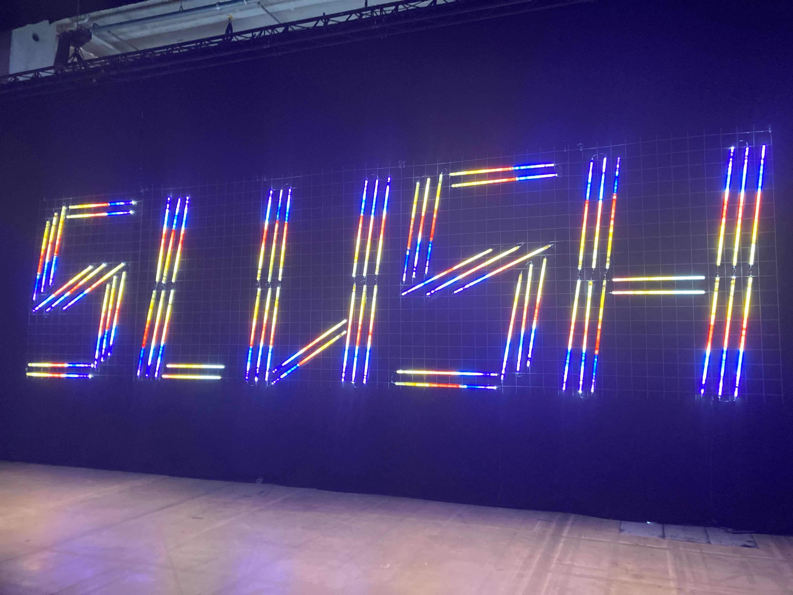

Aastalõpp läheneb kiirelt, kuid enne jõuluaega jõudis Agrello tiim novembrikuu vältel osaleda mitmel suurel üritusel. Konverentsid toimusid Eestis, Soomes ja Ühendkuningriigis. Loe meie meeskonna kokkuvõtet ja muljeid sellest artiklist.

‍

### Päev loomaaias

16\. novembril toimus Tallinna Loomaaias Äripäeva poolt korraldatud iga-aastane Praktilise Bürootöö konverents. Konverentsi sihtgrupp on sekretärid, assistendid, juhiabid, büroojuhid, meeskonna- ja vahetuse vanemad ning kõik teised, kes panustavad kontori- ja meeskonna heaolusse. Agrellol oli sellel üritusel oma _booth_ ning ka presentatsioon. Lavale astusid Agrello CEO Toomas Pihl ja äriarenduse juht Harry Käsk, kes tegid ülevaate Agrellot kasutavate ettevõtete edulugudest. Fookuses oli dokumendihaldus ning erinevad Agrello abil automatiseeritud töövood, mis aitavad aega säästa.

‍

### Slush Helsingis

Slush on iga-aastane Helsingis peetav startupide _founderitele_ suunatud suurüritus. Slush 2022 tõi kokku enam kui 4600 startupi asutajat ja võtmetöötajat ning 2600 investorit. Agrello meeskonnast osalesid Harry, Toomas ja Laura Findley.

Kiire laevasõit üle Soome lahe ning Agrello tiim oligi kohal, valmis kaheks intensiivseks päevaks täis inspireerivaid esitlusi ja _networkimist_. Päevakavas oli palju huvitavaid esinejaid ning teemadeks olid startupi asutajaks olemisega seotud mured ja rõõmud ning ettevõtte ja müügi kasvatamine.

Üritusel oli palju erinevate startupide väljapanekuid ning sai hea ülevaate, millega keegi tegeleb. See andis palju inspiratsiooni ning mõtteainet, kuidas Agrellot nende ettevõtetega siduda. Slushil on oma _networkingu_ platvorm, mis võimaldab juba enne üritust kohtumisi kokku leppida ning seda meie tiim ka tegi. Nii saab juba enne kohtumist teada vastaspoole huvid ning vastavalt sellele ka Agrellot tutvustada.

Kokkuvõttes oli Slush väga hästi korraldatud ning meeldejääv üritus.

‍

‍

### LegalEx ja B2B Sales and Marketing Expo Ühendkuningriigis

Viimasena osalesid Toomas ja Laura Londonis toimuval _legal tech_ üritusel nimega LegalEx. Peamiselt osalesid seal õigusalal tegutsevad ettevõtted, näiteks verifitseerimise ja KYC-ga tegelevad platvormid, õigusbüroode haldustarkvarade pakkujad ning ka advokaadibürood olid oma esindusega väljas. Rahapesu ja KYC  teemadel oli mitmeid huvitavaid ettekandeid. Ühtlasi ei ole UK-s veel kõik nii iseenesestmõistetavalt digitaalne nagu Eestis, seega on õigusbüroo töö digitaliseerimine aktuaalne ning ka Agrello sobitub selles võtmes hästi teemasse.

Toomasel ja Laural õnnestus läbi hüpata ka B2B Sales and Marketing Expolt, mille osalejad pakkusid erinevaid teenuseid seoses analüütikaga, e-maili turunduse tööriistu ning CRM-e. Rõõm oli kohata ka Pipedrive’i esindust.

Peamised esitluste teemad olid SEO, analüütika ning turundus läbi mõjuisikute. Sellelt ürituselt sai meie meeskond hea ülevaate turunduse viimase aja trendidest ning nii mõnegi kasuliku nõuande meie enda turundusstrateegia jaoks.

‍

‍

Hästi korraldatud ja huvitavate esinejatega üritustel on alati rõõm osaleda. Teiste ettevõtete tegemistega kursis olemine ja uute kontaktide loomine võivad viia suurte tegudeni. Kokkuvõttes saime väga palju inspiratsiooni ning ei jõua 2023 aasta üritusi ära oodata.
