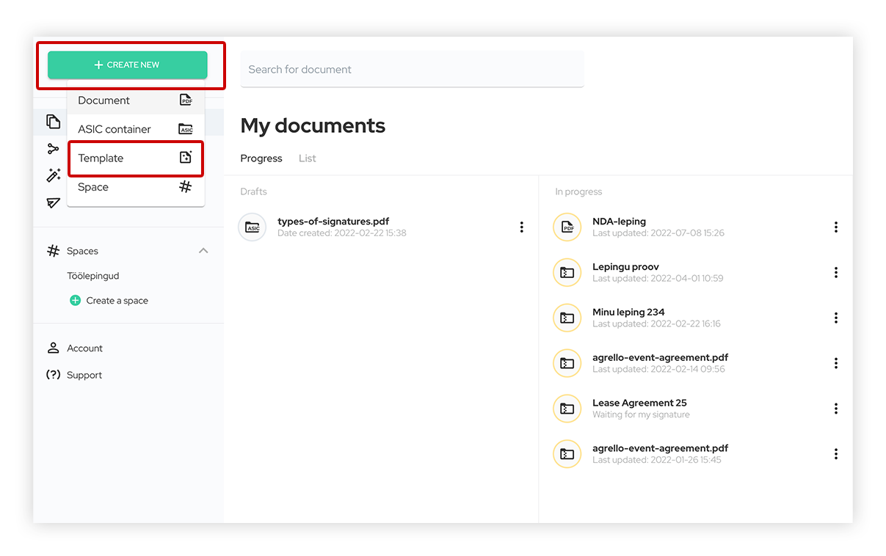
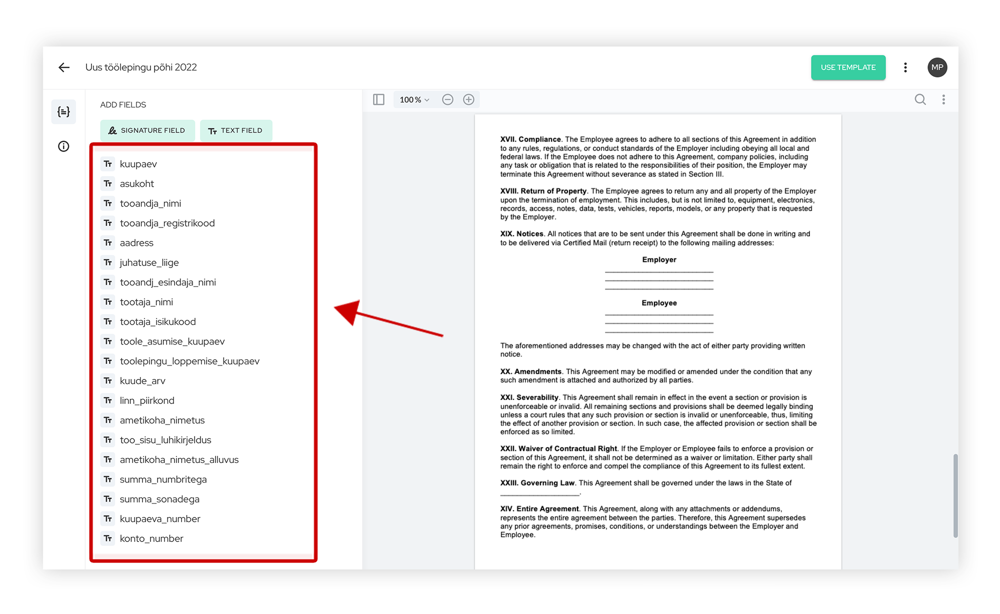

**Liela daļa personāla nodaļas ikdienas darba ir darba līgumu noslēgšana. Lielākos uzņēmumos tas notiek katru dienu, un vairumā gadījumu līguma pamats ir vienāds, tikai jāmaina ar darbinieku saistītie dati. Daudz laika tiek patērēts, sūtot darba līgumu turp un atpakaļ un vācot parakstus.**

Nesen mēs esam rakstījuši arī par 1. augustā spēkā stājušamies Darba līguma likuma grozījumiem un to, ko tas nozīmē. Nav nepieciešams pārslēgt jau noslēgtos darba līgumus, taču darbiniekiem, kuri strādā pie darba devēja likuma spēkā stāšanās brīdī, ir tiesības lūgt darba devējam iesniegt jaunos datus, un šādā gadījumā darba devējam ir pienākums divu nedēļu laikā iesniegt šos datus darbiniekam rakstveidā.

Darba devējam ir arī jāsaņem darbinieka apstiprinājums par datu iesniegšanu, kas pierāda, ka pēdējais ir saņēmis paziņojumu. To ērti var izdarīt Agrello vidē.

‍

[YouTube Video](https://www.youtube.com/watch?v=QMhRnfep9Vc)

‍

## Samaziniet līgumu sagatavošanas laiku

‍

Mēs jau esam runājuši par to, kā Agrello atvieglo darbu ar līgumiem un kā labāk organizēt parakstīšanas procesus, lai ietaupītu laiku. Piemēram, [**mēs esam prezentējuši, kā sagatavot līgumus parakstīšanai Microsoft Word**](https://www.agrello.io/post/create-fillable-word-contracts-and-request-signatures).

‍

Šodienas rakstā mēs sīkāk aplūkojam, kā Agrello līgumu pārvaldības un parakstīšanas platforma var palīdzēt ar darba līgumiem. Kā praktisku piemēru mēs izmantosim parastu, vienkāršu darba līguma veidlapu, ko [**varat lejupielādēt šeit**](https://uploads-ssl.webflow.com/5e6237b884b74554e9aef4df/63170dd8ca1158559d51914b_At-Will-Employment-Contract.docx). Agrello strādā ar Microsoft Word, visizplatītāko dokumentu veidošanas rīku un to, ar kuru lielākā daļa cilvēku ir pazīstami. Daudz laika aizņem līgumu sagatavošana, kopēšana un organizēšana mapēs, un parakstu vākšana un līgumu sūtīšana turp un atpakaļ ir laikietilpīga.

‍

Ar Agrello visu procesu var ievērojami paātrināt. Lai to izdarītu, mēs izmantojam Agrello līguma veidni ar **dinamiskajiem laukiem**. Tā vietā, lai sūtītu līgumus pa e-pastu turp un atpakaļ, drukātu tos un skenētu, Agrello platforma veic visu parakstu vākšanas darbu. Arhivēšanu pareizajās mapēs var viegli automatizēt, savienojot Agrello ar jūsu iecienītākajiem rīkiem (**Google pakalpojumi**, **Dropbox**, **Slack**, **Pipedrive** utt.).

‍

## Kā sagatavot darba līgumu ar Agrello?

‍

Tā kā Microsoft Word ir visplašāk izmantotais teksta redaktors, Agrello piedāvā risinājumu līgumu veidošanai Word. Izmantojot īpašus marķierus, tekstā var izveidot dinamiskos laukus, kur ir atstarpes, kas jāmaina, un tie kļūst aizpildāmi, kad tiek augšupielādēti Agrello platformā. Šādu līguma veidni var izmantot atkārtoti, lai veidotu dokumentus, un dinamiskos laukus var aizpildīt ar pareizajiem datiem katram jaunam darbiniekam, neizejot no Agrello platformas.

‍

### 1\. solis. Izvēlieties dinamiskos laukus darba līgumā

‍  
Vispirms atveriet savu pamata darba līgumu Microsoft Word vai lejupielādējiet [**pamata darba līgumu šeit**](https://uploads-ssl.webflow.com/5e6237b884b74554e9aef4df/63170dd8ca1158559d51914b_At-Will-Employment-Contract.docx). Svarīgi, lai šis fails būtu saglabāts **.DOCX** formātā, nevis .DOC formātā. Ja jūsu darba līgums ir saglabāts .DOC formātā, vienkārši veiciet nepieciešamās izmaiņas un saglabājiet to **.DOCX formātā**.

‍

Līguma veidnes sagatavošana ar dinamiskajiem laukiem ir vienreizēja piepūle jums. Nākotnē jūs varat izmantot to pašu veidni visiem darbiniekiem. Darba līgumā atzīmējiet visas vietas, kas jāmaina, ar **{{figūriekavām}}**. Šīs iekavas nepaliek redzamas darba līgumā, bet atzīmē lauku, kur vēlāk tiks parādīta informācija par darbinieku un darba devēju. Pārliecinieties arī, ka **{{figūriekavās}}** nav **pieturzīmju**, **atstarpes**, **atšķirīgu fontu** vai **īpašu rakstzīmju**, pretējā gadījumā Agrello var nesaprast laukus.

‍

Mēs iesakām rakstīt nosaukumu dabiskās iekavās, lai būtu skaidrāks, kāda informācija tiek parādīta šajā laukā, piemēram, **{{darba\_deveja\_nosaukums}}**, **{{registracijas\_numurs}}**, **{{darbinieka\_vards}}**, **{{personas\_kods}}**, **{{adrese}}** utt.

‍

‍

### 2\. solis: Augšupielādējiet darba līgumu Agrello vidē

‍

Pārliecinieties, ka esat pareizi sagatavojis darba līgumu ar visiem dinamiskajiem laukiem. Laba prakse ir neatstāt darba līgumā nevienu tādu lauku, kas vēlāk būtu jāaizpilda katram darbiniekam individuāli. Tomēr šīs prakses mērķis ir atbrīvoties no nevajadzīga manuāla darba un paātrināt līguma veidošanas un parakstīšanas procesu.

‍

Pārliecinieties arī, ka Word dokuments ir saglabāts **DOCX formātā**. Tagad, kad darba līguma veidne ir gatava, jūs varat izmantot to pašu veidni katram uzņēmuma darbiniekam, nekopējot līguma veidni vai neaizpildot laukus katram darbiniekam atsevišķi.

‍

‍

Augšupielādējiet galveno darba līgumu Agrello vidē. Ja jums vēl nav Agrello konta, jūs varat [**izveidot to šeit bez maksas**](https://docs.agrello.io/app/login) un bez saistībām. Neuztraucieties, ja redzat platformu angļu valodā. Mēs sākotnēji esam izveidojuši Agrello platformu angļu valodā, lai padarītu to starptautiski pieejamu. Noklikšķiniet uz "Create new" un izvēlieties "Template". Tas izveidos atkārtoti izmantojamu līguma veidni, kas būs pieejama jums Agrello vidē. Pēc līguma augšupielādes Agrello vidē jūs pamanīsiet, ka visi lauki, kas atzīmēti ar **{{figūriekavām}}**, parādās kā aizpildāmi lauki Agrello platformā.

‍

### 3\. solis: Definējiet parakstītāju laukus

‍

Lai darba līgumu varētu digitāli parakstīt un lai šis paraksts parādītos pareizajā vietā, paraksta lauki jāpiešķir visām pusēm. Darba līguma gadījumā, ja parakstītāji ir darba devējs un darbinieks, mēs pievienojam darba līgumam divus parakstītājus, noklikšķinot uz pogas **"SIGNATURE FIELD"**. Tad darba līguma apakšā parādīsies lauks, kuru ar peli var pārvilkt uz atbilstošo vietu.
