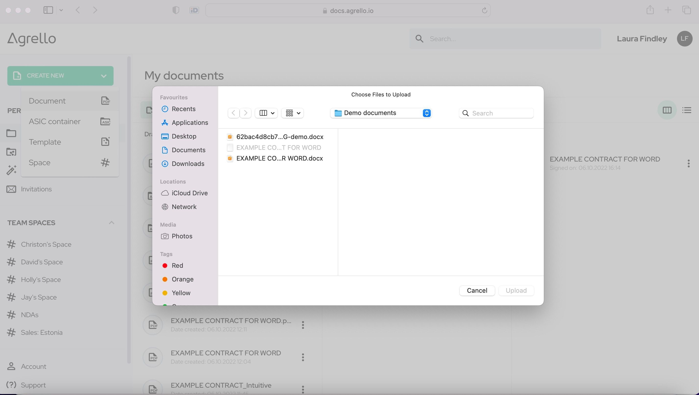
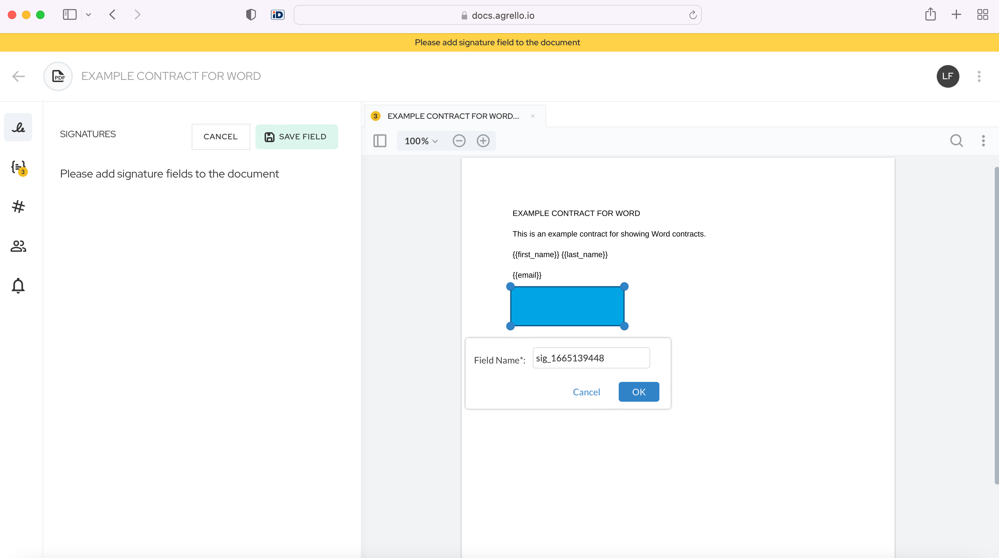
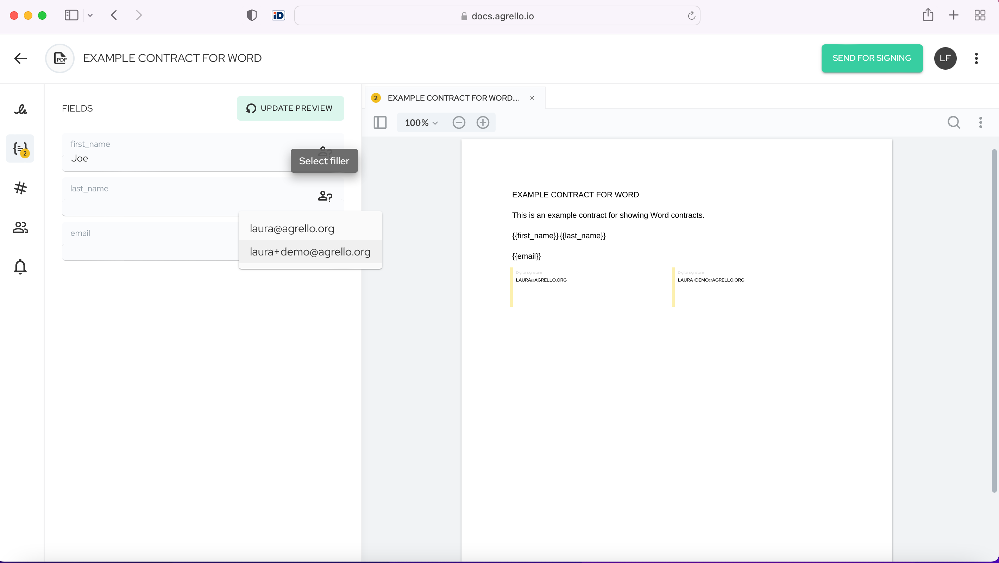
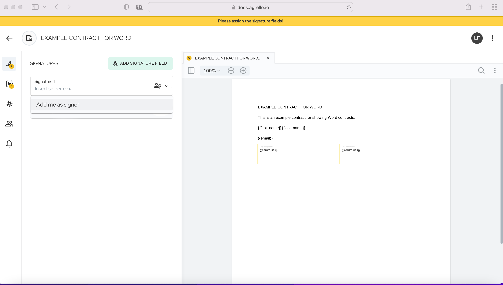

Ar Agrello jūs varat viegli un ātri izveidot un parakstīt dokumentus. Šajā rakstā mēs sniegsim pamācību par PDF dokumentu izveidi un dokumentu parakstīšanu, izmantojot Agrello parakstu.

## **Kāpēc parakstīt ar Agrello?**

Agrello paraksts ir vienkāršs elektroniskais paraksts, ko var izmantot ikviens Agrello platformas lietotājs.

Agrello paraksts darbojas, ievietojot kriptografisku pirkstu nospiedumu "telpā", kas izveidota PDF dokumentā. Tas nozīmē, ka, parakstot ar Agrello parakstu, jūs PDF dokumentā ievietojat vizuālu, kriptografisku sava paraksta versiju.

Vairumā gadījumu un valstu Agrello paraksts būs derīgs.

Agrello paraksts ir īpaši noderīgs tiem, kas atrodas ārpus Baltijas valstīm, kur Smart-ID, Mobile-ID un ASIC faili netiek atbalstīti.

‍

### **Kāpēc izmantot PDF dokumentus?**

Agrello platformā jūs varat viegli un ātri izveidot PDF līgumus - bet kāpēc izmantot PDF? Vienkārši tāpēc, ka tas ir visizplatītākais failu formāts, kādā tiek veidoti un izplatīti parakstīti dokumenti biznesa pasaulē. PDF failus ir viegli lietot, nosūtīt un izplatīt, un to nerediģējamā daba nozīmē, ka varat būt droši, ka jūsu līgumus nevar mainīt pēc to parakstīšanas. Turklāt Adobe Acrobat lasītājs ir bezmaksas, un jūs varat viegli pārbaudīt Agrello paraksta derīgumu ar Adobe Acrobat.

Ar to sāksim pamācību!

## Kā izveidot PDF dokumentu

#### **1\. solis** - **Piesakieties Agrello**

Ar Agrello pieteikšanās ir vienkārša un ātra, nav jāatceras garas paroles vai jāaizpilda garas reģistrācijas formas. Vienkārši piesakieties Agrello ar savu e-pastu, ievadot vienreizējo piekļuves kodu. Pēc tam jūs nonāksiet savā "Mani dokumenti" ekrānā.

Šeit "Mani dokumenti" ekrānā jūs redzēsiet šādu skatu (neuztraucieties, ja sākumā tas ir tukšs, tas piepildīsies). Kreisajā pusē ir "Izveidot jaunu", tad "Mani dokumenti", "Kopīgots ar mani", "Manas veidnes", "Ielūgumi", "Telpas", "Konts" un visbeidzot "Atbalsts". "Kopīgots ar mani" ir vieta, kur atrodas visi dokumenti, ko saņemat no citiem Agrello lietotājiem. "Manas veidnes" ir vieta, kur nonāk visas jūsu izveidotās veidnes. "Ielūgumi" ir vieta, kur atrodas jūsu gaidošie ielūgumi apskatīt vai parakstīt citus dokumentus (kad pieņemat ielūgumu, dokuments pārvietojas uz "Kopīgots ar mani"). "Telpas" ir vieta, kur atrodas jūsu telpas, kad tās ir izveidotas, jūs varat tur ievietot dokumentus, lai sadarbotos ar citiem. "Konts" ir vieta, kur jūs redzat savus konta iestatījumus, un "Atbalsts" ir vieta, kur jūs varat saņemt atbalstu jebkādām problēmām, kas jums varētu rasties.

Labajā pusē jūs varat redzēt visu savu līgumu progresa skatu - "Melnraksti" ir vieta, kur nonāk visi līgumi, kas vēl nav nosūtīti, "Procesā" rāda līgumus, kas ir nosūtīti un daļēji parakstīti, un "Parakstīti" rāda visus pilnībā parakstītos līgumus.

‍

#### **2\. solis - Izveidot jaunu dokumentu**

Noklikšķiniet uz pogas "Izveidot jaunu" un noklikšķiniet uz "Dokuments". Jūs varat arī izveidot jaunu dokumentu, izmantojot zaļo pogu "jauns dokuments" progresa skata augšdaļā.

Šeit ir arī citas iespējas. ASIC konteiners ir paredzēts dokumentiem, kas izveidoti Baltijas valstīs, jo tas ir Baltijai specifisks dokumentu formāts.

"Veidne" ir paredzēta veidnes izveidošanai - lai iegūtu labu pārskatu par to, kā to detalizēti izdarīt, [jūs varat apskatīt šeit](https://support.agrello.io/guides/document-automation/agrello-templates). Vienkārši sakot, veidnes ir ļoti ērts veids, kā izveidot atkārtojamus dokumentus jūsu bieži veidotajiem līgumiem - jūs varat izveidot vienu veidni un pēc tam turpināt veidot simtiem līgumu. Tas samazina kļūdu skaitu un nodrošina, ka jums katru reizi ir ideāli līgumi.

"Telpa" ir paredzēta telpas izveidošanai - telpa ir vieta, kur glabāt dokumentus, kas tiek kopīgoti ar citiem. Tas ļauj komandai sadarboties ar dokumentiem un nodrošina vieglu piekļuvi visiem komandas locekļiem dokumentiem, kurus viņiem nepieciešams redzēt.

‍

‍

#### **3\. solis - Augšupielādēt jūsu dokumentu**

Augšupielādējiet jūsu izvēlēto dokumentu no jebkuras vietas jūsu datorā.

‍

‍

‍

#### **4\. solis - Pievienot paraksta laukus**

Kad esat augšupielādējis savu dokumentu, jums jāpievieno paraksta lauki. Pievienojiet paraksta laukus dokumentam, noklikšķinot uz pogas "Pievienot paraksta lauku". Jūs varat ļoti viegli vilkt un nomest paraksta laukus vietā. Jūs varat pievienot tik daudz paraksta lauku, cik nepieciešams dokumentā, bet ņemiet vērā, ka paraksta lauki ir ekskluzīvi - t.i., viena persona nevar parakstīt dokumentu vairākas reizes.

‍

‍

Lapas augšējā kreisajā stūrī parādīsies zila kastīte, un jūs varat viegli vilkt un nomest to jebkurā vietā dokumentā, kur tas nepieciešams.

‍

‍

Jūs varat arī pārdēvēt tos pēc saviem ieskatiem, noklikšķinot uz pildspalvas/rediģēt formas lauka ikonas.

‍

‍

Kad esat pievienojis vēlamos paraksta laukus, noteikti noklikšķiniet uz pogas "Saglabāt lauku" augšējā labajā stūrī, lai saglabātu savus laukus.

‍

#### **5\. solis - Piešķirt un aizpildīt teksta laukus**

Ar Agrello, ja jūs izveidojat dokumentu, kas satur laukus figūriekavās, piemēram, {{tā}}, tad jūs esat izveidojis aizpildāmu lauku. Tie ir tie elementi, kurus jūs vēlētos mainīt līgumā, piemēram, parakstītāja vārds, ID kods, adrese utt. Tas ir ļoti noderīgi - tas samazina laiku, kas pavadīts ar jūsu līgumu, jo jums nav jāpavada laiks, sūtot e-pastus turp un atpakaļ, lai iegūtu informāciju, un tas samazina kļūdas, kas saistītas ar kopēšanu un ielīmēšanu.

Ja esat izveidojis teksta lauku ar figūriekavām, aizpildiet dokumenta laukus, vai arī jūs varat piešķirt kādam pa e-pastu aizpildīt laukus. Kad piešķirtā persona saņem e-pastu ar uzaicinājumu aizpildīt laukus, tad viņi var tos aizpildīt.

‍

#### **6\. solis - Piešķirt paraksta laukus**

Visbeidzot, jums jāpiešķir paraksta lauki cilvēkiem, vai nu sev, vai ierakstot viņu e-pastus lodziņā.

Šeit jūs varat pievienot sevi kā parakstītāju.

‍

‍

Tad jūs varat ierakstīt otras personas e-pastu, kuru vēlaties uzaicināt.

‍

