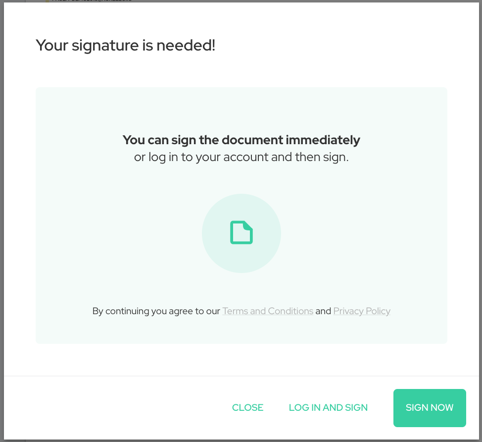
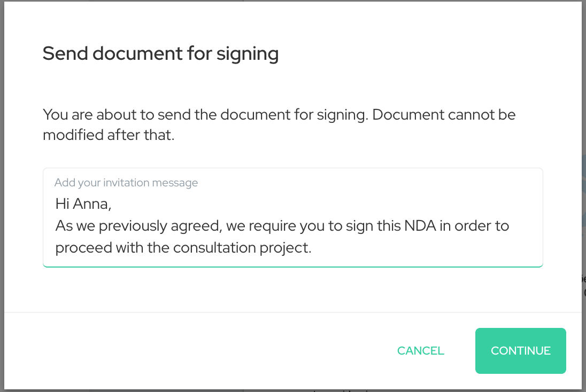

Mēs esam ieviesuši vairākus uzlabojumus, lai padarītu parakstīšanos ar Agrello labāku visiem - tīmekļa lietotnes lietotājiem, mobilajiem lietotājiem un pat tiem, kas vēl neizmanto Agrello, bet ir saņēmuši uzaicinājumu parakstīt dokumentu. Turpiniet lasīt, lai uzzinātu, kā šīs izmaiņas ietekmē jūs un kā jūs varat no tām gūt labumu.

‍

### Ievāciet parakstus ātrāk ar bezsesijas parakstīšanu

Bezsesijas parakstīšana var izklausīties kā Lohnesa briesmoņa stāsts, bet patiesībā tas nav nekas biedējošs. Gluži pretēji - tas ir vissvarīgākais uzlabojums Agrello parakstīšanas pieredzē. Šīs izmaiņas būtība ir nodrošināt iespēju parakstīt dokumentu **bez pieteikšanās** vai **konta izveidošanas** tieši šim nolūkam.

Tas ir svarīgi zināt, ja jūs uzaicināt kādu parakstīties, kurš neizmanto Agrello. Ar bezsesijas parakstīšanu jūs varat būt pārliecināts, ka viņiem neradīsies nekādas problēmas un dokuments tiks parakstīts.

‍

Pēc paraksta pieprasījuma saņemšanas un sekojot saitei uz dokumentu, parakstītājam ir iespēja pieteikties un parakstīt vai parakstīt nekavējoties bez konta izveidošanas. Izvēloties "parakstīt tagad", viņi var izvēlēties vai nu Agrello parakstu, Smart-ID vai Mobile-ID un turpināt, pievienojot savu vārdu un parakstot dokumentu bez konta izveidošanas.  
‍

### Pievienojiet pielāgotus ziņojumus paraksta pieprasījumam

Lai nodrošinātu, ka jūsu paraksta pieprasījums nepazūd jūsu adresātu pastkastes apakšā, mēs esam uzlabojuši Agrello paraksta pieprasījuma e-pastu izskatu.  
‍

- Jūsu vārds vai e-pasta adrese būs zem sūtītāja vārda
- E-pasta virsrakstā ir iekļauts dokumenta nosaukums.
- Lai izvairītos no pārpratumiem, ir iespēja pievienot pielāgotu piezīmi, kas paskaidro paraksta pieprasījuma saturu.

‍

‍

### Mobilās parakstīšanas pieredzes atjauninājumi

Vai jūs atceraties katru PIN kodu vai paroli, ko esat iestatījis dažādos pakalpojumos? Visticamāk, nē. Tas ir viens no iemesliem, kāpēc mēs noņēmām drošo 6 ciparu PIN kodu no Agrello mobilajām lietotnēm. Laika gaitā kļuva acīmredzams, ka papildu drošība, kas saistīta ar mobilā PIN kodu, nesniedza papildu vērtību mūsu klientiem. Kad esat ceļā, ir svarīgi ātri parakstīt lietas, un bez PIN koda tas ir ērtāk. Ja jūsu kontam ir piesaistīta arī mobilā ierīce, jums vairs nav jāapstiprina paraksts ar mobilo tālruni, kad parakstāt tīmekļa lietotnē.

Mēs ceram, ka jūs un jūsu biznesa partneri ērti parakstāt lietas ar Agrello!

‍
