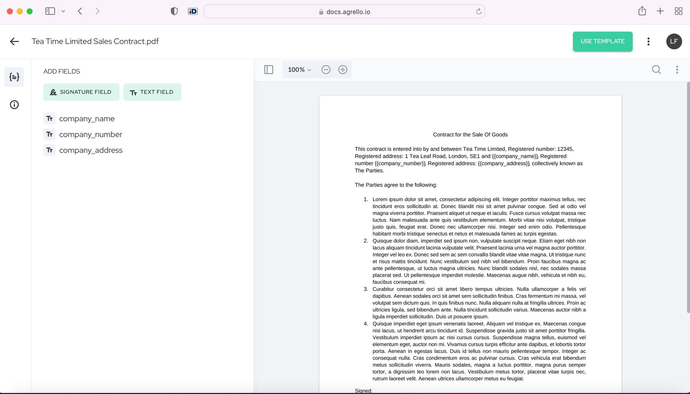
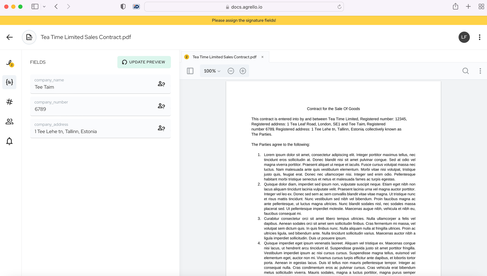
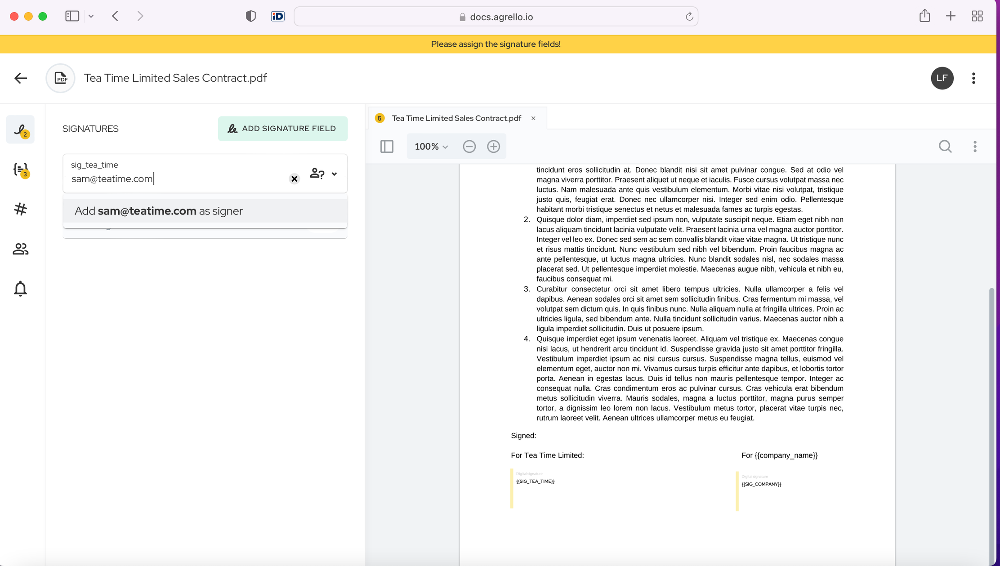

Pārrobežu līgumi ir neizbēgama biznesa daļa mūsu starptautiskajā un savstarpēji saistītajā pasaulē. Ir daudzi piemēri, kur līgumi var būt jānoslēdz pāri robežām, piemēram:

- Preču pirkšana un pārdošana;
- Ražotāja piesaistīšana produktu ražošanai;
- Darbinieks paraksta darba līgumu ar ārvalstīs esošu uzņēmumu;
- Uzņēmums pieņem darbā darbiniekus no ārvalstīm;

Šeit mēs sniegsim pārskatu par to, ko nozīmē parakstīt līgumu starp Angliju un Igauniju, izmantojot Agrello.

‍

[Iepriekšējā bloga ierakstā](https://www.agrello.io/post/are-digital-signatures-valid-in-the-uk) mēs norādījām, ka Agrello paraksts ir derīgs Anglijā. Agrello paraksts ir derīgs arī Igaunijā, tāpēc mūsu piemērā nav nekādu derīguma problēmu.  
‍

Ņemsim par piemēru pārdošanas līgumu. Angļu uzņēmums Tea Time Limited vēlas pārdot tēju igauņu uzņēmumam Tee Taim OÜ.

Mērija no Tea Time ir administratore, kas nodarbojas ar visiem līgumiem, un viņai ir kolēģe Marita no Tee Taim. Mums ir arī Sems no Tea Time, kurš paraksta visus viņu līgumus, un viņa kolēģis Siims no Tee Taim.

Lai noslēgtu šo pārdošanas līgumu, viņi izmanto Agrello, lai sagatavotu un parakstītu līgumu.

Tea Time Ltd ir standarta pārdošanas līgums, ko viņi ir izveidojuši, izmantojot veidnes, tāpēc Mērija vienkārši paņem jaunu veidni, lai izmantotu jaunajam līgumam ar Tee Taim.

‍

‍

Tajā ir figūriekavas, tāpēc Mērija no Tea Time piešķir dinamiskos laukus Maritai, lai viņa tos aizpildītu. Tas novērš būtisku šķērsli, ar ko saskaras daudzi pārrobežu līgumi - datu vākšanu. Ar Agrello Mērijai nav nepieciešams veidot garu e-pastu ķēdi ar Maritu, lai savāktu datus, Marita var to izdarīt pati.

‍

‍

Kad pienāk laiks parakstīšanai, tas ir ļoti vienkārši. Viss, kas Mērijai jādara, ir nosūtīt līgumu parakstīšanai - viņa nozīmē Semu un Siimu kā parakstītājus. Viņi noklikšķina uz pogas un viegli paraksta ar Agrello parakstu. Patiesībā, izmantojot parakstīšanu bez pieteikšanās, viņiem pat nav jāpiesakās Agrello, lai parakstītu, viņi var ātri parakstīt līgumu bez pieteikšanās.

‍

‍

‍

Pārdošanas līgums atjaunojas katru gadu, tāpēc Mērija arī iestata atgādinājumu tieši Agrello, un saņems e-pastu, kas atgādinās, ka līgums jāatjauno.

‍

‍

Mērija un Marita var glabāt līgumu Agrello, vai arī viņas var to lejupielādēt un glabāt savos datoros vai uzņēmuma diskos.

Tātad tagad Mērija un Marita ir veiksmīgi noslēgušas savu pārrobežu pārdošanas līgumu ar Agrello.

Ar Agrello jūs varat atslēgt savas līgumu pārvaldības spējas un parakstīt līgumus ātrāk, nekā pagatavot tasi tējas. Reģistrējieties un sāciet tagad!

‍
