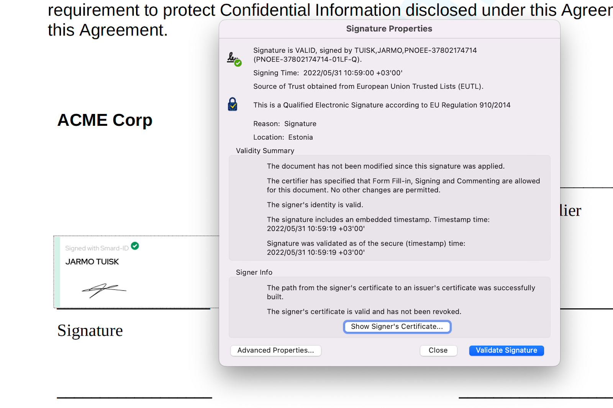

When you create a document you can choose whether your document should be formatted as a PDF or as an [ASIC](https://www.agrello.io/digital-signing/what-is-asic-container-and-xades-signature). The biggest difference between those two is how the digital signatures are attached to the document.

In the case of PDF files, the digital signature is embedded straight into the code of the PDF file itself in [PAdES (PDF Advanced Electronic Signature)](https://www.agrello.io/post/secure-your-pdf-documents-with-pades-signatures) format, while in the case of [ASIC (Advanced Signature Container)](https://www.agrello.io/digital-signing/what-is-asic-container-and-xades-signature) the digital signature and signed files are combined into a .asice file. In the case of ASIC, you can also sign multiple files with one set of digital signatures.

[**NB! Read in-depth overviews about different e-signature formats in our e-signature guide.**](https://www.agrello.io/electronic-signing)  
‍

Both formats allow the collection of Qualified Electronic Signatures. While in the case of PDF, you can also collect Agrello’s Advanced Electronic Signatures.

‍

‍

### What’s in it for me?

First of all, using PDF document format makes it simpler for you to define where the signature visual appearances will be.  Simply open the file in editing mode and just draw where you want to put the signatures.

Secondly, now the Qualified Electronic Signatures given with Smart-ID or Mobile-ID are also natively supported inside the PDF file. It will give you the possibility to meet the highest electronic signing standards.

Finally, if you choose ASIC document type, the signers can only sign with Qualified Electronic Signatures, so you do not need to remind your signers to choose the highest security electronic signature format.

### How to validate PDF signatures?

Validating PDF signatures is quite simple using Adobe Acrobat. All you have to do is download a signed file from Agrello, and then open it in Acrobat. Scroll down to the signature field a click on it. Acrobat then opens the signature modal that displays the information about the digital signature.

‍

​

‍

\*

[Read more about e-signature security from this article.](https://www.agrello.io/post/are-your-digital-contracts-secure-a-look-into-e-signature-security)

‍
