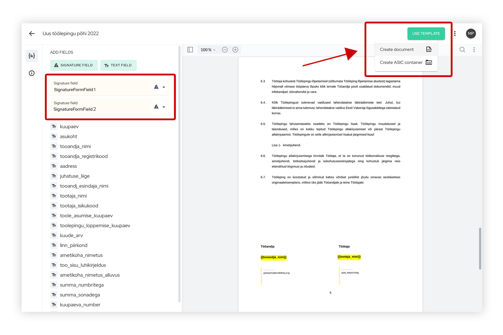
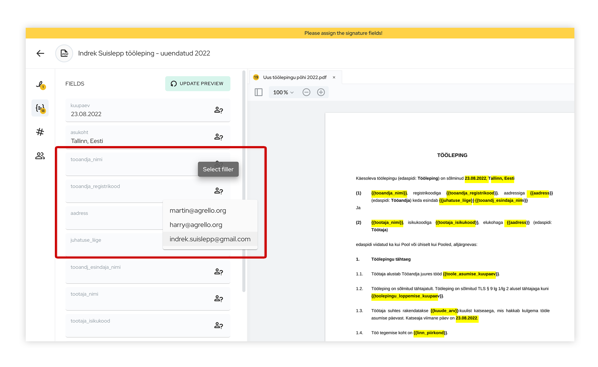
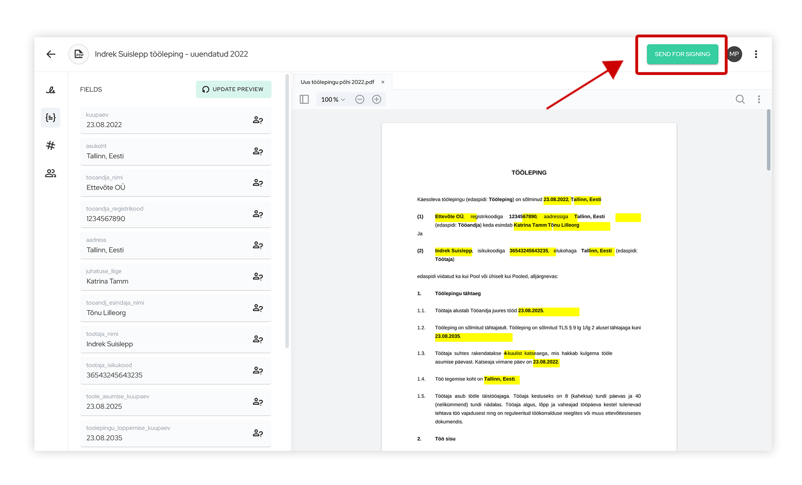
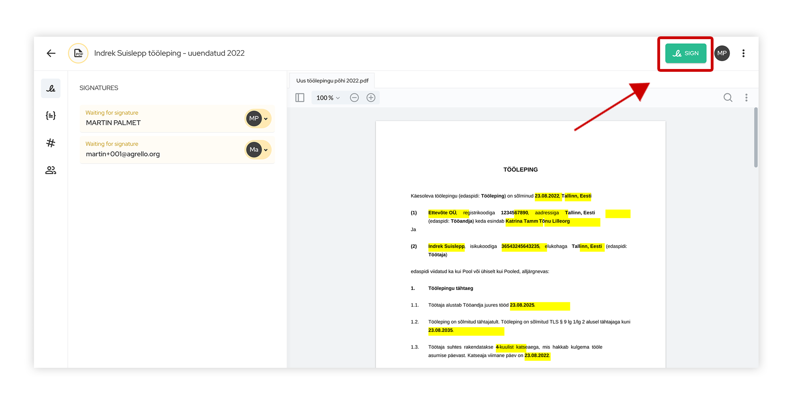

Personaliosakonna igapäevase töö suureks osaks on töölepingute sõlmimine. Seda tuleb suuremates ettevõtetes ette pea igapäevaselt ning enamasti kasutatakse sama lepingupõhja, kus muutmist vajavad vaid töötajaga seotud andmed. Palju aega kulub aga just töölepingu edasi-tagasi saatmisele ning lepingule allkirjade kogumisele.

Hiljuti oleme kirjutanud ka 1. augustil jõustunud [töölepingu seaduse (tls) muudatustest](https://www.agrello.io/post/toolepingu-seaduse-muudatused-ja-mida-see-endaga-kaasa-toob) ja sellest, mida see endaga kaasa toob. Juba sõlmitud töölepinguid ümber sõlmima hakata ei ole vaja, küll aga on töötajatel, kes seaduse jõustumise hetkel tööandja juures töötavad, õigus küsida tööandjalt uute andmete esitamist ning sellisel juhul on tööandja kohustatud need andmed kirjalikult töötajale kahe nädala jooksul esitama. Tööandjal tuleb andmete esitamise kohta ka töötajalt kinnitus võtta, mis tõestab, et viimane on teavituse kätte saanud. Seda on väga mugav teha Agrello keskkonnas.

‍

[YouTube Video](https://www.youtube.com/watch?v=BLwajy4XM9U)

##

Vähenda lepingute ettevalmistamisele kuluvat aega

Oleme varasemalt rääkinud sellest, kuidas Agrello teeb töö lepingutega lihtsamaks ning kuidas on võimalik allkirjastamise protsesse paremini korraldada, et aega kokku hoida. Näiteks, oleme tutvustanud, [_kuidas Microsoft Wordis lepinguid allkirjastamiseks ette valmistada_](https://agrello.io/post/kuidas-microsoft-wordis-lepingud-allkirjastamiseks-ettevalmistada)_._

Tänases artiklis vaatame lähemalt, kuidas Agrello lepinguhalduse ja allkirjastamise platvorm saab tööandja jaoks töötajaga lepingute sõlmimisel abiks olla. Kasutame praktilise näite tegemiseks üldlevinud lihtsat töölepingu vormi, mille saab alla laadida [_siit_](https://assets.website-files.com/5e6237b884b74554e9aef4df/630c5db67ed27f2623fe1194_agrello-tooleping.docx). Agrello töötab Microsoft Wordiga, mis on enamlevinud töövahend dokumentide ettevalmistamiseks ja enamikule meist vägagi tuttav.

Lepingute ettevalmistamisele, kopeerimisele ja kaustadesse organiseerimisele kulub väga palju aega, samuti on allkirjade kogumise protsess ja lepingute edasi-tagasi saatmine ajamahukas. Tervet seda  protsessi on võimalik Agrello abil oluliselt kiirendada.

Selleks *kasutame dünaamiliste väljadega Agrello lepingupõhjasid*. E-kirja teel lepingute edasi-tagasi saatmise, printimise ja skaneerimise asemel teeb kogu allkirjade kogumise töö sinu eest ära Agrello platvorm. Õigetesse kaustadesse arhiveerimise saab hõlpsalt ka automatiseerida, ühendades Agrello sinu lemmikute ja enimkasutatavate töövahenditega (näiteks **Google** teenused, **Dropbox**, **Slack**, **Pipedrive** jne).

‍

## **Töölepingu näidis**

Tööleping on juriidiline kokkulepe töötaja ja tööandja vahel, kus määratakse ära tööülesanded, palgatingimused, tööaeg ja teised olulised töösuhteid puudutavad aspektid. Lepingu sõlmimise puhul on oluline veenduda, et mõlemad pooled, tööandja ja töötaja, mõistavad täielikult kõiki tingimusi ja kohustusi, mis tööleping endaga kaasa toob.

Selleks, et ükski oluline punkt ei jääks töölepingu koostamisel välja, võib olla kasulik kasutada töölepingu näidist. Töölepingu näidis aitab mõista, milliseid punkte leping peaks sisaldama, kuidas sõnastada erinevaid klausleid töölepingus ja kuidas struktureerida lepingut tervikuna. Siinkohal tasub siiski meeles pidada, et internetist leitud näidislepingut ei tohiks kasutada asendusena individuaalselt koostatud lepingule, mis arvestab konkreetse töösuhte eripäradega (näiteks konkreetsed töötamise tingimused jms).

Teisisõnu töölepingu näidise kasutamine on hea lähtepunkt tööandja jaoks, kuid siiski on soovituslik konsulteerida ka juriidilise nõustajaga, et tagada lepingu vastavus seaduse nõuetele ja mõlema poole (tööandja ja töötaja) huvidele.

Tööandja jaoks oleks aga soovituslik kasutusele võtta ettevõtte spetsiifiline töölepingu näidis, kus on välja toodud kõik olulised töölepingu punktid, mis arvestavad just antud ettevõtte eripärasid. Ettevõtte töölepingu näidises on välja toodud näiteks töötamise tingimused, tööaeg, lepingu ülesütlemise tingimused, töö tegemise koht jms. Sellist ettevalmistatud lepingu näidist kohaldatakse hiljem juba vastavalt töötaja ametikohale, kuhu lisatakse tööülesanded, tasu töö eest jms.

Hoolega ettevalmistatud töölepingu näidist on hea kasutada ja eeskujuks võtta kõigi ettevõtte töölepingute koostamisel. Töölepingu näidise põhjal saab aga koostada ka päris lepingupõhjad, kus on määratletud kõik olulised töösuhet puudutavad aspektid. See tagab, et iga ettevõtte töölepingu sõlmimisel on kaitstud tööandja ja töötaja huvid, kõik tingimused on selgelt määratletud ja ükski oluline punkt ei unune lepingust välja.

##

Kuidas Agrelloga tööleping ette valmistada?

Kuna Microsoft Word on kõige levinum tekstitöötlusprogramm, siis on Agrellol varuks lahendus, kuidas Wordis tööleping mugavalt ettevalmistada ja teha seda tõhusalt ja ajasäästlikult. Kasutades spetsiaalset markeeringut saab teksti sees nendes kohtades, kus on muutmist vajavad lüngad, luua dünaamilisi välju, mis lepingu Agrello platvormile üles laadides muutuvad täidetavateks. Sellist lepingupõhja on võimalik korduvalt kasutada dokumentide loomiseks ning dünaamilisi välju saab iga uue töötaja puhul õigete andmetega täita Agrello platvormilt lahkumata.

‍

### **Samm 1. Märgi töölepingus ära dünaamilised väljad**

Kõigepealt ava oma varasemalt ettevalmistatud või kasutusel olnud töölepingu põhi Microsoft Wordis või lae hoopis töölepingu põhi alla [siit](https://assets.website-files.com/5e6237b884b74554e9aef4df/630c5db67ed27f2623fe1194_agrello-tooleping.docx). Oluline on, et see fail oleks salvestatud **.DOCX formaadis**, mitte .DOC formaadis. Juhul, kui sinu tööleping on salvestatud .DOC formaadis, siis lihtsalt tee vajalikud muudatused ning salvesta see ümber .DOCX formaati.

Dünaamiliste väljadega lepingupõhja ettevalmistamine on sinu jaoks ühekordne vaev. Edaspidi saad seda sama põhja kasutada kõikide töötajate puhul. Töölepingus märgi ära kõik need kohad, mis vajavad muutmist, kasutades *{{loogelisi\_sulge}}*. Need sulud ei jää töölepingus nähtavale, vaid märgistavad välja, mis on hiljem töölepingus täidetav, näiteks kuhu kuvatakse hiljem töötaja ja tööandja info. Lisaks ole tähelepanelik, et *{{loogelistes\_sulgudes}}* ei oleks kasutatud *täpitähti, tühikuid, erinevaid fonte* ega *eriliigilisi tähemärke*, sest vastasel juhul ei pruugi Agrello väljadest aru saada.

Loogeliste sulgude sisse soovitame kirjuta välja nime, et hiljem oleks selgem, milline info sellele väljale kuvatakse, näiteks *{{tooandja\_nimi}}, {{registrikood}}, {{tootaja\_nimi}}, {{isikukood}}, {{aadress}}* jne.

‍

### **Samm 2. Lae tööleping Agrello keskkonda**

Veendu, et oled töölepingu korrektselt ettevalmistanud ning selles on olemas kõik vajalikud väljad (dünaamilised väljad). Hea on, kui sa ei jäta ühtegi sellist välja töölepingusse, mis nõuaks hiljem iga töötaja puhul eraldi täitmist. Selle praktika eesmärgiks on siiski pääseda üleliigsest käsitööst ning kiirendada lepingute ettevalmistamise ja allkirjastamise protsessi.

Samuti veendu, et Wordi dokument oleks salvestatud **.DOCX** formaadis. Nüüd, kui töölepingu põhi on valmis, siis seda sama põhja saadki korduvalt kasutada iga ettevõtte töötaja puhul, ilma, et peaksid lepingupõhja kopeerima, kasutama kellegi teisega sõlmitud lepingut põhjana või iga töötaja kohta välju eraldi täitma.

Seejärel lae töölepingu põhi Agrello keskkonda üles. Kui sul ei ole veel Agrello kasutajakontot, siis saad selle luua [_siin_](https://docs.agrello.io/app/login)**_._** Ära ehmata, kui näed platvormi inglise keeles. Oleme Agrello platvormi loonud esialgu ingliskeelsena, et anda sellele rahvusvaheline haare. Vajuta “Create new” ja vali “Template”, nii luuakse korduvkasutatav lepingupõhi, mis jääb sulle Agrello keskkonda edaspidi kasutamiseks. Peale lepingu üles laadimist Agrello keskkonda märkad, et kõik need *{{loogelistes\_sulgudes}}* märgitud kohad ilmuvad Agrello platvormil täidetavate väljadena. Nüüd ongi sul olemas lepingu põhi, mida saad kasutada mugavalt iga kord, kui töötajaga tööleping sõlmitakse.

### **Samm 3. Määra allkirjastajate väljad**

Selleks, et töölepingut oleks võimalik digitaalselt allkirjastada ning see allkiri ilmuks ka õigesse kohta, tuleb  määrata töölepingus allkirja väljad kõikidele osapooltele. Kui töölepingu puhul on allkirjastajateks tööandja ja töötaja, siis lisame töölepingule kaks allkirjastaja välja, vajutades nupule *“SIGNATURE FIELD”*. Seejärel ilmub töölepingu põhjale väli, mida saab hiirega lohistada sobivasse kohta.

### **Samm 4. Kasuta töölepingu põhja ning loo muretult lepinguid**

Lepingupõhi on nüüd loodud. Sellele samale põhjale saab luua kõikide töötajate lepingud ilma, et peaksid ühte ja sama lepingupõhja käsitsi kopeerima, eraldi salvestama, täitma ja emaili teel allkirjastamiseks saatma. Edaspidi saad kõikide töötajatega lepingud hõlpsalt luua Agrello platvormil ning neile ka mugavalt allkirju koguda.

Sul on võimalus valida, kas lood PDF-formaadis dokumendi allkirjastamiseks, vajutades *“Create document”* või lood ***“ASIC*** _container_***”*** tüüpi lepingu, kuhu saad veel lisaks töölepingule lisada muid dokumente ja faile, näiteks töökeskkonna reeglid jms.

Seejärel määra ära, kes on allkirjastajad. Selleks sisesta allkirjastajate e-maili aadressid ning siis saavadki kõik osapooled kutse töölepingu allkirjastamiseks.

‍

### **Samm 5. Täida dünaamilised väljad ise või lase osapooltel need täita**

Sul on võimalik valida, kas täidad töölepingus kõik väljad ise või lased mingid väljad osapooltel täita. Seda on näiteks hea kasutada töötaja isikuandmete täitmiseks - lihtsalt määra need väljad töötajale täitmiseks. Nii ei pea sa ise otsima või e-maili teel küsima töötajalt tema andmeid. Selleks, et väljad täidaks kindel osapool, siis saad *“Select filler”* ikooni abil lisada vastava inimese, kes peaks kindlad väljad täitma. Enne väljade täitmist ei saa töölepingut allkirjastada.

Kui kõik väljad on täidetud ja allkirjastajad on määratud, siis on leping ka allkirjastamiseks valmis. Seda, kas lepingus on kõik väljad korrektselt täidetud või mitte, on lihtne jälgida, sest enne ei ilmu töölepingus üles paremale nurka rohelist nuppu *“SEND FOR SIGNING”.* Alles siis, kui tööleping on allkirjastamiseks korrektselt ettevalmistatud, ilmub vastav nupp.

‍

Nüüd on Agrello töölaual näha ka *“In progress”* tööleping. See tähendab, et leping on allkirjastamisel. Leping püsib seal seni, kuni on töötaja ja tööandja poolt allkirjastatud.

Agrello töölaual on sul võimalik jälgida kõikide oma lepingute staatust - kas need on juba allkirjastatud või veel allkirjade ootel. Seega sa oled alati kursis iga lepingu protsessiga ning omad alati head ülevaadet.

‍

### **Samm 6. Töölepingu allkirjastamine**

Kõik allkirjastajad saavad endale e-mailile kutsed allkirjastamiseks. Kui töötaja on saanud kutse kätte, ei pea ta tegema muud, kui dokumendi aktsepteerima, lepingu üle vaatama ning töölepingu digitaalselt Agrello keskkonnas allkirjastama.

Dokumentide allkirjatamiseks saab Agrello platvormil kasutada Agrello elektroonilist allkirja või juba tuntud lahendusi nagu **Smart-ID**, **Mobiil-ID** ja **ID-kaart**.

Siinkohal tasub meeles pidada, et töölepingu allkirjastamiseks tuleb Eesti seaduste kohaselt lepingu allkirjastamisel kasutada **omakäelise allkirjaga võrdset digitaalset allkirjastamise viisi** (tööleping peab olema omakäeliselt või digitaalselt allkirjastatud). Seega Agrello allkiri ei sobi Eestis töölepingu allkirjastamiseks, kuid seda saab edukalt kasutada teiste igapäevaste lepingute puhul (näiteks ärilepingud) või dokumentide kinnitamisel (näiteks töökeskkonnadokumentidega tutvumine).

‍

#### Digiallkiri ja Agrello allkiri

Digitaalne allkiri või digiallkiri on digitaalne tehnoloogia, mis võimaldab dokumente turvaliselt allkirjastada. Digiallkirja kasutamine on laialt levinud erinevates valdkondades, alates äridokumentidest ja lepingutest kuni ametlike kirjadeni.

Lisaks identifitseerimisele annab digiallkiri võimaluse kaitsta kogu dokumendi sisu nii, et seda ei saaks enam muuta. See tähendab, et kui leping on juba allkirjastatud, ei ole seda enam võimalik muuta ilma, et allkiri kaotaks kehtuvuse. Seetõttu on digiallkiri oluline tööriist kaasaegsetes äriprotsessides, muutes kogu dokumendihalduse kiiremaks, efektiivsemaks ja turvalisemaks.

Agrello **lihtallkiri** vastab **eIDAS** määruse *Simple* tasemele ja on lihtne elektrooniline allkiri, mis sobib vormivabadele lepingutele ning on sobilik igapäevasteks tehinguteks. Selle puhul piisab, kui tead vaid vastaspoole e-posti aadressi.

## **Töölepingu allkirjastamine Agrelloga on lihtsam ja kiirem**

Agrello on loodud selleks, et muuta lepingute ettevalmistamise ja kogu allkirjastamisega seonduv asjaajamine sulle võimalikult mugavaks ja intuitiivseks.

Kasutades Agrello platvormi oma ettevõtte töölepingute sõlmimiseks, aga ka sõlmitud lepingute haldamiseks, säästad palju aeg lepingute ettevalmistamise ja allkirjastamise pealt ning lihtsustad oma tööd.

#### **Kokkuvõtteks:**

- Kasuta dünaamiliste väljadega Microsoft Word töölepingu põhja.
- Sama ühte põhja saad korduvalt kasutada iga töösuhte loomiseks kõikide töötajate töölepingute tarvis.
- Hoia silm peal töölepingute allkirjastamise töövoo staatusel oma Agrello töölaual.
- Agrello saadab ise e-maili teel allkirjastamise kutsed. Sina ei pea seda käsitsi tegema.
- Kõik allkirjastatud töölepingud on ühes kindlas kohas ning alati kättesaadavad.
- Soovi korral saad ka lepingute ettevalmistamise ja allkirjastamise automatiseerida.

##

**Kuidas töölepingute allkirjastamist automatiseerida?**

Nüüd, kui oled saanud ülevaate sellest, kuidas luua dünaamiliste väljadega töölepingu põhi ning tööleping allkirjastamisele saata, siis kindlasti huvitab sind ka võimalus, kuidas Agrelloga on võimalik luua sadu allkirjastamisele minevaid töölepinguid.

Tõepoolest, seda ei pea kõike tegema ükshaaval, vaid selleks on väga hea ja mugav lahendus. Oleme kirjutanud eraldi loo koos üksikasjaliku kirjeldusega, [_kuidas Agrello ja Exceliga luua sadu allkirjastamisele minevaid dokumente_](https://agrello.io/post/kuidas-agrello-ja-exceliga-luua-sadu-allkirjastamisele-minevaid-dokumente)_._

‍
