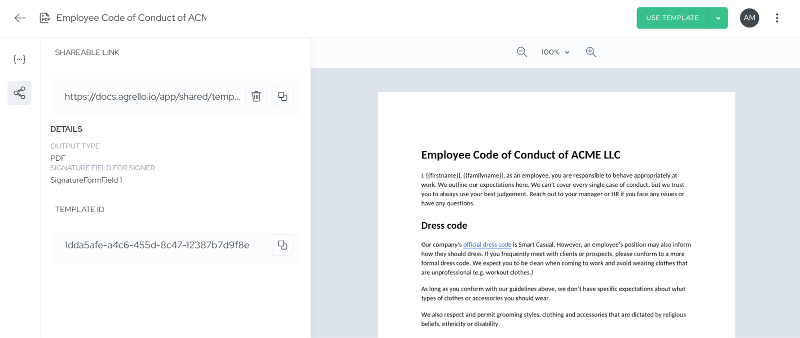

**Agrello Forms** is a feature extending our Templates module, that allow users to easily create shareable forms for signing. All you need to do is create a fillable template, then create a shareable link and send to anyone who needs to fill and sign the form (application, contract etc.)

## **How does Agrello Forms work?**

**Agrello Forms** makes document collection remarkably simple and efficient. **Start with any template you've created in Agrello** – whether it's an NDA, employment application, safety waiver, or any other document that requires signatures. 

With just a few clicks, you can generate a shareable link that allows anyone to fill out and sign your document without needing an Agrello account.

Open your uploaded template and search for Sharing options on the left-side panel

When recipients click your shared link, they see a clear preview of the document and are guided through a simple process: they provide their email address, fill in any required fields, and sign the document using Agrello's secure signing methods. The entire process takes just minutes, and the completed document is automatically stored in your Agrello account.

**Agrello Forms** feature supports all of Agrello's signing methods, including qualified electronic signatures through Smart-ID and Mobile-ID, which are legally equivalent to handwritten signatures in Estonia and other supported regions. For international recipients, Agrello's own e-signature provides a secure and legally valid solution that works globally.

## **What makes Agrello Forms valuable for your business?**

The primary advantage is the elimination of document workflow friction. Instead of sending attachments that recipients must download, fill out, scan, and email back, you simply share a link. This dramatically reduces the time from document request to signed completion, often from days or weeks down to minutes.

For sales teams, this means prospects can sign NDAs immediately during calls or meetings. HR departments can distribute employment forms, safety training acknowledgments, or vacation requests that employees can complete on any device. Operations teams can collect signed waivers, agreements, or applications without managing complex email threads.

The feature also provides better organization and security compared to traditional methods. All completed documents are automatically stored in the same folder as your template, making it easy to track submissions. Unlike basic form tools like Google Forms, Share to Sign creates legally binding documents with full audit trails and supports regional e-signature standards that many international platforms don't offer.

Additionally, since the entire process happens in the web browser, recipients don't need to install any software or create accounts. This removes barriers to completion and ensures higher response rates for your document requests.

## **Frequently Asked Questions**

### **Do recipients need an Agrello account to sign shared documents?**

No, recipients can complete and sign documents without creating an Agrello account. They simply need to provide their email address and can sign using their preferred method.

### **What types of documents work best with Forms?**

Any template that requires signatures works well – NDAs, employment applications, waivers, consent forms, service agreements, and more. The feature is particularly valuable for documents you send repeatedly to different people.

### **How secure are documents signed through Forms?**

Share to Sign maintains Agrello's high security standards. Documents can be signed with qualified electronic signatures (Smart-ID, Mobile-ID) that are legally equivalent to handwritten signatures, or with Agrello's secure e-signature for international use.

### **Can I track who has signed my shared documents?**

Yes, all completed documents are automatically stored in your Agrello account with full audit trails. You can see when documents were signed and by whom, just like with regular Agrello documents.

### **What happens if someone starts but doesn't complete a shared document?**

The system includes confirmation steps to prevent abandoned documents. A document is only created in your account after the recipient confirms their intent to proceed and provides their email address.

### **Can I disable or change a shared link after creating it?**

Yes, you can disable shared links at any time through your template settings. You can also regenerate new links if needed while keeping your template intact.

## **How to create your first Agrello Forms template**

Getting started with Share to Sign is straightforward. Follow these simple steps to turn any template into a shareable signing experience:

1.  **Navigate to Templates** - Go to the templates section in your Agrello folder
2.  **Upload Your Template** - Upload a new template that you want to convert to a Share to Sign document
3.  **Add Signature Placement** - Place the signer logo where you want the signature to appear (required for PDF documents)
4.  **Access Sharing Options** - Click on the "Share" button in the left sidebar
5.  **Create Shareable Link** - Click "Create" under the "Shareable link" section
6.  **Choose Output Format** - Select whether you want the final document as PDF, ASIC, or EDOC
7.  **Select Signature Field** - For PDF documents, choose which signature field the signer will use
8.  **Copy Your Link** - Your shareable link is now created and ready to copy and distribute

‍*Template view - Shareable link can be created on the left side panel.*

### **Bonus Tip: QR Code Sharing**

You can make your Share to Sign links even more accessible by creating QR codes using popular online tools like [bit.ly](http://bit.ly/), QR Code Generator, or similar services. This allows you to share your documents as scannable QR codes on printed materials, presentations, or anywhere a quick scan would be more convenient than typing a URL.
