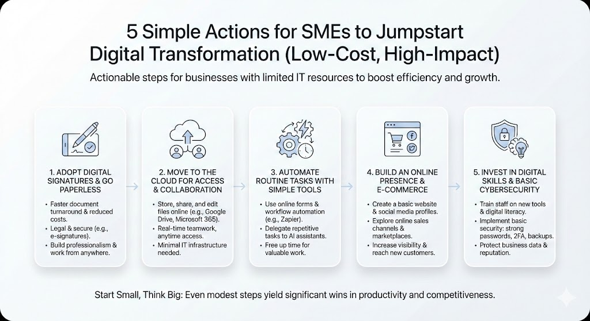

How far have Europe’s SMEs come in adopting digital tools, and what practical steps can under-digitalized businesses take right now? In this deep-dive, we’ll analyze the current state of SME digitalization in Europe (with a focus on the Baltics and Ukraine) and offer **five low-barrier actions** that SMEs (20–300 employees) can implement immediately to jumpstart their digital transformation.

## The State of SME Digitalization in Europe (2023–2025)

**Most European SMEs are still only semi-digital.** As of 2024, about **73% of EU SMEs have achieved at least a basic level of digital intensity** – meaning they use at least 4 out of 12 common digital technologies (from simple tools like social media or cloud storage to more advanced ones like AI)[\[1\]](https://ec.europa.eu/eurostat/web/interactive-publications/digitalisation-2025#:~:text=%23%20Over%2070,SMEs%20reach%20basic%20digital%20intensity). 

This is a notable jump from roughly 58% in 2023[\[2\]](https://ec.europa.eu/eurostat/web/products-eurostat-news/w/ddn-20240829-1#:~:text=In%202023%2C%2059,for%20large%20enterprises%20was%2091), indicating rapid progress in the past 1–2 years. However, it still falls short of the EU’s **Digital Decade** goal – which aims for **90% of SMEs to reach a basic level by 2030**[\[3\]](https://ec.europa.eu/eurostat/web/products-eurostat-news/w/ddn-20240829-1#:~:text=According%20to%20one%20of%20the,2030%20in%20the%20Digital%20Decade). In other words, nearly one-third of small businesses remain “very low” in digital adoption, relying on just a few or no digital tools in daily operations.

**Advanced technologies have low uptake among SMEs.** While basic digital tools (like broadband or a company Facebook page) are common, relatively few SMEs use **automation or AI-powered solutions**. For example, only about **13% of European enterprises have adopted artificial intelligence technologies as of 2024**[\[4\]](https://ec.europa.eu/eurostat/statistics-explained/index.php?title=Towards_Digital_Decade_targets_for_Europe#:~:text=In%202024%2C%2013,Sweden%20and%20Belgium%20%28both). Among small firms, the share is even lower – roughly **11% of small businesses use AI, compared to 41% of large companies**.

Similarly, **cloud computing** – a cost-efficient technology for data storage and software access – is underutilized by smaller firms. In 2023 only **45% of all EU businesses were buying cloud services**, and **just 44% of SMEs** used the cloud, versus 78% of large companie. Adoption of **data analytics** is also modest (about one-third of businesses) despite its value for decision-making[\[7\]](https://ec.europa.eu/eurostat/statistics-explained/index.php?title=Towards_Digital_Decade_targets_for_Europe#:~:text=In%202023%2C%2033,enterprises%20used%20data%20analytics). 

The picture is clear: **bigger firms are pulling ahead**, leveraging advanced tools to boost productivity, while many SMEs stick to the basics. This gap poses a risk, as digitalized competitors can operate faster and more efficiently.

**Western/Northern Europe vs. CEE vs. Baltics: a digital divide.** There are **stark regional disparities** in SME digitalization across Europe. Generally, Northern and Western European countries lead, while parts of Central, Eastern, and Southern Europe lag behind. For instance, in 2024 an impressive **93% of Finnish SMEs and 90% of Danish SMEs** had at least a basic level of digital intensity, essentially nearing full digital integration. In contrast, only about **50–53% of SMEs in Bulgaria and Greece** met that basic digital threshold[\[8\]](https://ec.europa.eu/eurostat/web/interactive-publications/digitalisation-2025#:~:text=or%20very%20low%20%2827,intensity%20levels). (A decade ago, those figures were even lower.) 

The chart below illustrates this gap, with Baltic countries sitting in between these extremes:

_SME Digitalization Gap:_ _In 2024, Finland and Denmark have about 90% of SMEs at a basic digital level, versus ~50% in the least digital countries. Latvia (59% in 2024) and its Baltic neighbors are around the EU mid-range, highlighting both progress and remaining potential._

As the chart suggests, **Baltic states generally outperform other CEE countries** in digital uptake. Years of pro-digital policies and e-government initiatives have had an impact. For example, Lithuania was among Europe’s leaders in e-commerce adoption – **38% of businesses in Lithuania made online sales in 2022**, on par with tech-savvy Sweden (38%) and second only to Ireland[\[9\]](https://www.weforum.org/stories/2023/09/digitalization-europe-eurostat-report/#:~:text=Ireland%20had%20a%20higher%20proportion,Bulgaria%20had%20the%20smallest%20shares). 

Estonia and Latvia likewise boast high internet usage and world-renowned e-government platforms. _Paradoxically, their SME sectors are not as digitally advanced as one might expect._

According to EU assessments, **only about 54–59% of Estonian and Latvian SMEs have a basic level of digital intensity**, roughly on the EU average and far from the Nordic top tier[\[10\]](https://supplierplus.com/how-embracing-real-time-economy-best-practices-can-save-your-business-7000-working-hours-a-year/#:~:text=,the%20EU%20target%20of%2090). This means even in tech-progressive Estonia, nearly half of SMEs are still not using enough digital tools in daily operations – a gap the government recognizes and is working to close.

**Ukraine’s digital leap amid adversity.** Ukraine, though outside the EU, deserves special mention. Even amid war, Ukrainian SMEs have **accelerated digital transformation** as a means of resilience and survival. The government’s “Diia” digital platform and other initiatives have paved the way for businesses to operate online despite physical disruptions. 

As of 2024, roughly **28% of Ukrainian companies are utilizing cloud services**, and **32% are employing data analytics or AI elements to optimize processes**. This adoption is quite notable – in fact, Ukraine’s data analytics usage is comparable to the EU average. War has also spurred a shift to e-commerce and remote work: online retail sales in Ukraine jumped 25% in 2024, reaching 10% of total retail turnover[\[12\]](https://voxukraine.org/en/resilience-of-ukraine-s-small-and-medium-businesses-amid-the-war-challenges-policy-and-the-future#:~:text=In%20particular%2C%20Ukrainian%20SMEs%20are,actively%20adopting). 

Additionally, **58% of Ukrainian micro and small businesses now accept electronic payments**, and over three-quarters of those report gains in income or customer reach as a result. Another milestone: **Ukraine became the first non-EU country to have its digital signatures legally recognized by the EU in 2023**[**\[14\]**](https://ega.ee/ukraine-digital-by-design/#:~:text=implementation%20of%20technical%20interoperability%20solutions,conduct%20online%20transactions%20with%20ease), enabling Ukrainian businesses to securely sign contracts with EU partners digitally. All these trends demonstrate how even under dire circumstances, going digital has been key to SME resilience and will be a cornerstone of post-war recovery.

Overall, the **big picture** is that Europe’s SMEs are gradually embracing digitalization – but many are still early in the journey. There’s a significant gap between the digital “haves” (often larger firms or those in digitally advanced countries) and the “have-nots” (often smaller firms in lagging regions). The good news is that **the barriers to entry for basic digital tools have never been lower.** Cloud software, mobile apps, and AI services are increasingly affordable and user-friendly. The following section outlines five practical, cost-efficient actions that under-digitalized SMEs can take **right now** to boost their digital maturity and competitiveness.

## 5 Actions SMEs Can Take Now to Jumpstart Digital Transformation

Even with limited IT staff or budget, **small steps can yield big wins**. Below are five immediate actions – focused on simple, low-cost solutions – for SMEs that want to become more digital. These recommendations are tailored to organizations with 20–300 employees and minimal in-house IT capacity.

‍

5 Simple Actions for SMEs to Jumpstart Digital Transformation (illustration: Agrello)

### **Adopt Digital Signatures and Paperless Contracts** 

One of the easiest ways to start digitalizing is to move away from paper-based paperwork. Using **electronic signatures** for sales contracts, supplier agreements, HR documents, etc., can save enormous time and hassle. For example, companies that implemented e-signature platforms report a ca **60% faster document turnaround** compared to traditional printing & scanning workflows. 

In client-facing businesses, this speed and convenience also boost professionalism – nearly half of SMEs observed improved client satisfaction after switching to digital signatures. Going paperless cuts costs, too: over **60% of SMEs cite cost reduction as the top driver for adopting e-signature solutions**, thanks to savings on printing, mailing, and administrative labor. 

Many affordable e-signature services (including some free tiers) are available and legally recognized across Europe. In fact, Estonia, Latvia, and Ukraine all have national digital ID and e-signature systems that make signing documents online both secure and routine. By embracing e-signatures, an SME can finalize deals in minutes (not days), eliminate physical paperwork clutter, and conduct business **anywhere, anytime** – a client in Singapore can sign a contract with a supplier in Riga or Tallinn instantly, no postal delays. It’s a **quick, low-barrier step** that builds a foundation for further digital processes.

### **Move Your Files to the Cloud for Easy Access and Collaboration** 

Ditch the local server and USB sticks – using **cloud storage and cloud-based software** is a simple yet transformative step. Cloud tools (like Google Drive/Docs, Microsoft 365, Dropbox, or local alternatives) allow your team to **store, share, and work on files online** instead of emailing attachments back and forth. 

The benefits are immediate: everyone always sees the latest version of a document, you can collaborate in real-time, and employees can access work files securely from anywhere (office, home, or on the road). Importantly for smaller firms, cloud services **require little to no IT infrastructure** – no hardware to maintain, just an internet connection. Many solutions operate on a pay-as-you-go or freemium model, keeping costs low. Despite these advantages, remember that **less than half of EU SMEs currently use cloud computing (about 44%)**[**\[6\]**](https://ec.europa.eu/eurostat/web/interactive-publications/digitalisation-2025#:~:text=development), so adopting it can give your business a competitive edge in efficiency. 

For example, instead of manually installing software on each computer, you can use cloud-based accounting, CRM, or project management tools that update automatically and scale with your needs. **Estonian and Latvian SMEs** have been increasingly turning to cloud solutions for data backup and remote work flexibility, and **28% of Ukrainian companies now use cloud services to ensure business continuity during the war**[**\[11\]**](https://voxukraine.org/en/resilience-of-ukraine-s-small-and-medium-businesses-amid-the-war-challenges-policy-and-the-future#:~:text=57,a%20leader%20in%20Eastern%20Europe). 

By joining the cloud, you also gain built-in data security and backups provided by reputable providers, which is far safer than having critical files on one office PC or an unsecured drive. In short: moving to the cloud can be **cheap or free, quick to set up, and immediately effective** in streamlining your operations.

### **Automate Routine Tasks with Simple Digital Tools** 

Many SMEs still perform countless routine tasks manually – from entering data into spreadsheets to processing forms or sending reminders. In 2025, there are plenty of **easy automation tools** that don’t require you to be a tech expert or write code. For instance, you can use online form builders (Wufoo, Google Forms, Typeform, etc.) to collect data from customers or employees and have it automatically feed into a spreadsheet or database, instead of re-typing responses. 

Likewise, **workflow automation services** like Zapier or Make (formerly Integromat) can connect your apps and automate actions (e.g. when a customer fills an online order form, it automatically triggers an invoice email). These tools often have free plans and simple drag-and-drop interfaces. Another accessible option is to leverage **AI assistants** for certain tasks. 

AI tools (like ChatGPT or other) can help draft emails, generate marketing content ideas, or summarize long documents, saving staff time. In fact, within one year of ChatGPT’s release, **around 18% of SMEs in countries like Spain, France, and the US were already experimenting with generative AI services** for task automation[\[18\]](https://icsb.org/central/accelerating-sme-digitalisation/#:~:text=capabilities%20that%20were%20once%20the,exclusive%20domain%20of%20tech%20giants). 

Over half of those early adopters felt the benefits outweighed the risks, citing efficiency gains[\[19\]](https://icsb.org/central/accelerating-sme-digitalisation/#:~:text=The%20survey%20findings%20are%20striking%3A,benefits%20outweigh%20the%20associated%20risks). For a small business with limited people, automating repetitive workflows means you **free up human time for more valuable work** (servicing customers, developing products, etc.). 

Start small: pick one annoying, repetitive task and try an off-the-shelf tool to automate it. It could be as simple as scheduling your social media posts in advance, using an appointment booking app instead of phone tag, or setting up a chatbot on your website to answer common customer questions 24/7. Even modest automation steps can significantly boost productivity – and they typically require only a few hours of setup. Think of it as delegating the drudgery to technology.

### Build an Online Presence – Websites, E-commerce and Social Media

In an increasingly digital marketplace, being _invisible_ online is not an option. Yet a surprising number of SMEs (especially B2B or traditional local businesses) lack a modern website or any e-commerce channel. If your company is among them, now is the time to establish a basic **online presence**. This can be very cost-effective: a simple website can be built with DIY platforms like WordPress or Wix, and social media profiles (Facebook, Instagram, LinkedIn) are free marketing channels if used smartly. 

At minimum, ensure your business can be found online with up-to-date contact info, service descriptions, and customer testimonials. For those in retail or consumer services, consider dipping into **e-commerce** – even if it’s just listing products on an existing marketplace (like Etsy, Amazon, or regional platforms) or offering online ordering for pickup. During COVID and beyond, businesses that sold online fared far better. 

Today about **23% of EU businesses conduct e-sales** (through their website or marketplaces), and this share is growing. The Baltics have shown strong performance here – Lithuania, for example, saw **38% of businesses selling online in 2022**[\[9\]](https://www.weforum.org/stories/2023/09/digitalization-europe-eurostat-report/#:~:text=Ireland%20had%20a%20higher%20proportion,Bulgaria%20had%20the%20smallest%20shares), demonstrating that even smaller markets can excel in e-commerce. By joining the fray, you open your doors to a much wider market. A boutique in Riga can sell to customers in Spain; a manufacturer in Tallinn can generate leads via search engines. 

**Social media** is another powerful tool: 51% of SMEs globally rely on social media to support growth[\[21\]](https://www.digital-adoption.com/digital-transformation-statistics/#:~:text=34%20Digital%20Transformation%20Statistics%20For,Failures), often because it offers targeted advertising and direct engagement with customers at a fraction of the cost of traditional ads. The key is to start manageable – maybe launch one Facebook page or LinkedIn profile and post updates once or twice a week. Use free analytics to see what works. 

Over time, your online presence will not only drive sales, but also enhance credibility (a company with a modern web presence appears more legitimate and trustworthy in the digital age). In Ukraine, for instance, many SMEs pivoted to online sales via Facebook and Instagram during the war to reach customers despite physical constraints. No matter your industry, some part of your customer journey – from discovery to purchase to support – is happening online, so make sure you’re **actively present and engaged** there.

### **Invest in Digital Skills and Cybersecurity Basics**

Finally, an often overlooked but crucial action: **equip your people with basic digital skills and protect your digital assets.** Technology is only as effective as the people using it. SMEs with limited IT staff should empower all employees to be digitally competent. This doesn’t mean sending everyone to coding bootcamp, but rather providing practical training in the tools you adopt. If you roll out a new software (be it a CRM, an inventory system, or even Microsoft Teams for communication), allocate time for staff to learn it properly – many providers offer free tutorials or webinars. 

According to Eurostat, only **21% of SMEs currently train their staff in ICT skills** (versus 70% of large firms)[\[23\]](https://ec.europa.eu/eurostat/web/interactive-publications/digitalisation-2024#:~:text=When%20looking%20at%20the%20business%27,sized%20enterprises%20%28SMEs). Improving this not only helps avoid technology frustration, but also increases buy-in and innovation from your team. Governments in Estonia, Latvia, and Ukraine are actively supporting SME skill development – for example, Ukraine’s Diia.Business platform has launched over 100 training courses for entrepreneurs and employees (covering digital literacy, online marketing, etc.) to upskill the workforce during the recovery[\[25\]](https://voxukraine.org/en/resilience-of-ukraine-s-small-and-medium-businesses-amid-the-war-challenges-policy-and-the-future#:~:text=marketing%2C%20e). 

Avail yourself of such programs or online resources – many are free. Alongside skills, **cybersecurity** must be part of your digital game plan from day one. The good news is that basic cyber hygiene is low-cost: use strong passwords (or a password manager), enable two-factor authentication on accounts, keep software updated, and do regular data backups. Yet, **19% of SMEs admit to having _no_ cybersecurity measures at all** which is a ticking time bomb. Something as simple as a phishing email could cripple a business without protections. 

Make sure you have at least antivirus/anti-malware installed (there are free versions), and educate your staff about common scams and safe practices. You don’t need a dedicated IT security team – just instill a culture of caution (e.g. verifying unexpected requests, not clicking suspicious links) and use the security features built into modern tools. Remember that **trust and reputation are vital for SMEs**; one data breach or prolonged IT outage can severely damage customer trust. By taking basic precautions, you not only guard your business but also signal to clients that you are a professional, trustworthy partner. 

As an example of the payoff: SMEs that adopt proper e-signature solutions with built-in security features reported much higher confidence in compliance and data protection (82% of such SMEs felt they met standards better after switching to dedicated e-signature platforms). 

In summary, **don’t skip the human factor** – invest in your team’s digital know-how and secure your digital environment, so that all the other tech investments truly deliver value.

## Looking Ahead: Small Steps Lead to Big Gains

Digitalizing your business can feel daunting, especially for smaller companies with tight resources. But as we’ve seen, **the gap is widening** between those who embrace digital tools and those who don’t – in efficiency, growth, and resilience. The current state of European SMEs’ digital adoption is a mixed bag: overall trends are positive, yet many SMEs in Estonia, Latvia, Ukraine and beyond remain only **partially digital**. 

The encouraging news is that the barriers to entry have come down dramatically in recent years. With a clear focus on practical, cost-effective solutions – like the five actions outlined above – even the smallest firm can start boosting productivity and competitiveness **within weeks, not years**.

To recap, **start with the “low-hanging fruit” of digitalization**: move paperwork and data to digital formats, leverage the cloud, automate the boring stuff, establish an online presence, and make sure your people and systems are prepared for the digital era (skills and security). These steps require more will than money – and the return on investment is well worth it. A Sage study estimated that better digital adoption by SMEs could unlock _hundreds of billions of euros_ in economic growth across the EU[\[28\]](https://www.sage.com/en-gb/-/media/files/company/documents/pdf/digital-newsroom/empowering-smes-in-the-digital-decade.pdf#:~:text=,struggling%20to%20adopt%20digital), as firms become more efficient and innovative. On a company level, that translates to faster sales cycles, lower costs, access to new markets, and improved customer satisfaction.

Most importantly, **digitalization is a continuous journey, not a one-time project.** As your business gains confidence with basic tools, you can explore more advanced technologies like data analytics, AI-driven customer insights, or even robotics, depending on your field. The experience of digital front-runners in Europe shows that small businesses _can_ thrive in the digital age, punching above their weight. With the Estonian, Latvian, and Ukrainian markets becoming ever more integrated with the EU and global economy, local SMEs have a tremendous opportunity to grow by going digital. The time to act is now – the tools are available, the use cases are proven, and the support (from governments and providers) is there. By taking these immediate steps toward digitalization, under-digitalized SMEs can **boost their resilience today and secure their relevance for tomorrow**. Your competitors are moving – don’t get left behind in the analog past. Embrace the digital future, one practical step at a time, and watch your business transform.

‍

## FAQ

### What is SME digital transformation and why does it matter?

SME digital transformation involves adopting digital tools and practices to improve efficiency, competitiveness, and resilience. It helps small and mid-sized businesses streamline operations, reach new customers, and adapt to modern markets.

### How can small businesses start digitalizing with limited resources?

Start with low-barrier tools like digital signatures, cloud storage, and simple automation apps. These are affordable and often free, requiring little technical skill but offering big productivity gains.

### Which digital tools should SMEs prioritize in 2025?

Key tools include cloud-based file storage, e-signatures, basic AI tools (like chatbots or content generators), and workflow automation platforms. Social media and website presence are also crucial for visibility.

### What are the common barriers to SME digital transformation?

Barriers include limited digital skills, budget constraints, lack of IT staff, and concerns about cybersecurity. However, most of these can be overcome with free training, government support, and off-the-shelf solutions.

### How is SME digital adoption progressing in the Baltics and Ukraine?

Baltic SMEs show solid progress but still lag behind Nordic leaders. Ukraine, despite war challenges, has rapidly adopted digital tools like e-commerce and cloud services as part of its resilience strategy.

### Is cybersecurity a big issue for SMEs starting digital transformation?

Yes. Many SMEs overlook basic cybersecurity, making them vulnerable. Simple practices—like using secure passwords, updating software, and training staff—are essential first steps.

‍

**Sources:**

- Eurostat, _Digitalisation in Europe_ reports (2023–2025 editions) – statistics on SME digital intensity, cloud, AI adoption[\[2\]](https://ec.europa.eu/eurostat/web/products-eurostat-news/w/ddn-20240829-1#:~:text=In%202023%2C%2059,for%20large%20enterprises%20was%2091)[\[1\]](https://ec.europa.eu/eurostat/web/interactive-publications/digitalisation-2025#:~:text=%23%20Over%2070,SMEs%20reach%20basic%20digital%20intensity)[\[8\]](https://ec.europa.eu/eurostat/web/interactive-publications/digitalisation-2025#:~:text=or%20very%20low%20%2827,intensity%20levels)[\[6\]](https://ec.europa.eu/eurostat/web/interactive-publications/digitalisation-2025#:~:text=development)[\[4\]](https://ec.europa.eu/eurostat/statistics-explained/index.php?title=Towards_Digital_Decade_targets_for_Europe#:~:text=In%202024%2C%2013,Sweden%20and%20Belgium%20%28both)[\[5\]](https://ec.europa.eu/eurostat/statistics-explained/index.php?title=Towards_Digital_Decade_targets_for_Europe#:~:text=The%20uptake%20of%20AI%20varied,and%20small%20enterprises%20%2811).
- European Commission Digital Economy and Society Index (DESI) data – country comparisons for SMEs’ digitalization (Estonia, Latvia, etc.)[\[10\]](https://supplierplus.com/how-embracing-real-time-economy-best-practices-can-save-your-business-7000-working-hours-a-year/#:~:text=,the%20EU%20target%20of%2090)[\[29\]](https://www.parlament.gv.at/dokument/XXVIII/EU/25124/imfname_11488727.pdf#:~:text=Edge%20Nodes%20,70.0%25%2080).
- World Economic Forum, **Eurostat report summary (2023)** – highlights on SME digital uptake and e-commerce[\[30\]](https://www.weforum.org/stories/2023/09/digitalization-europe-eurostat-report/#:~:text=For%20businesses%2C%2070,number%20of%20digital%20technologies%20used)[\[9\]](https://www.weforum.org/stories/2023/09/digitalization-europe-eurostat-report/#:~:text=Ireland%20had%20a%20higher%20proportion,Bulgaria%20had%20the%20smallest%20shares).
- OECD & VoxUkraine reports on **Ukraine’s SME digital transformation** during war – cloud, e-commerce, e-services adoption stats[\[11\]](https://voxukraine.org/en/resilience-of-ukraine-s-small-and-medium-businesses-amid-the-war-challenges-policy-and-the-future#:~:text=57,a%20leader%20in%20Eastern%20Europe)[\[13\]](https://voxukraine.org/en/resilience-of-ukraine-s-small-and-medium-businesses-amid-the-war-challenges-policy-and-the-future#:~:text=outsourcing%20market%20is%20estimated%20at,their%20income%20or%20customer%20base).
- International Council for Small Business (ICSB) article (2025) – OECD survey insights on SMEs using AI, data, cybersecurity gaps[\[31\]](https://icsb.org/central/accelerating-sme-digitalisation/#:~:text=capabilities%20that%20were%20once%20the,exclusive%20domain%20of%20tech%20giants)[\[26\]](https://icsb.org/central/accelerating-sme-digitalisation/#:~:text=While%20businesses%20are%20embracing%20digital,one%20or%20two%20basic%20protections).
- _E-Signature Adoption Report 2023_ (as cited by eSignGlobal) – benefits of e-signatures for SMEs (cost reduction, speed, satisfaction)[\[17\]](https://www.esignglobal.com/blog/sme-esignatures#:~:text=According%20to%20the%202023%20Electronic,operational%20DNA%20of%20smaller%20enterprises)[\[15\]](https://www.esignglobal.com/blog/sme-esignatures#:~:text=might%20spend%20days%20circulating%20a,revenue)[\[16\]](https://www.esignglobal.com/blog/sme-esignatures#:~:text=customer%20experience,business%20can%20tip%20the%20scales).

Additional sources on SME digital adoption and EU Digital Decade targets[\[3\]](https://ec.europa.eu/eurostat/web/products-eurostat-news/w/ddn-20240829-1#:~:text=According%20to%20one%20of%20the,2030%20in%20the%20Digital%20Decade)[\[28\]](https://www.sage.com/en-gb/-/media/files/company/documents/pdf/digital-newsroom/empowering-smes-in-the-digital-decade.pdf#:~:text=,struggling%20to%20adopt%20digital).
