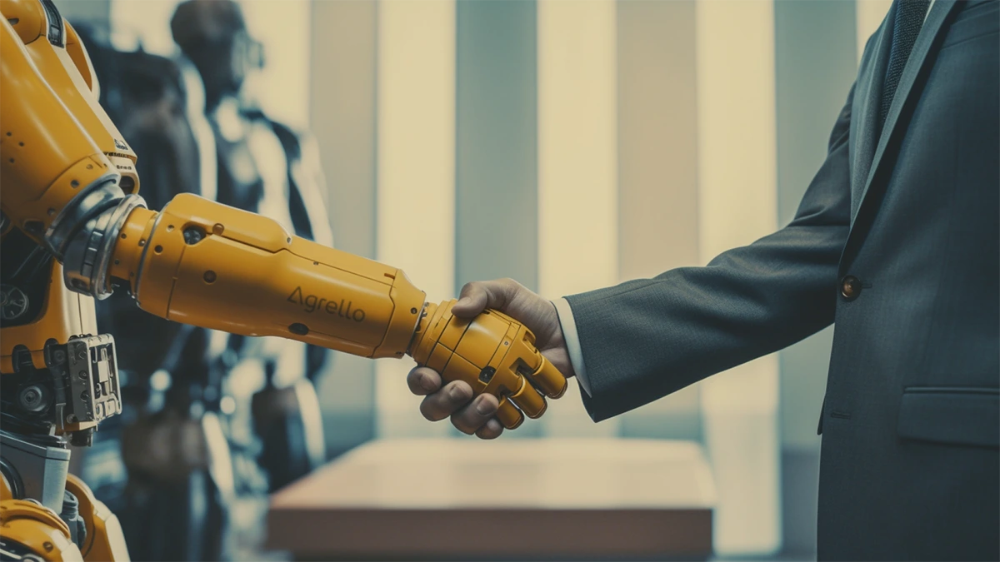

Artificial intelligence (AI) is developing at a tremendous pace and no area of life will remain untouched by it. Almost every other person has already tried chatting with the ChatGPT chatbot. In the last few months, several specialised apps have entered the market that use the same technology as ChatGPT, but focus on specific areas. Most of these apps are in the field of text processing, such as creating marketing texts or optimising and correcting spelling in web texts.

These are relatively "soft" areas and the associated risks for companies are rather small. But what about the legal field? Is AI ready to write contracts for companies and, if so, are we ready to trust these contracts?

## Can AI already create contracts?

If we try to describe what a contract is in a very brief and simple way, it might sound like this: "A contract is an agreement between two or more parties in which the parties assume certain obligations and/or obtain certain rights. Contracts can be oral or written and are regulated by the principles of contract law." If we think about this further, we can safely say that no AI can independently know what were the details of the agreement reached between the contracting parties.

Nevertheless, it would be hasty to conclude from this that AI probably cannot create contracts either. The thing is that many agreements between companies and/or individuals are still quite standard and can be fixed by means of standard contract templates. And many suitable contract templates can be found on the internet. This in turn means that they have also reached the data models of ChatGPT and other similar AIs. In addition, there are many comments by lawyers on various standard terms on the internet. This information is also available to AI. All of this is the foundation on which ChatGPT and other AIs can currently base their ability to create contracts.

So already today, anyone can go to ChatGPT and ask AI to create, for example, a basic employment contract, a lease agreement for an apartment, or a consultant services contract. This can also be done in different languages, including in Estonian. If you add information about the parties to the prompt, the text of the contract becomes more specific even to the point that you could almost sign it immediately.

Why do I say almost? Mainly because the contracts that ChatGPT creates with one command line are often quite short and cover only the most general and common conditions. This does not mean that AI is stupid and does not have information about more detailed conditions. It should be understood that AI works to some extent as a statistical predictor. It prefers to create results that are statistically most likely to occur. Therefore, the contract produced by the first prompt contains sections that are most frequently encountered in its database in the given context.

To get a better contract from AI, you need to know how to expand your prompt, contextualize it, and ask AI to pay attention to specific circumstances that should be reflected in the contract. It’s quite similar to the process of drafting a contract with the help of a lawyer. Even a regular lawyer requires additional information to produce a good and watertight contract and this is a task for a skilled lawyer or a person with a good understanding of contract law, who can eventually guide the AI towards the desired result.

## The dangers of AI-generated contracts

Using AI to create contracts seems like a very tempting way for companies to save hundreds or thousands of euros in legal fees. However, there are several limitations and dangers that need to be considered when using AI.

The first limitation to consider is that even the most powerful AI models do not excel in all fields. It must be taken into account that they are trained on certain datasets. The less a particular topic is covered in the general dataset, the more uncertain the AI result created from it will be. This is particularly challenging for smaller language and legal domains, including the Estonian legal system.

Secondly, it must be recognised that AI training takes place during a specific period and is based on knowledge that was available at that time. For example, the latest AI, GPT-4, was trained on data available in the autumn of 2021. Therefore, even ChatGPT knows nothing about later legal changes or court decisions.

Thirdly, it must be kept in mind that when using ChatGPT, the user's inputted data is transferred to a third party, OpenAI, who may use this data for further development activities. Therefore, it is not advisable to allow ChatGPT to create sensitive contracts as it is impossible to control what will happen to that data later.

The fourth issue is related to liability. Even if AI creates the contract, it cannot be held responsible for problems or damages resulting from the wording or errors in the contract. In this case, responsibility still falls on the individual who proposed the contract's text to the parties.

Therefore, when using AI to draft contracts, it is still advisable to collaborate with legal experts to ensure the legality and accuracy of the contracts and to reduce potential risks. This is especially important for contracts that differ significantly from standard contracts, are more complex in nature, and may entail greater risks for companies.

## Summary

In summary, it can be said that AI development has indeed made it possible to create contracts with AI. This can already be done using the AI tools available to everyone today. The AI world is developing at a rapid pace, and its ability to be an increasingly better legal advisor is growing. Previous experiments have shown that GPT-4 is capable of passing the US Bar Exam better than most law students. Nevertheless, we still need to be quite cautious about AI-created contracts for some time, being aware of the associated risks. This is particularly important in smaller language and legal domains like Estonia. Therefore, we cannot bid farewell to lawyers just yet, but we can perhaps bother them a little less with trivial contracts.

Here at Agrello we have started our own AI initiative that we call **Agrello Codriver** and who is meant to be your online legal assistant and give you information on certain aspects of the contract at question. There is still a long road ahead, but you can already try it out on our platform.
