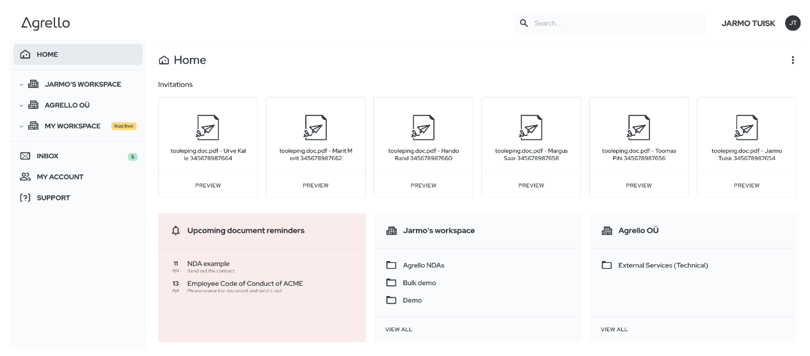

## Agrello platvormi kohandamine suuremate meeskondade koostööks

Mida suuremaks ettevõtted kasvavad, seda olulisemaks muutub tõhus koostöö ja dokumendihalduse korraldamine. Suuremate tiimide vajadustele vastavalt oleme teinud Agrello platvormi olulisi täiustusi, et paremini toetada meeskondi, mille suurus jääb 30–300 töötaja vahele.

### Agrello _workspace_’id

Agrello _workspace_ on uus ja lihtne meeskonna haldamise lahendus, mis tähendab et ettevõttel on üks konto, kuhu alla saab lisada meeskonna liikmeid ning arveldamine toimub kogu meeskonna eest. _Workspace_’is saab meeskond hõlpsasti koostööd teha, jagada olulisi ressursse nagu kooskõlastatud lepingupõhjad ning hallata juurdepääsuõigusi. _Workspace_ lihtsustab meeskonna tööd ja muudab Agrello igas suuruses ettevõtetele mugavaks abimeheks.

‍

### Dokumentide parem organiseerimine

Agrello platvormil dokumentide organiseerimise võimekuse parandamiseks on nüüdsest kasutamiseks valmis hierarhiline kaustade süsteem, mis võimaldab kasutajatel oma dokumente sorteerida just neile sobivalt kaustadesse ja alamkaustadesse. See funktsioon muudab dokumentide leidmise ja juurdepääsuõiguste haldamise ettevõtte struktuuri alusel lihtsamaks, säästes kasutajatele väärtuslikku aega ja vaeva.

Meie uus alamkaustade funktsionaalsus võimaldab kasutajatel luua kuni kolme tasandi kaustu, pakkudes dokumentide organiseerimiseks loogilisemat struktuuri. See funktsioon on mõeldud kuni 300 töötajaga ettevõtetele, et kohanduda erinevate organisatsiooniliste struktuuridega.

## Muud uued funktsioonid ja täiustused

Lisaks suuremate meeskondade koostöö toetamisele ja dokumentide paremale organiseerimisele on Agrello platvormil veel mitmeid uusi funktsioone ja täiendusi, mis parandavad üleüldist kasutajakogemust.

### Dokumentide massliigutamine

Dokumentide massliigutamise funktsioon võimaldab kiiresti liigutada mitmeid dokumente ühest kaustast teise, muutes dokumentide organiseerimise ja haldamise lihtsamaks.

### Hiljutiste dokumentide meeldetuletused

Lisasime kõige uuemate dokumentide meeldetuletused kasutajate avalehele, et oleks lihtsam jälgida oma kõige hiljutisemaid dokumente ja nende staatust.

‍

### Uuendatud Zapieri-integratsioon

Meie uuendatud Zapieri-integratsioon lihtsustab Agrello ühendamist tuhandete teiste rakendustega, võimaldades sujuvat integreerimist olemasoleva töövooga.

### Public API uuendus

Agrello public API uuendus võimaldab arendajatel ühendada oma rakendused Agrello platvormiga, laiendades veelgi integreerimisvõimalusi.

### ID-kaardi tugi

Kasutajad saavad nüüd dokumente turvaliselt dokumentidele kvalifitseeritud elektroonilisi allkirju anda ka oma riiklike ID-kaartidega, lisades allkirjastamisprotsessile täiendava turvalisuskihi.

### PDF-allkirja haldamise täiendused

Oleme täiendanud oma PDF-allkirja haldamise võimekust, võimaldades kasutajatel importida juba allkirjastatud dokumente ja neid uuesti allkirjastada, säilitades dokumendil juba olemasolevad digiallkirjad.

## Kokkuvõte

Need tooteuuendused ja täiendused muudavad Agrello platvormi veelgi võimsamaks tööriistaks erinevate suurustega ettevõtetele. Jätkame elevusega oma platvormi arendamist, et paremini rahuldada kasutajate vajadusi ja aidata ettevõtetel lepinguhaldust lihtsustada.

‍

‍
